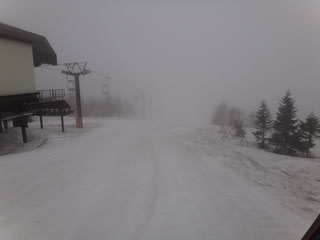
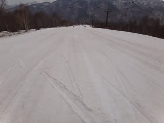
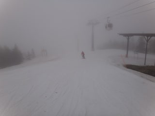
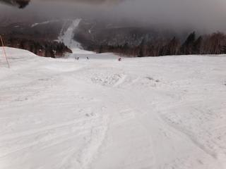
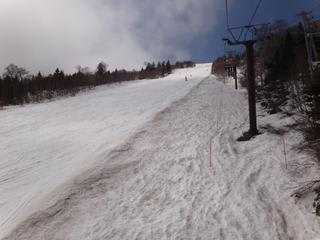
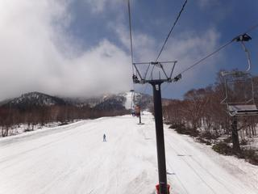
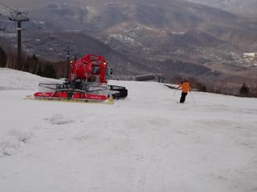
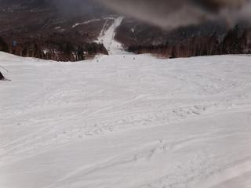
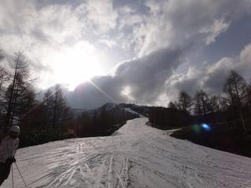

# 5月7日は奥志賀高原で滑ったよ

📅 投稿日時: 2011-05-07 21:24:50

で．

一昨日まで一の瀬で滑っていたわけですが．

昨日の平日をはさんで．

今日，また，志賀に戻ってきました．

でも，一の瀬は一昨日でクローズしてしまったので．

今日は奥志賀！

朝のうちは，かなりのガス．

風も強く，結構寒い…

でも，雪はアイスバーンではなく，朝イチからユルい

春の雪です．

板のすべりもあまりよくありません．

雪が張り付くよ．．．

…おとといまでが恵まれすぎたか…

さらに．午前10時には強風でゴンドラが止まっちゃいました．

ほかのリフトは止まらなかったのが救い…

しかし．

奥志賀も，この時期としては驚きの積雪量で，

コース全面真っ白です．

例年ならこの時期，第2高速沿いの急斜面の上のほう，

土が出てるし，こぶ溝に土が出てくるもんですが．

今年はぜんぜん大丈夫．

ゴンドラコースも，ふもとまでコース全面雪に

覆われてます．

何年ぶりだろうか…これほどの積雪量があったのは．

ただ．

雪は張り付きます．

板に強烈なブレーキが…

人がぜんぜんいなかったので，やわらかい雪ですが，

それほどひどいこぶにはならず．

特に，奥志賀の第2高速沿いの急斜面，全面の

こぶになるイメージがありますが．

今年は昼に一回圧雪をかけなおすというサービスもあり，

午後もこぶにならず．

…さすがに圧雪かけて1時間もかからずに

荒れはじめますが，コブはできなかったです．

あ，コース脇にはラインコブができていて，

圧雪がかからないので，コブ好きの方はそちらでOK.

午後になると日がさし始め，風も弱まり

ゴンドラが動き出しました．

ゴンドラコースも，中間部分が昼過ぎに圧雪がかかります．

うーん．

すばらしい．

圧雪かけたて，滑りやすい…

がらがらで晴天で，恵まれているようですが…

やっぱり滑らない雪に悩まされます．

うーん．

ちょっと，楽しくない．

夕方までこんなバーンコンディションを保ったので，

それほど荒れてなくよさげに見えるんですがね～

やっぱり，3連休までがコンディション良すぎたのかなぁ…

気温自体は午前は結構冷えたんですけどね．

しっかりインナーを着てジャケット着ないと寒いくらい．

午後はあったかかったですけど．

路面凍結とかはまったくなかったです．

とりあえず，明日は熊の湯方面に行ってみよう…

