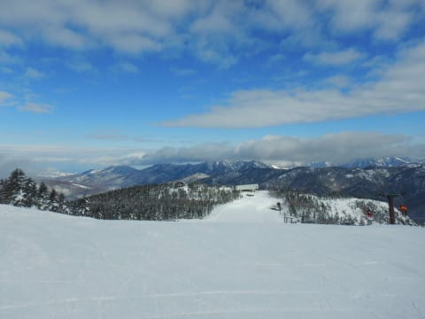

# 2020/12/28(月)も志賀高原で滑ってました！…曇り時々晴れ，それほど混まなかったけど，西館・東館・ブナ平はもう少し積雪が欲しい…

📅 投稿日時: 2020-12-29 03:32:36

🏷️ カテゴリ: [2021スキー滑走日記](c2b0fc073d6357d3b786f6ca655147f7d.md)

えー．

ニュースなどでさんざんやっているので，

30，31日がすごい雪になりそうなことは

皆さんご存知と思いますが．

…その豪雪が降り出す前触れとなる，

30日の明け方．

降り始めが雨にならないことを

祈らなくてはならないかも…？

と思っている今日この頃，皆様いかが

お過ごしでしょうか．

ということで．

このBlogを読み込んでいる一部の読者の方は．

日曜夜の更新が速報モードでなかったので．

「Skier_Sは月曜も滑っているのでは…？」

という，鋭い読みをした方がいたようですが．

…鋭い．

良く分かっていらしゃる…

不良サラリーマンの私は，28日の仕事を

「仕事？なにそれ？おいしいの？」

と知らないふりをして，志賀高原で

滑っていたのでした…！

ってなわけなので．

本日28日(月)の志賀高原の状況をば…

えー．

まず．

いつも通り8:30の営業開始を狙い，

朝イチの焼額第1ゴンドラ前に並びますが…

あさイチの列は，平日にしては多めかな…

そして，本日から1月3日までの間はずっと，

別料金のファーストトラックを開催していて．

ファーストラックの料金を払えない一般ピーポー（含む私）は，

ファーストトラック参加者が気持ちよさそうに

滑っているのを横目に，8:30の通常営業開始を

待たなくてはなりません…（ちょい涙）

とりあえず一般ピーポーの私は，8:30の

通常営業開始でやっと山頂へ上がれるわけですが…

山頂の気温は，-5℃と，これまでに比べると

冷え込みは弱いですね…

んで．

山頂は…

ちょいとガスってます(涙）

とはいえ…

あさイチは，今日も焼額クオリティの，

最高レベルのシマシマ！

ぐははははははは！

いい感じで圧雪された，足場がしっかりして

どこまでも傾いて行ける，快楽の

シマシマバーン！

あぁ…

アイスバーンになることもなく，

緩んだ雪になることもなく．

この3日間で3日とも，朝イチ最高の冷え冷え

シマシマを堪能できるなんて…

シーズン中もそうそうないかも…！

ってなことで．

今日も朝イチシマシマを堪能したあと．

しばらく白樺コースや唐松コースを滑りますが…

第2高速リフトは最大この程度で，

それほど待ち時間なく乗れますし．

…そして，今日は平日というだけでなく．

第1ゴンドラに一人乗りレーンが復活し，

4人までの乗り合いができるようになったためか．

終日ゴンドラ待ちはゲート外に出ることが

なかったです…

で．

今日は，

初めて志賀高原に来た

という方と一緒に滑ったので．

焼額を脱出し，志賀高原ツアーを

してみました…！

まずは奥志賀．

基本的に終日曇り空だった本日ですが．

奥志賀を滑っている間だけ，

ちょっと日が射しました…

奥志賀エキスパートコースは…

今日も締まり気味の，

いい感じのバーンコンディション！

平日の本日は，奥志賀ゴンドラも

待ちなくほぼ飛び乗り！

さすが北斜面の奥志賀，雪質はいい感じです…

で．

次は一の瀬方面に足を伸ばしますが…

ファミリーはパーフェクターがまだ

オープンしていませんね．

正面バーンは締まり気味の雪の上に，

ところどころモサモサ雪が乗っている

感じで，ちょっと大回りで飛ばすには

怖い感じ…

でも，正面バーンは積雪的には十分

です！

そして．

寺子屋に行ってみると…

うーむ．

一部風に飛ばされて，雪が

薄い部分もありますが…

さすがの標高が高いだけあって．

雪質は一番いいかも？？

雪が薄いエリアさえ避ければ，

人が少なくガラガラで，全くコースが

荒れてなかったので，気持ちよかったなぁ…

残念だったのは，東館・西館・ブナエリア．

東館オリンピックコースは，まだちょっと

土が出ているエリアもあり…

東館からブナ平に下りるつづら折り路

は，かなり雪が茶色くなっている

ところも(涙）

（写真がピンボケ（泣））

ブナ平は積雪はまともだったけど．

雪質はちょっと重めで…

ブナ平の最下部，七曲り部分は…

もう，雪が茶色くなっており．

これは，絶対新しい板で来たくない

感じ(泣）

焼額や奥志賀の状況から考えると，

ここまで雪が少ないとは思わなかった…

さらに，西館はちょっと雪質も重く，

さらに，高天ヶ原から西館に抜ける

橋もまだ通行止めだったので…

うーん．

東館，西館，ブナより下は，もう少し

積雪があってからの方がいいかな…

あ，でも．

高天ヶ原は積雪十分で，いい感じでした～！

でも．

一の瀬も，パーフェクターはまだオープンできず．

寺子屋も一部石が出ている…

となると．

やっぱり焼額が一番安心するよね

と，結局焼額に戻ってきました…

本日の焼額は．

最高気温がマイナス3℃程度と，

意外と気温が上がらなかったので．

雪質もよく．

昨日とうって変わって，ゴンドラも

終日混まなかったし．

当然リフトはほぼ飛び乗り！

いや…やっぱり焼額が自分にとっては

一番いいや…

と．

今日もラスト近くには，好き勝手飛ばしたい

放題のガラガラゲレンデを，思う存分

最終リフトの16時までかっ飛ばしたのでした…

…しかし．

今シーズン初めて，焼額・奥志賀以外に

遠征したわけですが．

いろんな人から，

「焼額以外でSkier_Sを見かけたんだけど？？」

と，目撃情報が報告されたので．

どうやら私は，

まるでツシマヤマネコが対馬以外で

発見されてしまったかの如く，

焼額以外での目撃情報が特別ニュース扱いになる

存在なんだなぁ…

と，改めて痛感したSkier_Sだったのでした…

## 💬 コメント一覧

### 💬 コメント by (そとく)
**タイトル**: Unknown
**投稿日**: 2020-12-29 09:02:45

大雪と騒がれていますが、年末年始の志賀高原は、どんな感じなんでしょうね？

無事滑れるとよいのですが・・・

よい、年末年始になることを祈ってます。

### 💬 コメント by (りやまやり)
**タイトル**: Unknown
**投稿日**: 2020-12-29 11:25:06

この度、VNレヴォーグSTIを契約しました！

決め手はズバリこちらのブログです！スキーと志賀高原と車への愛情に溢れたSkier_S様の目線から書かれた記事の数々は、専門誌の情報や専門家の言葉からは得られないリアルで貴重なメッセージを届けてくださいます。

納車は3月下旬なので、車が活躍するのは来シーズンからになりますが、今からワクワクしています。

これからも、楽しくてためになる記事を期待しています！体にお気をつけて年末年始のスキーをお楽しみください。

カテゴリ違いの書き込み失礼しました。

### 💬 コメント by (西舘)
**タイトル**: Unknown
**投稿日**: 2020-12-29 18:50:06

中央エリアは発哺温泉にあった大型ホテルが閉館してしまってから一の瀬一人勝ち状態がどんどん加速し、他ゲレンデ整備が後回しになっています。

東館山は風が強いので、折角降雪があってもタイミングよく踏んで貰えないと、ふわふわパウダーが災いして吹き飛ばされてしまうのです。勿体無いですよね。

高天原〜西舘の連絡橋は1月2週目オープンかなと思います。

広大過ぎて整備が大変なのは理解しますが、焼額、熊の湯の健闘ぶりを知っているだけに、なんだかなと思ってしまいます。

こんなては一の瀬〜奥志賀＋熊の湯の志賀高原になってしまいそう。

明日から志賀高原入りしますが、午前中は気温が緩みそうなので到達できそう。

ほんの少しぱらついてくれると直後の大寒波で雪の間に入った水分が凍り付き、断熱材となって、GW明けまで滑れるようになると思うのですが、いかがでしょう。

### 💬 コメント by (Skier_S)
**タイトル**: 明日志賀高原へ舞い戻ります！
**投稿日**: 2020-12-29 22:33:20

＞そとくさま

年末年始の天気予想記事，アップしました～！

ひたすら雪降り，特に1日まではかなりの積雪＆冷え冷えの

天気です．

まぁ，30日以外はゴンドラが止まるほどの強風にはならなさそうなので，

根性さえあれば滑れますよ（笑）．

＞りやまやりさま

VNレヴォーグ購入おめでとうございます！！

うらやましいです…

…しかし，このBlogが何か役立ったのであれば嬉しいです（VNレヴォーグの試乗記事は書いてませんが（笑））

納車されたら，またコメントください！

カテゴリ違いのコメントでも歓迎ですので（笑）．

＞西舘さま

中央エリアは，経営母体が別々だった時はまだ競争原理が働いてましたが，

全てリゾート開発に統合されてしまうと，競争が無くなり

「一の瀬が動いてりゃいいよね」になってきた感がありますよね…（涙）

西舘も，中級コースが修復されず辛いです（泣）

30日は，午前中はそんなに積もらなさそうです．

ただ，午前中は風が出そうですが…

午後からドサドサ積もりそうです！

明け方，ちょっと重めの雪になりそうですが，断熱材になるほどの

氷になってくれる雨の量にはならない感じです…

