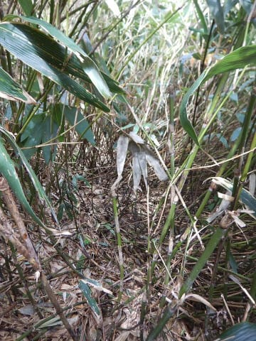
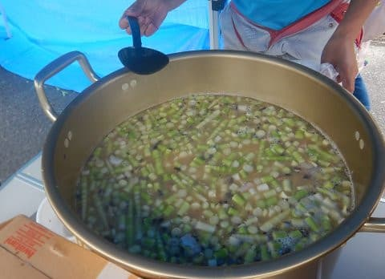

# この時期恒例！志賀高原へタケノコ狩りへ行ってきた

📅 投稿日時: 2019-06-24 03:53:47

🏷️ カテゴリ: [日記](cc4b5682fb7b8b144980957a978653fb0.md)

ここ数年．恒例となってきている

タケノコ狩り．

えー．

タケノコって言っても．

普通の竹のやつじゃなく．

細い笹のタケノコ．

いわゆる「ネマガリダケ」ですね．

こいつを採りに，志賀高原へ

行ってきました～！

天気がちょっと心配でしたが．

タケノコを採っている午前中はうっすら

日も射す程度と．

やっぱり私は天気の神様に

祝福されているようです！←なんのこっちゃ

で．

志賀高原のゲレンデ脇にある，

こんな笹薮．

こういうところをかき分けていくと…

こんな感じで生えている，タケノコちゃん！

こいつを採っていくわけですが…

今年は4月に雪が多かったので．

例年よりタケノコが生えるのが

遅く．

いつもなら6月中旬がピークのタケノコ

ですが．

今年は今週がちょうど今がいい感じの

生えはじめだったようで．

タケノコが生えやすい雨上がりと

いうのもあって．

かなり太い，いいタケノコがボコボコ

生えてました～！

ってな感じで．

タケノコを採った後は，

見慣れたゲレンデをトコトコ歩いて．

駐車場へ戻り…

大タケノコ料理大会です！

…大量のタケノコの皮を，

人海戦術で，剥く，剥く，剥くのだ！

…ネマガリダケって．

皮を剥くと1/3くらいになっちゃうので．

かなり大量に剥いたつもりでも

食べられるのはほんのちょっと．

剥くのが大変です…

採ってきたタケノコは，

一部は皮を剥かず，そのまま焼いて

焼きタケノコになったり…

天ぷらになったり．

山の上で，揚げたての天ぷらが

食べられるとは！！

これは，うまい！！！

うますぎる！！！

焼きタケノコもホクホクして

美味しかったし…

そして，メインはこいつ．

タケノコ汁！

今回は20人という大勢が集まったので，

こんな巨大な鍋で作りました…

そして，山の上で食べるタケノコ汁の

美味しいこと！

これだけでおなか一杯になるシアワセ．

ってなことで．

いつもの志賀高原常連が集まる，

タケノコ狩りイベントでしたが．

…スキーシーズンが終わってるのに．

志賀高原に20人も集まるとは．

みんな，志賀高原への忠誠心が高いなぁ…

と思った，Skier_Sだったのでした．

## 💬 コメント一覧

### 💬 コメント by (はなげ親分)
**タイトル**: Unknown
**投稿日**: 2019-06-24 14:09:21

忠誠心の高い一人です(笑)

楽しかったですね🎵

いつものメンバーとこの時期に会うのも、ゴンドラ以外で話をたくさん出来るので新鮮でした。

もう一回程、何かイベントを期待したいな～❤️

### 💬 コメント by (もりや)
**タイトル**: Unknown
**投稿日**: 2019-06-24 22:02:15

スキーシーズンは毎週の様に滑りに来る仲間と、雪が無くなってもまた、こうして志賀高原に集まりネマガリダケを収穫し、焼き竹の子、天ぷら、竹の子汁と調理し、みんなで楽しく食べるのって凄く良いですよね。

 採りたての天ぷらは格別でしょうね！

### 💬 コメント by (Goku)
**タイトル**: Unknown
**投稿日**: 2019-06-24 23:05:00

山での天ぷらは最高でしたね♪

タケノコ汁は足りないよかイイかなと思って、多く作り過ぎちゃいました(笑)

天気もなんとか持って、ホントに楽しかったですね～♪

### 💬 コメント by (Skier_S)
**タイトル**: 忠誠心の高い皆様へ
**投稿日**: 2019-06-25 00:38:56

＞はなげ親分さま

天ぷらおいしかったです～！

イカの口もありがとうございました．

天気が良くて，もう少しゆっくりできればよかったんですが．

また，夏に集まれるイベントがあるといいですね～！

＞もりやさま

今回はお会いできず，残念でした…

すごくいいイベントでした．

採りたてってだけでおいしいですが，いつものメンバーと

一緒というのもさらにおいしさを増します．

次回はぜひご参加を！

＞Gokuさま

土曜はありがとうございました～！！！

サバ缶や食器など，いろいろな出費＆ゴミの持ち帰りなど，

いろいろご迷惑おかけしました…

でも，天気がギリギリもって良かったですね．

来年は，天気が良くてもっとゆっくりできるといいのですが…

### 💬 コメント by (しんちゃん)
**タイトル**: 楽しかった～
**投稿日**: 2019-06-26 00:31:40

シーズン後、久々に皆さんと元気な姿で会えてうれしかったです。

この日は、山でタケノコ、里でスイーツを楽しむという、信州満喫の一日でした。

この時期、展示会や早期予約会が開催されており、物欲選手権にどこまで耐えられるか。来シーズン、安全に復帰できるよう体と用具の準備を進めてまいります(^^ゞ

### 💬 コメント by (Skier_S)
**タイトル**: ＞しんちゃんさま
**投稿日**: 2019-06-26 01:53:23

楽しい一日でしたね～！

あと，久しぶりに元気な姿を見れて一安心でした．

とりあえず，保険料がでたら，物欲にまみれてください(笑)．

