# 2013シーズン3日目…10月29日のイエティの滑走レポート

📅 投稿日時: 2012-10-30 01:20:33

🏷️ カテゴリ: [2013スキー滑走日記](c91dbe557f9a69230b1600e48622fdd61.md)

っつーことで．

この週末は，日曜に日帰りでまたまたYetiへ滑りに行ったわけですが．

あれですね．

やっぱり．

天気が悪い予報が出ていたからか．

先週よりは人が少なかったですね～．

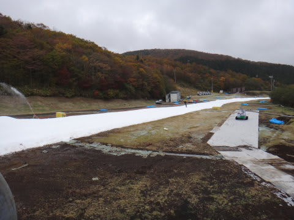

だけど．

午後3時までは本格的な雨になることも無く．

結構滑れたので．

…この時期のYeti.

あえて天気が悪い予報の日に行くのがいいかも？？

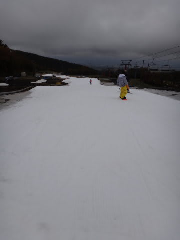

…って思ってみたりしたこの週末でしたが．

さてさて．

結局．

天気は，午前9時～11時までの2時間．

「パラパラ」程度の雨が降り．

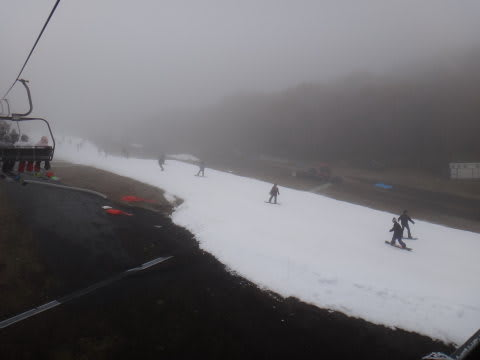

多少ガスっぽい感じになったりもしましたが．

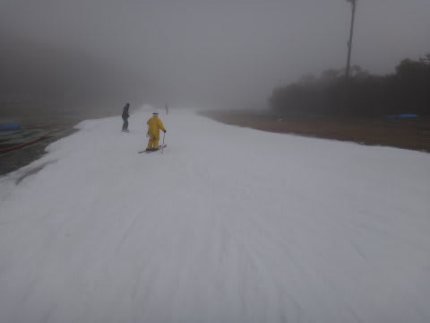

それ以外の時間は降ってもポツポツ，という感じで．

午後3時近くまでは，予想以上に天気はもってくれましたね～．

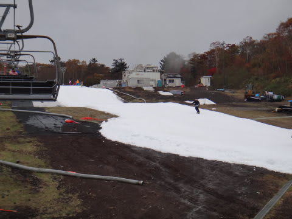

＃午前9時～11時までの「パラパラ」は無い予想だったんだけど…

＃この2時間以外，大体あたりの天気予報だったということで…

で．

リフト待ちは．

平均1-2分程度かな？？

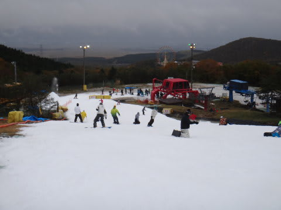

かなりすいてました．

いつもの週末なら，クワッドと平行に動いているペアリフトも運転してますが．

この日はペアリフトは運行されず…

でも，リフトは待っても最大5分行かないくらい．

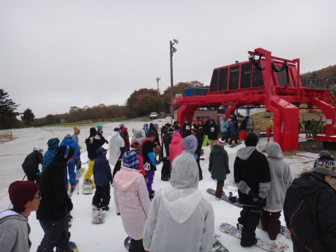

最大でこの程度．

あー．

でも．

あれですよ．

リフト待ちは減っても．

リフトが時間当たり運ぶ人数は変わらないわけですから．

コース上の人の数はそんなに変わらないんですけどね～．

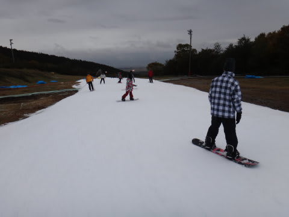

＃ペアリフトが動いてない分，ちょっと少ないかも．

でも．

朝，人が少ないうち．1時間半ほどは，雨もそれほど降ってないのも

あって．

かなり快適…

シーズンインの練習バーンとしては，かなり良い方なのでは？？

コースの雪の状態は…

まぁ，コースの広さは先週と変わらず，ですか．

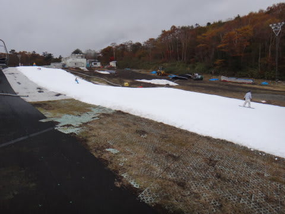

あー．

そういや，

先週はあった，ボックスとかがおいてあったアイテムエリアは

無くなってましたが…

雪は，硫安でしっかり固められているのか．

雨が降っているというのに，昼過ぎでもそれほどどぼどぼにならず．

適度な硬さのバーン．

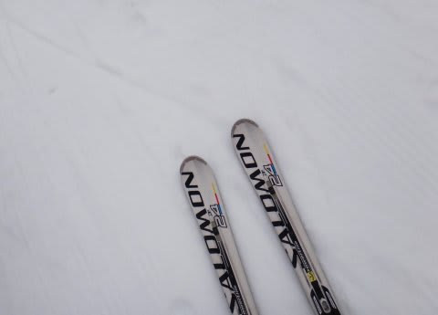

午後に入ると，リフト乗り場前，ちょっと雪が薄くなりつつある部分もあったけど…

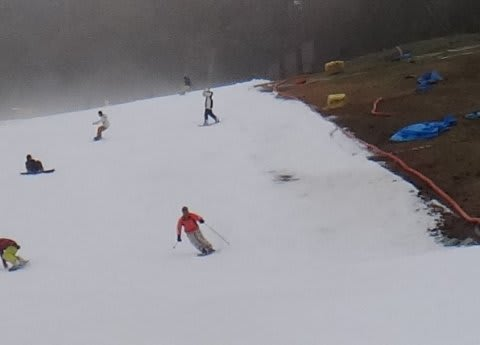

まぁ，石を踏む心配は無い程度．

雪の厚みは十分あります．

リフト乗り場も，板を履いたまま乗り降りできます．

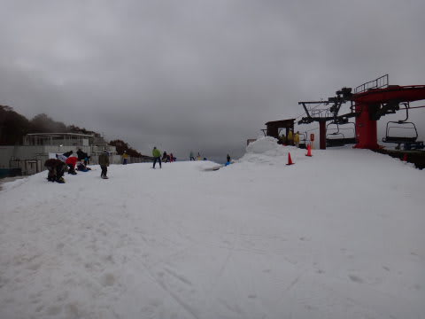

ご安心を．

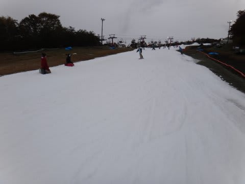

ってことで．

雨の予報で人が少ないのに．

雨が降ってない時間が長く，かなり快適に滑れたという．

晴天の日より良かったのでは？？

と思わせるYetiなのでした．
