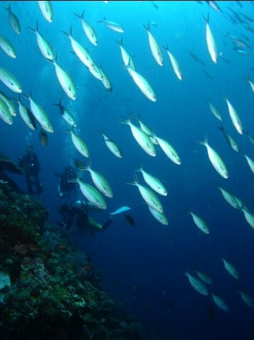

# 2010年7月，2歳の子連れで座間味でダイビング！…プロローグその1

📅 投稿日時: 2021-09-10 06:07:02

🏷️ カテゴリ: [ダイビング日記](ce3a7a8d424d112fce83ee85c81a0e344.md)

えー．

志賀高原索道協会のホームページを

見ていると．

来るシーズンのシーズンパス詳細情報と

受付開始は例年通り10月上旬公開という

案内がありました…！！

([志賀高原索道協会ホームページ](https://www.shigakogen-ski.com/)より)

うーん．

価格が分かるのはまだ1か月先か…

ってなことで．

本題へ．

昨日予告した，10年以上前のダイビング旅行記．

スタートです！

ーーー

それは2010年の，座間味ダイビングに行く前．

[前年のタヒチダイビング](ed1a0981df33d8e447e4cb50a3f342544.md)で，それまで

我が片腕のように，超愛用していたデジカメ，

Olympus C-4040の調子が悪くなってしまい．

（2001年発売のカメラだよ…今から見ると何これ？って形）

（[Olympusニュースページ](https://www.olympus.co.jp/jp/news/2001a/nr010626c4040zj.html)より引用）

とりあえず，これまで長いこと一緒に

過ごしたパートナーなので，心理的に

このまま見捨てるわけにも行かず．

分解して原因を調べたところ，

どうもFPCコネクタの接触不良らしく，

何とか修理して動かせるレベルまで

直したんだけど…

一体またいつぶっ壊れるか分からない，

不安な状態で（涙）

かつ，ハウジングも使い込んでおり，

リターンスプリングはヘタリきって，

ボタンが戻らなくなるわ．

シャッターレバーが折れて，

前使っていたハウジングから

移植しているわ…

…と，満身創痍の状態．

このハウジングで，200本ほど

潜ってるし．

さすがにそろそろ買い替え時か…？？

修理してまだ何とか動いているものの，

いつぶっ壊われるか分からず，

ダイビング途中でぶっ壊れてしまった

ときに限って，

巨大ジンベエザメがマンタ100枚の

群れに突っ込み，イルカの大群が

その回りをぐるぐる…

とかいうシチュエーションに出会う

かもしれません．

そんなときに，カメラが無かったら一生の

不覚です．

死んでも死にきれません． 

しかし．

このカメラ．

もう当時でもさすがに10年前の機種ながらも

レンズ自体はF1.8と異常に明るく，

そして，水中での発色が意外といい！

　

　

…とても，今から約20年前のデジカメの画像とは

思えませんね…！

やっぱり，C-4040．いい絵出しますね…

今のデジカメは，デジタル処理で背景が青っぽく

調整されて，ぬりえっぽい絵になりがちだけど…

（こんな感じで，背景が紺色に締まったグラデーションになってくれない）

古いC-4040は，フィルムっぽい感じで

背景が紺色に落ちてくれますね！

（今のカメラで背景-1.3～-1.7段で調整しても，

　ここまで紺色のグラデーションが出ない…）

　

せいぜい400万画素のカメラだけど，

撮像素子も大きく，レンズもくそ真面目に

大きなレンズのため，

回折限界で画素サイズ以下のレンズの分解能を

もたない（2010年当時の）1000万画素機なんかより，

よっぽどこっちの方が絵がきれいなので．

なかなか後継機が見つからず…

（今のデジカメから考えるとすごいデカい…

　この写真に写っているのは，C-4040の前に

　使っていた同じ外形のC-4100）

とはいえ．

さすがに，この古くさいカメラが利用するのは．

「すまーとめでぃあ」

という，最近の人は聞いたこともないだろう

という旧世代メディア．

容量は最大128Ｍしかないし，この当時でも

入手はすでに不可能…

さらに，ハウジングは今年の7月で8年目に突入．

世界中の歴戦を経て，貫禄たっぷり…

というより，老体に鞭打ってなんとか生きながらえている感じ…

というか，何度か死亡宣告を受けながらも，電気ショックで

なんとか心肺停止から復活してきているって言うか…

…うーーん．

かっこよく言えば，不死鳥のようによみがえっているとも

いえますが，

「ふはははは，ふっかーつ！」

と戻ってくるたびに，傷が大量に増えている感じです．

「もう，次の復活はねーよ…」

と思わずにいられません． 

ということで．

そろそろ交代時期かな，と．

C-4040の後継機探しに取り掛かったの

でした…

（続く）

## 💬 コメント一覧

### 💬 コメント by (マルハバ)
**タイトル**: ウチには・・
**投稿日**: 2021-09-10 07:40:45

もっと古い C-2020 が健在です。

ハウジングもありますよ。

今でもオークション出品の画像撮影に使ってますがホントに綺麗に撮れますよね。

### 💬 コメント by (Skier_S)
**タイトル**: ＞マルハバさま
**投稿日**: 2021-09-11 11:41:20

ええ！！

C-2020ですか！

私は，実はC-2020 ⇒C-3030⇒C-4100⇒C-4040とこのシリーズを

4台乗り継いで使ってます…

C-2020は残念ながら水分が入って死んでしまいました．

やはり海沿いで使うと，バッテリーやメディア交換の際にどうも海水が

数滴入っていたみたいで…

C-3030は落下で破壊，

それでも同じシリーズを乗り継ぐほど，いいカメラでした！

しかし，C-2020がまだ現役って，すごい…

