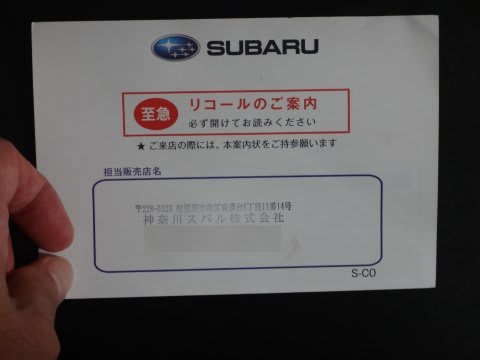
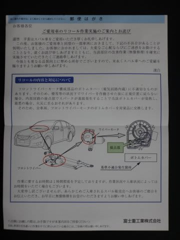
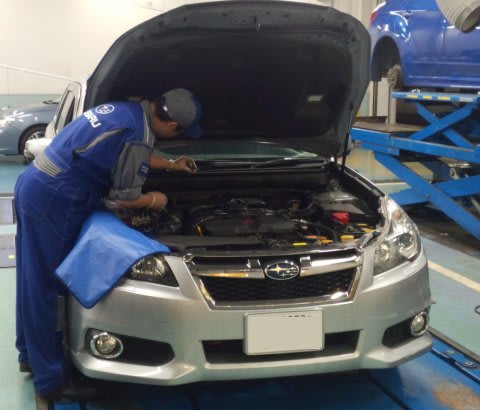
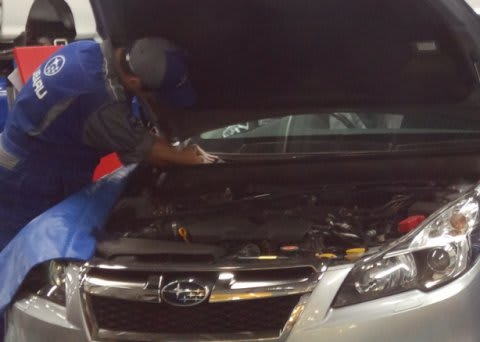

# BRレガシィ，リコールに出したよ

📅 投稿日時: 2016-10-22 02:06:43

🏷️ カテゴリ: [車](cba0e8330b3f2ded7c1addfacc75d4547.md)

えー．

ある日．

我が家に．

スバルから，こんな手紙が届きました…

うむ？

リコールのお知らせですね…

ニュースになってたので，

中身は知っていましたが．

内容を見てみると…

報道されていた通り，雪が積もった状態で

ワイパーを使うと，ワイパーが正しい位置に戻らず，

接点でスパークが生じ発火するかも…

ってことらしく．

…雪が積もった状態でワイパー使ったら危険って…

スキーヤーの我が家にとっては，致命的なんですが…（涙）．

我が車，雪でワイパー使うことが，おそらく

異常に多い使い方なわけで．

それで発火するのは，マズい．

スキー場往復が，走行距離の7割を占める我が家にとって．

雪が降ってる時にワイパー使ったらマズい車というのは．

「水中で使うと危険です」と書いてあるダイビング器材

のようなもので．

はっきり言って，使えない．

ということで．

この週末，ディーラーに持っていきました…

うむ．

ワイパー部分をばらして，部品を交換しているようですね…

約1時間ほどで，対策品に部品が取り換えられました．

おまけに，お詫びのしるしなのか，

ピカピカに洗車してもらえました…

ってことで．

これで，雪道でも安心してワイパーが使えるように

なったな．

さて．これでスキーシーズン，いつでも来い！

＃…って．

＃ホントはこの週末にイエティに行って，

＃シーズンインのはずだったのに…

## 💬 コメント一覧

### 💬 コメント by (yama)
**タイトル**: シーズンイン
**投稿日**: 2016-10-22 06:42:24

21日ナイターでシーズンインしました。金曜日なので混雑すると心配しましたが、なぜか飛び乗り状態で4時間で33本滑って終了しました。今日はどうするか思案中です｡

### 💬 コメント by (Skier_S)
**タイトル**: yamaさま
**投稿日**: 2016-10-22 23:08:44

もうシーズンインですか…

いいですね～

私のシーズンインは来週でしょうか…

また一緒に滑りましょう！

### 💬 コメント by (yama)
**タイトル**: やはり
**投稿日**: 2016-10-23 05:28:32

今日も行きました。さすがに土曜日ナイター飛び乗り状態とは成らず3時間半で27本で終了です｡実は午前中は仕事でした。明日は日曜日は仕事で行けません。来週は日、月曜日と休みです｡日曜日に会えるのを楽しみにしています。

### 💬 コメント by (Skier_S)
**タイトル**: yamaさま
**投稿日**: 2016-10-23 23:46:11

2連チャンですか！

いいなぁ…

土曜はちょっと混んだんですね．

ってか，土曜もナイターのみだったんですね…

今週末も，日曜はダメそうです（涙）．

行くとしても，土曜になります…

上手く予定があいませんね（泣）．

### 💬 コメント by (megalith)
**タイトル**: Unknown
**投稿日**: 2016-10-24 19:34:20

ご無沙汰しています。

リコール自分のところにも来ました。

ですがまだ行っておりません。(^_^;)

何時行こうかなぁ。(^_^;)

### 💬 コメント by (Skier_S)
**タイトル**: megalithさま
**投稿日**: 2016-10-25 02:43:52

お久しぶりです～！

そうですよね．

そちらもリコール対象ですよね…

10分とか20分で終わるのかな…

と思ったら，意外と時間がかかります．

それだけのために行くと時間を持て余すので，

新型インプレッサの試乗ついでにでも

行かれることをおススメします（笑）

もう，試乗車が大体のディーラーに

出そろってきたようなので…

