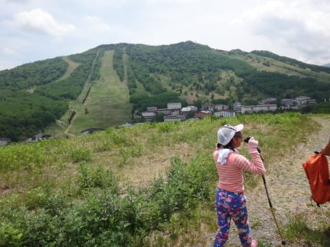

# 先週日曜は…志賀高原へ，根曲り竹のタケノコ採りへ！

📅 投稿日時: 2016-06-19 01:58:13

ってなわけで．

すでに報告したように．

先週末は，月山へ行ってきたわけですが．

…しかし．

月山だけに行ってきたわけで無いのは，

すでに報告した通り．

…そう．

月山を滑った後は…

定番の山菜料理屋，[出羽屋さん](http://www.dewaya.com/access.html)で，

美味しい山菜を食べるのですが…

わが娘．

ここの山菜がたっぷり入ったお鍋で煮る，

山菜そばが大好きだし…

そして，山菜てんぷらも

「月山竹！月山竹！」

と言いながらがつがつ食べる娘．

…おまえ，味覚が子供らしくないんだが…

で．

山菜を食べた後は，

定番のサクランボ狩り！

佐藤錦を食べたいだけたらふく

おなかに詰め込む！！

…そうそう．

最近の我が家のお気に入りは，佐藤錦より大きくて

美味しい，紅秀峰．

娘の手と比べると，その大きさが分かろうというもの…

まだあまり売られてませんが，佐藤錦より

高いお値段らしく．

こいつも食べたいだけ腹いっぱい食べられます．

ってことで．

睡眠時間2時間というのに．

月山→山菜料理→サクランボと満喫し，

新潟県内まで移動，一泊したあとは…

次の朝早くに．

やってきました…志賀高原！

…根曲り竹がピークのこの時期．

タケノコ採りにやってくる人が結構いますが…

部外者は，このようなところで入山券を買わなくては

ならないんだな…

とりあえず．

タケノコを採るために，

ゲレンデをとぼとぼ登って…

適当な笹薮を探して…

いざ，タケノコを探す！

…と．

ボコボコ見つかる，タケノコ君．

うーーむ．

採りに来るのが一週間遅かったのか…

かなり伸びたタケノコが多い感じ．

娘は…

大好物が根曲り竹とサンマという，

子供としては独特な味覚のわが娘ですから．

自分の大好物が地面からにょきにょきと

生えているのを見て，狂喜乱舞！！

次から次へと，「タケノコ，タケノコ！」

とハイテンションで採りまくってます…

その他，ワラビやらゼンマイやらも

大量に生えてますね～

このあたり…

ってことで．

2時間ほど笹薮を這いまわり，タケノコを採ると…

かなりの大量！

さっそく焼きタケノコにしてみますが…

うむ！

採りたてはやっぱりおいしい！

焼きタケノコ，お店だとかなりお高いので．

あんまりいっぱい食べられないことがこれまで

不満だったわが娘．

「タケノコをおなか一杯食べたい！」

と，いつも言ってたけど…

その夢がかなったわが娘．

嬉しそうというか…

ひたすら黙々と皮を剥いてかじりついてますね（笑）

そして，一部はタケノコ汁に…

長野流に，サバ缶を投入したタケノコ汁！

いやー．

どうして，サバ缶とタケノコって，こんなに合うんでしょう！

大好物のタケノコ汁がおかわりし放題…！

娘にとって天国ですね（笑）

もう，タケノコだけでおなか一杯にするという

夢がかなって，シアワセそうです．

…ってわけで．

かなり大量にあった気がするタケノコ汁．

全部なくなっちゃいました…

いや～，おいしかった！！！！

しかし．

自分で採ったタケノコを，その場で料理して

食べるなんて…

すごいゼイタク．

また来年もやりたいな～．

とりあえず．

今回のタケノコ採り，プロデュースしてくれた

[Gokuさん](http://red.ap.teacup.com/gokurakuskier/544.html)，ありがとうございました～！！

## 💬 コメント一覧

### 💬 コメント by (Goku)
**タイトル**: 来年は
**投稿日**: 2016-06-19 20:03:46

案内した身としては、細いのしか採れなかったのが少し残念でした。

来年は太いのいっぱい採って、またタケノコ三昧しましょう。

### 💬 コメント by (Skier_S)
**タイトル**: Gokuさま
**投稿日**: 2016-06-20 08:13:25

月山でもタケノコ探しましたけど，

それよりはずっと太いのばかりで

すごいなと思ったんですが…

志賀高原の実力はそんなもんじゃない，

ってことですね（＾＾

来年も楽しみにしています！

