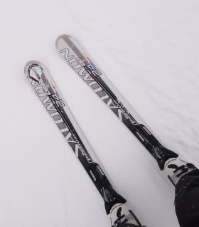

# '11 SALOMON 24hours S5履いたよ

📅 投稿日時: 2012-02-24 01:52:08

🏷️ カテゴリ: [スキー板試乗](c0bd8048615710cee890e403a36cc9a2b.md)

ということで．

またいろんな人の板を履いてるわけですが．

今度は昨シーズンのSALOMON 24hours S5 170cmです．

あー．R=15mくらいですか．

オールラウンド基礎板ですね．

持った感じ，多少重さを感じますが．

今履いているSALOMON 24hours LMと同じで．

履くと予想以上，むちゃくちゃ軽く感じます．

フレックスはしっとり．

角付けするといとも簡単にたわみます．

トップ部分のたわみで，トップが板の向きを決めて行ってくれます．

トップが気持ちよく食い込み，ステアリングしていってくれる感じです．

面を使うというより，きれいにエッジに乗ってグリップして進んでいく板ですね．

でも，コントロールしにくいとか，板のままに曲げられるという感じではなく，

角付け量と回転半径の関係が，まさにフィーリングとどんぴしゃ．

このくらいの弧で曲がりたいんだよな…と思った角付け量で，

ぴったりその通りの旋回半径で曲がるたわみが発生して，

思い通りの回転弧でしっかりグリップしてターンしていける感じ．

人間が意識するのは角付け量だけ．

角付け量をコントロールするだけで，あとは何も考えなくても超オートマチックで

板が曲がっていってくれます．

これは．

これは，いかん．

簡単すぎる．この板．

この板はいたら，バカになりそう…

そういう心配をしてしまうくらい，人間が何も考えなくても板が勝手に

曲がってくれます．

板の張りがそんな強い感じもなく，返りもマイルドなので

疲れない板ですね～．

かといって弱いわけではなく．

スピード耐性も十分．

170cmくらいだと，気持ちいいのはミドルからちょっとロング目くらいですかね．

どっちかというとエッジに乗っていく板なので，板に迎え角つけてショート目のターンを

しようという気分にはならなかったです…．

いやー．

フルオートマチック．

この板に慣れると，他の板では滑れなくなるんじゃなかろうか…

しかし．

しかし．

こういうトップが食いついてエッジグリップで滑っていく板って．

もしかすると，これからちょっと時代遅れになっていくのかも…
