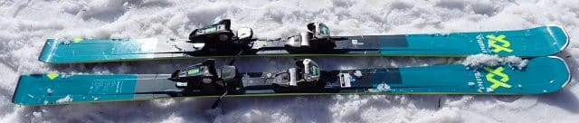
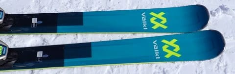
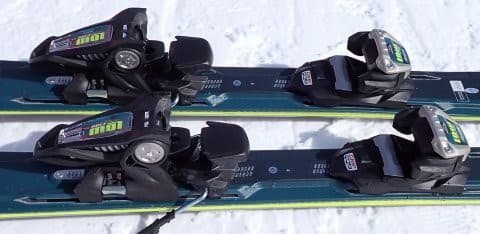
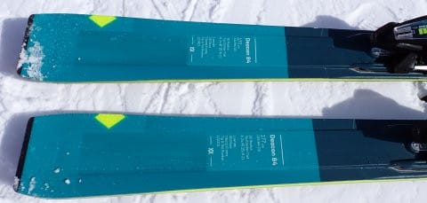
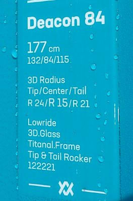

# 試乗レポート番外2…2023モデルのVOLKL DEACON 84も試乗してみた

📅 投稿日時: 2023-06-15 03:05:22

🏷️ カテゴリ: [スキー板試乗](c0bd8048615710cee890e403a36cc9a2b.md)

いかん…

いろいろクリティカル過ぎて，毎日の更新時間が

とんでもないことになってますが…

できれば，日が昇る前に寝たいんだけど…

今週はずっと寝るころには外が完全に明るく

なってる…

今日もまだ仕事が終わってない…（泣）

いったいいつ寝られるのか？？

ってなことで．

今日も書き溜めておいた試乗レポート．

来シーズンの板ではなく，今シーズンモデルの

板の試乗レポート．

フォルクル編です．

では，どうぞ～！！

〇VOLKL DEACON 84 177cm

オールラウンド・オールマウンテン

センター幅84㎜と，セミファットに分類される

板になりますが…

VOLKLは「ある程度の新雪・オフピステの性能も持たせた

オンピステ板」

と定義しているようで．

基本的にはゲレンデ用で，普通のファットでは

無理な硬いアイスバーンでも行けて，さらに

ある程度の新雪などの非圧雪バーン

にも行ける太さがある板…ってことで．

性格的には，圧雪・ゲレンデ寄りの板に

オールマウンテン性を持たせたっぽい

感じですが…

履いてみたところ．

…これ，GS板じゃない？？という

エッジグリップの強さと安定感．

どうせセミファットなんて，スピードを

出したらヘロヘロになるほどフレックスが柔い…

という先入観を持って滑ると衝撃の，

がっつりグリップ板！

硬い斜面でスピードを出していっても，

微塵も負ける気配を見せることなく

カッツリバーンを捉えた鋭いカービングで

斜面を切り裂いていきます．

比較的重量感もあり，グリップ感が強くて

177㎝と長いので，ずらして小回りをする

感じの板ではないけど…

センター付近がR15，トップがR24，

テールがR21という，複合ラディウスの

なせる業なのか．

山回りでかかと付近に圧をかけて板を抑えて

いくと，予想より小さい半径で回ってくれて，

しっかりカービングのまま小回りに

近いところまで行けます！！

なんだこれは！

177㎝のセミファットのくせに，雪面に手を

擦るカービング小回りチックな滑りまで

できちゃうよ…！

幅84㎜というのが絶妙なのか，普通のファット

板で感じる，切り替えの時に板がパッタン

パッタンしちゃう感じの，幅広さで切り替えが

邪魔される感じがなく，

切り替えもあくまでスムース．

さらにメタルのしっかりした張り・返りが

あるので，硬いバーンでも負けずに強い

グリップ感があり，快楽度が高い加速感のある

切り替えもできます．

それでいて，ほかの板だと荒れた重い雪に

板がたたかれて，滑るのにてこずる3月の

昼頃の荒れ気味斜面でも…

比較的どっしりした重量感とフレックスの

強さ，そしてその幅広さのおかげで．

春雪の上を板がたたかれることなく，

まるで整地であるかの如く，楽に滑って

いけるという驚きの走破性を見せます．

いや．

ほかの板だと荒れたバーンに感じる斜面が，

この板だと整地に感じる…！！

おそらく，この幅広さがあるので．

新雪なんかも普通の大回り板よりは

かなり滑りやすいんじゃないかな…？？

強烈なグリップで，整地でも普通の大回り

ベースのオールラウンド板と負けない

くらいの性能もあるし．

意外と小さめの半径のカービングまで行けるし．

それでいて，春雪や荒れ雪の走破性は，

幅の狭い板と比較にならないくらい

高いものがあって，荒れ荒れ春雪でも

整地のように滑っていけるし…

今まで食わず嫌いで，このクラスの板を

試乗しなかったのは間違いでした．

この板，すごい．

かなり気に入りました…！！！

## 💬 コメント一覧

### 💬 コメント by (シルバー・ヘッド)
**タイトル**: Unknown
**投稿日**: 2023-06-15 16:26:37

sさん、こんにちは。やはり「84」いいですね。物欲に負けそうです。因みに「80」は如何でしょうか？

月山のレポート、毎年楽しく読ませて頂いてました。sさんからの月山話題が気になり、5月5日に38年振りに伺って、焼額と同じくクルクルと楽しく過ごせました。ただ、駐車場からヒーヒー言いながら(なんど、滑らずに帰ろうかなと思い)リフト売り場まで行きましたが、最後の登りがキツイ❗️のにFのブーツだと苦もなく余裕のようでしたね。物欲が刺激さます。また、ブルーの基礎用のFISヘッドも気になり、先週末にiの展示会に伺いましたが完売でした。(白は在庫あり)やはり、ブログでの照会に物欲が刺激されますね。

秋までの週末が暇となり、刺激少ない毎日となっていますがブログからの物欲刺激を楽しみにしてます。

### 💬 コメント by (Skier_S)
**タイトル**: ＞シルバー・ヘッドさま
**投稿日**: 2023-06-16 02:42:48

いやー．

Deacon84，いいですよ！！

80のほうが微妙にフレックスが柔らかくてお値段が安いので，硬めの斜面は滑らずに

春の柔らか雪で滑る用にするなら，80でもいいと思います…！

で，HEADのSL FISはもう売り切れですか！？？

いい板だし，やっぱりか…という感じですね．

もしかするとほかの店では在庫があるかも？

エキップさんには残ってないかな…？

### 💬 コメント by (しんちゃん)
**タイトル**: ヤバい板ですね
**投稿日**: 2023-06-16 08:36:53

ヤケビで試乗した経験がありますが、DEACON、物欲を刺激されてしまうヤバい板ですよね。

荒れたバーンでも、自分から板を抑えようとしなくてもまるで整地のように滑走できるし、大回りも小回りもこなせるし、なんといっても太板独特のどっこいしょといった切り替えではなく、ナチュラルな切り替え感覚でした。この板はヤバい。

YASで、すでに物欲を発揮してしまった方もいるとかいないとか（笑）

### 💬 コメント by (Skier_S)
**タイトル**: ＞しんちゃんさま
**投稿日**: 2023-06-17 00:33:51

お久しぶりです～！

この板，ヤバいですよね…

春雪の荒れた斜面では，この板に勝る板はないんじゃないかと思うくらい．

しんちゃんもぜひ物欲に負けてみてください…(笑)

