# 2021/3/12(金)の志賀高原スキー場特派員レポート…終日曇り，雪は硬めのバーン状況

📅 投稿日時: 2021-03-13 00:31:51

なんだか，最近はありがたいことに．

優秀な特派員が毎日いっぱい

写真と実況中継をLINEで送って

くれるおかげで．

このBlogの方が，スキー場公式ホームページ

より志賀高原の毎日の情報がずっと詳しく

知れる

ようになってる気が…

おそらく，このBlog．

日本で一番確実に志賀高原の毎日の

ゲレンデ状況を把握できるサイト

じゃなかろうか？？

と思いつつある今日この頃．

皆様いかがお過ごしでしょうか．

ってなことで．

本日も，特派員の志賀高原情報です！

…で．

今日は朝は晴れる…と思ったところ．

朝から曇りだったようで…

おこみんも心なし寂しそうです．

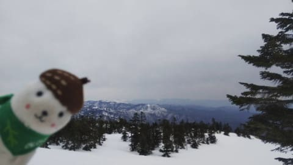

朝イチの気温は-2℃程度と，

高めではあったのですが．

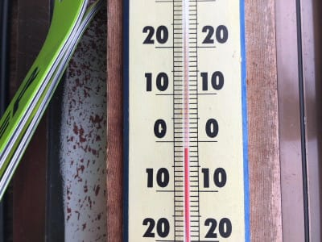

あさイチの焼額のシマシマは，ガッツリ

凍った「電動マッサージバーン」

だったようです…．

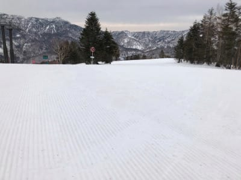

一の瀬ファミリーも，朝イチは

ガリガリ君だったという報告が，

次々入ってきました…

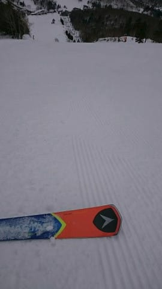

このカリカリバーン，昼近くになっても

緩む様子は全く無く．

焼額GSコースも，午前いっぱいは

かなり硬めのまま．

そして，曇り空で凸凹が見にくく，

ちょっと滑りにくかったようです…

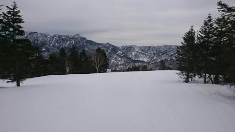

で．

平日なのにそこそこ人がいて．

休日ほどは混まないまでも，

焼額第1ゴンドラもゲートの外まで

並んだり…

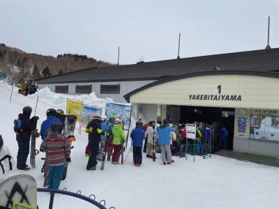

第2ゴンドラも，建物の外に出るか

どうかってくらいまで，人が並ぶ

こともあったようです．

で．

標高が高く，雪が悪くなってない

寺小屋ですが．

今日もそれほどガチガチに固まって

おらず，バーンコンディションは

悪くなかったようです．

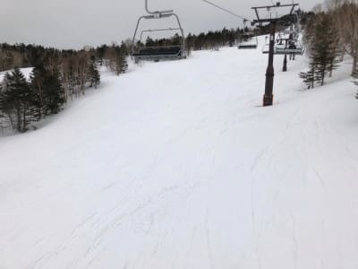

昼を過ぎると，気温はプラスまで

上がったようですが．

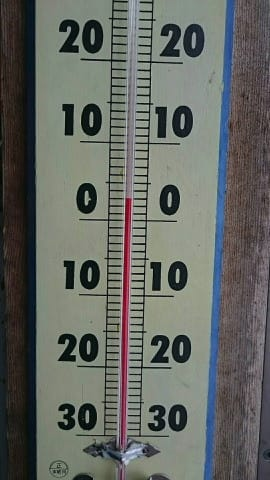

日差しがそれほど強くなかったので，

意外と雪はなかなか緩まず．

とはいえ，昼ごろにはGSコースは

硬めながらもエッジが効くいい感じに

なっていったようで…

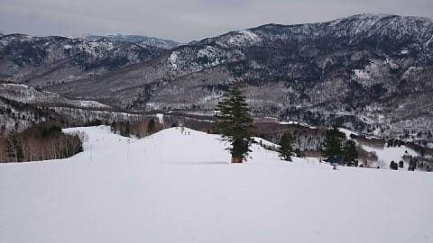

午後は硬い下地の上にうっすらザラメが

乗ったような雪になり．

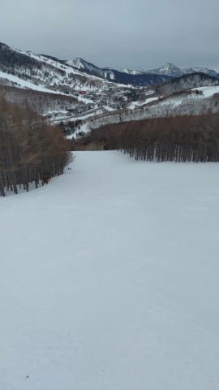

曇りで起伏が見えなかったのが残念

ながらも，いい感じ下地が硬くて

エッジが効くのに，緩みすぎてはいない，

悪くないバーン状況になっていたようです…

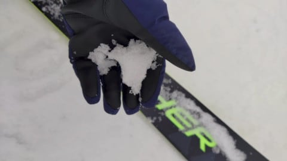

そして．

ゴンドラは多少人がいても．

コースはやっぱりガラガラ！

ただ，最後の方はかなりザラメっぽい

雪になっていき．

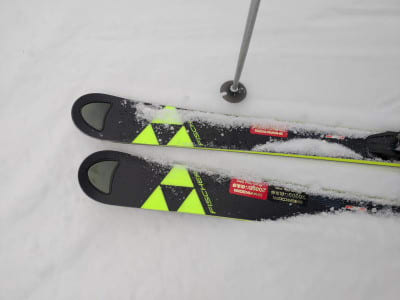

奥志賀のエキスパートコースなんかは，

ちょっと凸凹してきていた

みたいですね…

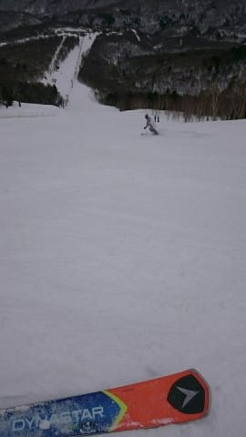

とはいえ，人がそんなに多くもなく．

下地もしっかりしていたので，

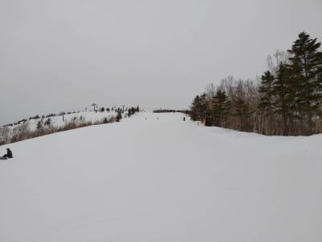

全体的にはラストリフトまで

フラットバーンをキープしてくれたみたいで．

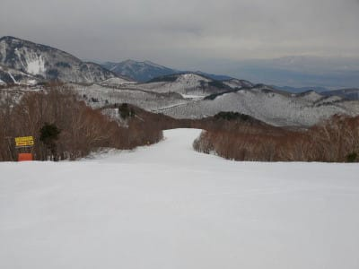

今日もラストまで，かなりの人数の特派員が

滑り続けていたのでした…

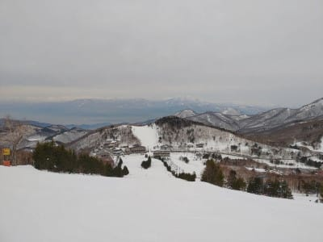

営業開始前からラスリフ終了まで．

志賀高原の写真入り状況が

中継され続けるという，このすばらしさ…

平日の仕事中に，毎日こんなもの見てたら，

…スキーに行きたくなって仕方がないんですが

とりあえず．

私も早く，平日に志賀高原にスキーに行ける

身分になりたい…

ってなことで．

この週末ですが．

やっぱり明日は予想通り，

朝から雨です…

というか．

朝早くから，かなりの雨が降ってるはず．

そして，午後までは雨が降り続き，

時折やんだり，強く降ったりで…

夕方近くに雪になっていくかな？

すごく運がよければ，昼過ぎに

雪に変わるかも…

で．

土曜の夜は雪が降ってくれて．

日曜の朝は5-10cmの積雪！

昼間もパラパラ雪が降り続け，

昼間も5cmほど積もるかな…

…下地はむちゃくちゃガチガチに

硬いけど(涙）

とりあえず．

2月から続く高温期間．

特に，赤矢印で示した2月27日以降は，

ずっと冷えず，雪もまともに降ってませんが．

水色矢印で示した，来週末21日

あたり，ちょっと冷えそうな予想

なので…

そこに期待かな…

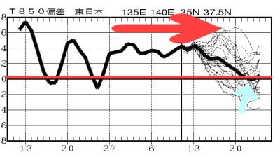

## 💬 コメント一覧

### 💬 コメント by (レインボー73)
**タイトル**: Unknown
**投稿日**: 2021-03-13 07:37:13

お借りします。

朝の七時半。ダイヤモンドは雪だけど、強風が吹き荒れてます。試乗会は時間を遅らせてスタートしますので、よろしくお願い申し上げます。

風はだんだん弱くなる予報なので、できると思います。

しばらくはダイヤモンドの休憩所でウロウロしてます。

### 💬 コメント by (新米パパ)
**タイトル**: Unknown
**投稿日**: 2021-03-13 08:31:59

8時半、やけび、奥志賀、リフトもゴンドラも運休中

### 💬 コメント by (レインボー73)
**タイトル**: Unknown
**投稿日**: 2021-03-13 13:58:07

土曜日の志賀高原情報

雨の湯田中を不安感満載スタート。途中から雪になるも試乗会のダイヤモンドはすんごい南東風。こりゃ無理だ！

奥志賀は当然として、ヤケビもだめ。あっかーん！

ところがファミリーÀ線、Ｂ線が動いてくれたのです。ありがとう！当然行列ができますが、短いÁ線が比較的空いてました。

10時にはファミリークワッド始動。混雑を避けてタンネに逃げるも、考えることは皆同じ。凄い列。

### 💬 コメント by (レインボー73)
**タイトル**: Unknown
**投稿日**: 2021-03-13 16:22:17

土曜日の志賀高原情報２

強風が雨まじりの雪を吹き付ける。こんな悪条件なのに皆さん頑張ってます。我らはレインボーまで持たず、昼過ぎにあっさりリタイア。

良かったのは昼前のパーフェクタ。上部はフラット快適バーン。気持ちよく滑っていくと、ゴーグルに雪がへばりついて見にくくなった最後の急斜面がボコボコ。私なら当然バランスをくずしますよね。ならばと２回目はリベンジ成功。

12時頃にダイヤモンドご始動。下から見ると横に白い筋が。白い部分は吹き溜まり、青い部分は氷。手強いバーンです。案の定、厳しかったそうな。よかった、やめて。

仲間はそのあとヤケビへ行ったら、もう搬器を片付けている最中。やむなく山の神でとんぼ返り。雨も降ってきたので、そこまでして滑る根性は持ち合わせてない軟弱な仲間はリタイア（もっと早くにリタイアした奴は誰だ！）。明日のパウダーに胸が踊ります。エス様、いまでしょ！

### 💬 コメント by (レインボー73)
**タイトル**: Unknown
**投稿日**: 2021-03-13 16:37:16

ヤケビのカラマツ（二高）は故障だそうです。明日も復旧の目処がたたないそうです。皆様、よくご確認の上ご移動を！

### 💬 コメント by (Goku)
**タイトル**: 行かない勇気
**投稿日**: 2021-03-13 21:06:22

今日の悪天候を予想して、我が極楽派スキーヤーは行くのをやめて正解だったようです。

行ってみないとわからないと思いつつ、時には行かない勇気も時には必要かと・・・

### 💬 コメント by (西舘の息子)
**タイトル**: 相変わらず長文記録を達成しそうでごめんなさい。
**投稿日**: 2021-03-14 00:07:07

今日はレインボーさんのレポートの通り、悪条件のオンパレードのような日でしたが（妖怪板つかみが居なかっただけマシ）雨のような雪のような環境の中粘っていたら、丁度ダイヤモンドが動き始めたタイミングに出くわして、誰も滑ってないバーンを滑ることが出来ました。これだけで今日頑張った甲斐あって良かったなと。

リフトは大渋滞ですし、雪も重いしでしっかり板毎の比較を出来たわけではないですが、太板の試乗レポートはこのブログでは貴重だと思いますので、第二弾実施します！

●LINE BLADE 176cm

エキップ社長一押しの太板。LINEが初めて地面からスキーが離れないPVを作ったと話題になりました。僕個人としても一番乗りたかった板です。

まずリフトに乗って、風が強いのもあって、なんだこの風の抵抗の強い板はと思ったのがファーストインプレッション。

とはいえ滑ってみると、R13相当の板の通り凄く小さく回れます。ただ太いので簡単に扱えるというわけでは無く、万人向けでは無いと思いましたが、板を倒すのが大好きなS様のような方には凄く向いているのでは無いでしょうか。

勿論太板なので、今日みたいな重い雪でも、障害を蹴散らして滑って行くように感じました。

物欲を刺激する危険な板でした。

●K2 MINDBENDER 90Ti / K2 MINDBENDER 99Ti

太さの違う二本の板を乗り比べ。センター幅90の方は案外普通。尖ってないので別にいいかなという感じ。悪い板では無いので、気軽に扱える太板入門という感じではないでしょうか。

しかしセンター幅99の方は最早別物で、丁度ダイヤモンドオープンで一番乗り出来たのもあり、ちょいパウダーを滑れたのもあって、素晴らしいパウダー性能を実感しました。少しパウダーなのに抵抗を感じませんし、なめらかにターン出来ます。人が大分滑って荒れてきても、BLADEと同じように蹴散らして進んでいきました。

●HEAD KORE 93

レインボーさんも持ってる板という事で、乗せて頂いたところ。何でも出来そうな予感。しっかりグリップしてくれているし、しっかり回ってくれるので、レインボーさんもお世話になっている偉大な師匠の滑りを練習するにも最適に感じました。

安定感も凄くあって、どこを滑っても恐怖感は無いと思います。

ドーベルマンの沼に引き込まれた僕ですが、やはり板は太い方が好きなのかもしれません

### 💬 コメント by (Skier_S)
**タイトル**: 明日は雪
**投稿日**: 2021-03-14 01:31:42

＞レインボー73さま

今日は過酷な状況だったみたいですね…

この悪天候は，決してスキーに行けなかった私の恨みではありませんので！

でも，試乗会行きたかった…

＞新米パパさま

レポートありがとうございます！

今日，結局滑られたのですか??

＞Gokuさま

今日は休んで正解の一日です…

私もいろんな未練なく一日仕事に打ち込めました

＞西舘の息子さま

今日，この天気でも試乗会あったんですね…！

レポートありがとうございます．

いろいろ参考になる人も多いのでは…？

また，物欲刺激されてるようですね(笑)

