# 2009年　初の海外子連れダイビング旅行記　2　Way to Borabora Is.

📅 投稿日時: 2012-08-28 00:48:04

ということで．

…日本時間の夜のフライトは予想以上に楽に乗り越えられたなぁ…

って感じで．現地時間朝8時過ぎ，日本時間では夜中の3時ごろ

パペーテ・ファアア国際空港に到着～．

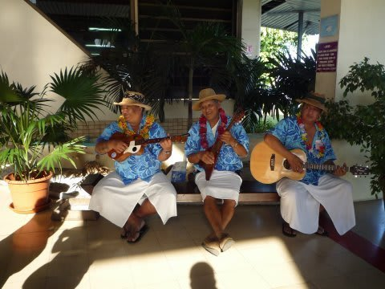

パペーテ到着の儀式である，タヒチ音楽生演奏の中でティアレの

花の手渡しを受けて，入国審査へ．

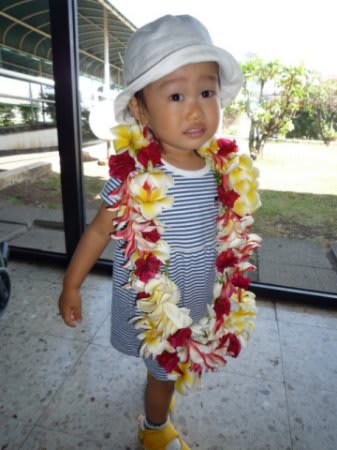

なんか，娘のサイズと比較するとちょっと巨大すぎ(笑）．

入国審査を突破したら，すぐに国内線ターミナルへ移動し，

ボラボラ行きの国内線の搭乗手続きを済ませ，国内線へ乗り換えです．

乗り継ぎ時間が2時間とちょうど良い時間なので，30分も待たずに搭乗開始．

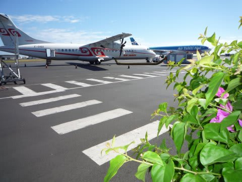

すばらしいベストなタイミングの乗り継ぎだこと…．

で．

この，ボラボラ行きの国内線も．

子供がいたのでぶっちぎり優先搭乗．

んで，タヒチの国内線，自由席なので早く乗れば好きな座席に

座れるんですよね～．

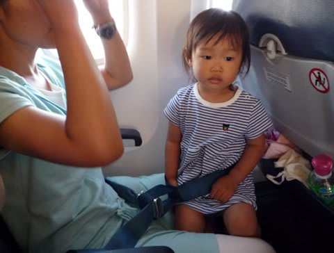

ボラボラ行きで「勝ち席」と思われる左側，前方の席をＧｅｔ！

我々が着席したころ，ようやっと普通の乗客が乗り始めてきます．

うふふ．何か特権階級になったような気分…

で，国内線に乗った娘．まだ日本時間で言えば朝5時ごろ

なので，空港待合室で元気にはしゃいでいた娘も，

乗ったとたんにまたコテンと寝てしまいました．

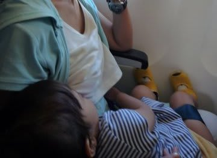

途中経由地をはさんだ約1時間半のフライト，目を覚ますことなく

目的地までぐっすり…

というわけで．移動第2段階もまったく問題なくクリア．

…なんだか．

あれだけ危惧していた長距離移動．

飛行機の中で一度もぐずることなく，11時間の国際線→1時間半の国内線という

二つのフライトを乗りこなし．

あっさりボラボラに到着．

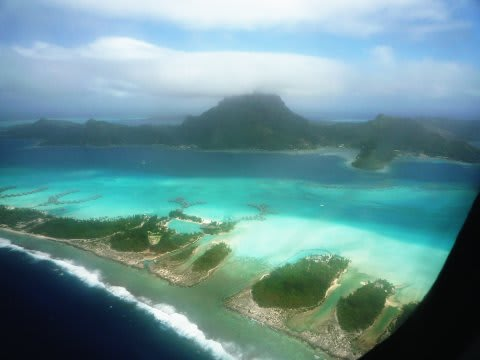

…なんだか．

心配していたのは何だったの？？？

って．拍子抜けするくらい何の問題もなく着いちゃったなぁ…．

ボラボラの空港で飛行機から降り，

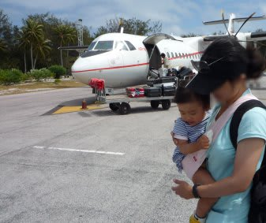

原始的な手荷物受け取りをしたあとは，

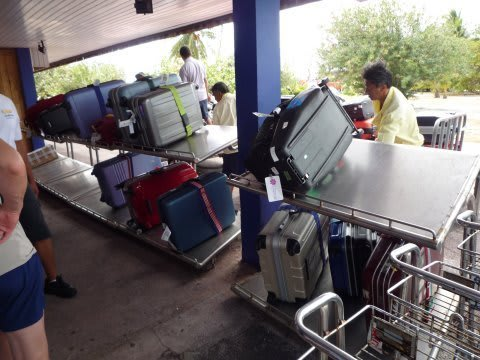

空港は，ボラボラ本島からわずかに離れた島にあるので．

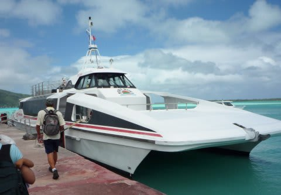

20分ほどこんな船に乗って，空港のある島から本島に向かいます．

この船から見る海の色のすごさといったら！！！

これだけで，ボラボラに来た価値が十分あるのでは…と思える美しさ．

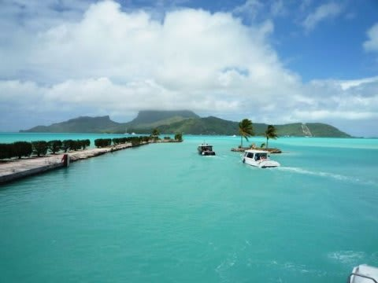

もう，この船に乗り終わっただけで

「満足．これで帰っても悔いは無いっ！！」

と思わせるほどです．

＃ホントにこの船に乗っただけで帰るのはイヤだけど

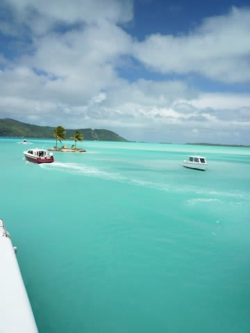

いやーーー．

タヒチに来たっ！！！！！！

って感じ．

で，本島に到着したら，ホテル送迎の「ル・トラック」で

ホテルへ移動し．

現地時間ちょうど12時ごろ．

家を出てから約20時間．

この間，娘はまったくぐずることなく．

無事，ボラボラでの宿泊地である「ノボテル・ボラボラ」に到着したのでした… 

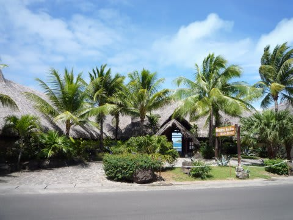
