# わが愛車，スバルレガシィのキーレスエントリのリモコン電池を換えてみたよ

📅 投稿日時: 2017-01-27 02:47:40

🏷️ カテゴリ: [車](cba0e8330b3f2ded7c1addfacc75d4547.md)

えー．

土曜ですが．

朝は結構冷え込みそうな予想になってきましたね～．

土曜の朝イチは，冷え冷え圧雪（もしかしたらうっすら新雪？）の，

かなりいいコンディションになりそうです…！

…日曜は相変わらず高温になりそうですが（涙）．

ってことで．

つい先日．

わが愛車，11万4000km熟成済みのレガシィ君．

3年ちょい使った，キーレスエントリのリモコン．

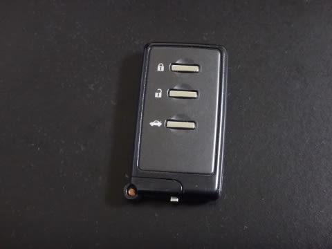

…こいつの電池が減ってきたようで．

車のインフォメーションディスプレイに

「キーの電池を交換してください」

って表示が出るようになりました…

ふーん．

リモコンの電池が減ると，ちゃんと教えて

くれるんだ…（ちょっと感動）

だもんで．

リモコンの電池を換えてみました…

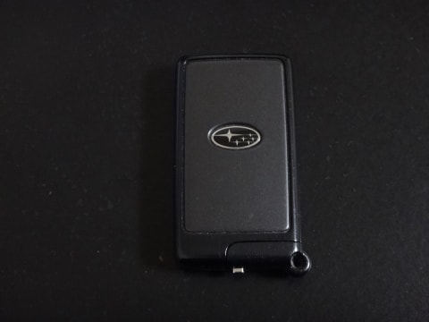

まず．

リモコンに内蔵されているメカニカルキーを外して…

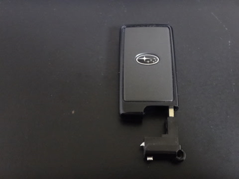

あとは，リモコンをこんな感じで．

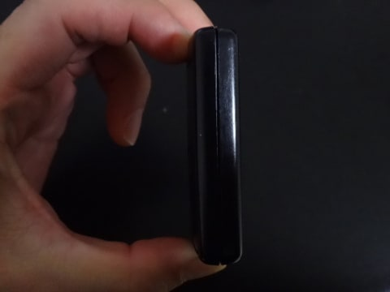

隙間に爪を入れて，ぐっと左右に引っ張れば，

結構簡単にぱっかりと開きます．

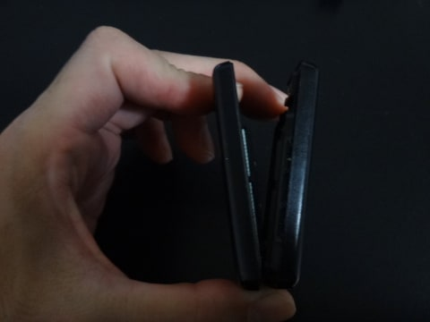

この写真だと，メカキーが刺さっている側から

開いているように見えますが．

実際は，長い辺の側面側の隙間に爪を入れた方が

開きやすいかな…

まぁ，どこからでも「えいや」って感じで

左右に広げれば，パキっと外れます．

中身はこんな感じで…

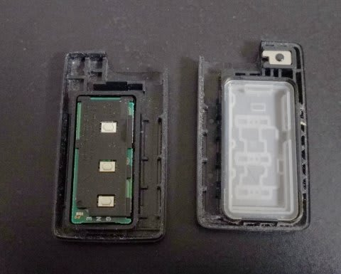

この，ボタンがついている側を裏返すと，

電池が入ってます．

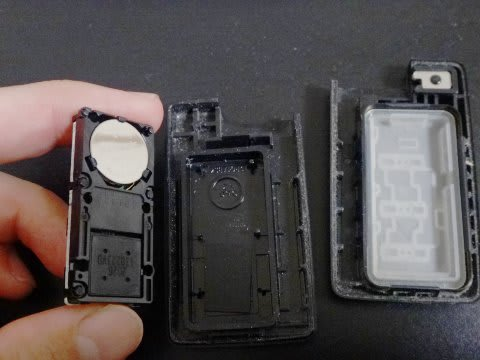

電池は「CR1632」．

電気屋やホームセンターで普通に売っている，

ボタン電池です．

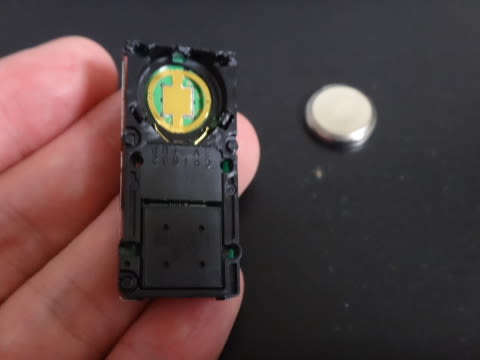

電池は爪で抑えられているので．

爪を外すようにしてやれば，

電池は簡単に外れます．

で，新しい電池を入れ替えて．

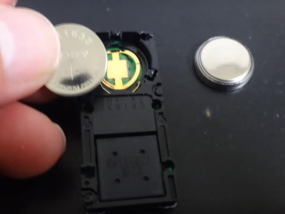

パチンと抑えると，きれいにはまるので．

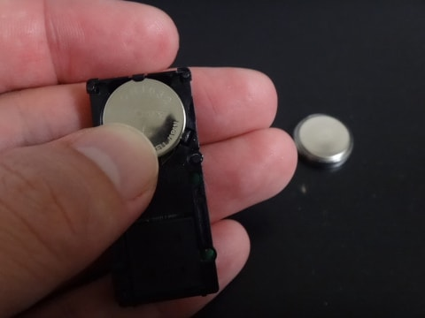

そうしたら，元通り蓋をしてあげましょう…

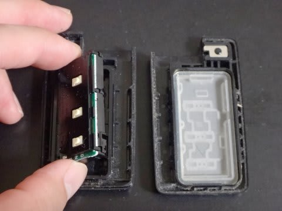

最後はこうやって，ぐぐっと抑えると…

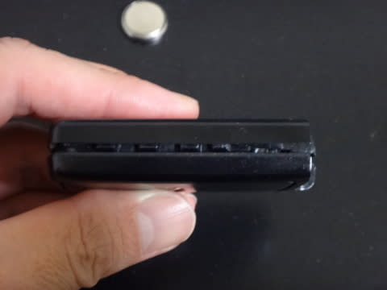

これもまた，パチンとはまります．

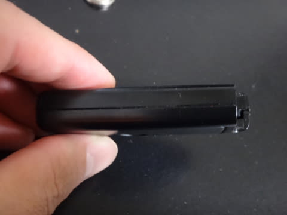

はい．

これで完成！

電池交換，1分もかからずに終わります…

ってことで．

キーレスリモコンの電池．

ディーラーに行かなくても，

自分で簡単に換えられますので．

ぜひお試しを…

## 💬 コメント一覧

### 💬 コメント by (イエティヒロちゃん)
**タイトル**: 早く教えて
**投稿日**: 2017-01-28 00:18:32

ご無沙汰です。11月３日以来です。キーレス此れ迄、二回交換。一般鍵屋さん、コレは難しいとかで、最寄の販売店で1500円した記憶。自分でもトライしたが壊したらヤバイと思い優しく終わったのが駄目だった。これからは、よろず相談しますね（笑）。正月志賀逢えず残念でした。

### 💬 コメント by (Skier_S)
**タイトル**: ひろちゃんさま
**投稿日**: 2017-01-28 21:40:50

え？？

1500円もするんですか？？？

うーむ．

自分でトライしたほうが絶対いいですね…

次回は相談してください（笑）

