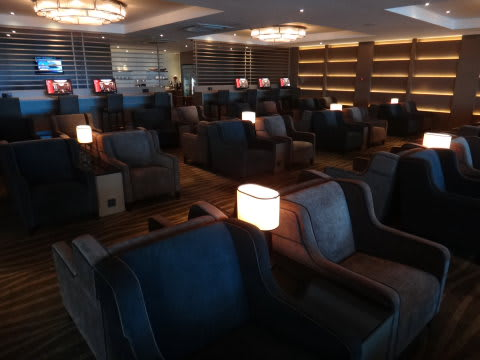
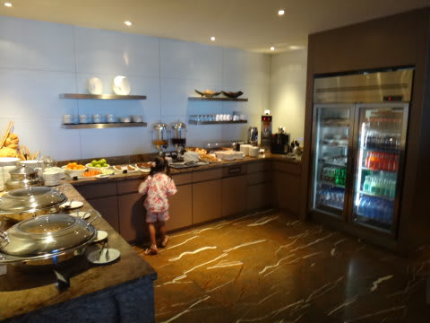
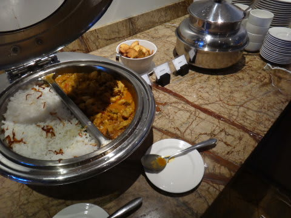
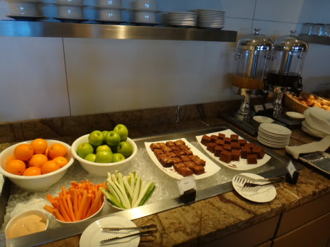
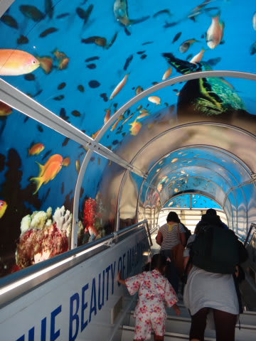
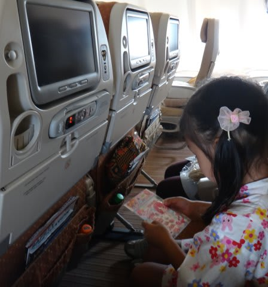
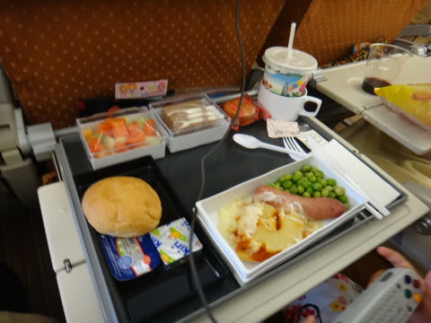
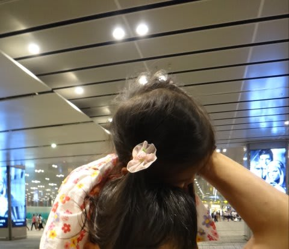

# 2012年　子連れモルジブ　ダイビング旅行記　その27

📅 投稿日時: 2012-12-19 01:13:07

えーー．

19日から20日は．

スキー場は冷えて，いい雪が積もりそうですね～．

で．

この週末，

3連休ですが．

それまでこのいい雪がもってくれればいいんですが．

なんだか…

土曜22日の天気は微妙ですね～．

今のところ，標高が高いところはなんとか雪になってくれそうな気はしますが．

南風で気温が上がり，標高が低いところでは雨の可能性が高いです．

雪になっても，ちょっと重めかな…

…でも．

だけど．

23，24日は…　クリスマス寒波がやってきそうな予感！

23，24日の2日間．すごい冷えます．んで，積もりそうです…

＃吹雪でリフトが動かないかも

ということなので．

モルジブダイビング旅行記，行ってみよう！

＃何が「ということなので」なんだろう…

---------

モルジブの空港で，シンガポール行きの搭乗を待っている間．

とりあえずスターアライアンスゴールドのラウンジが使えるので．

入ってみると…

ラウンジも，以前と変わったなぁ…

ちょうど昼ごはん時でおなかが減っていたので．

あとで機内食が出るとわかっているのにいろいろ食べてしまう自分…

このラウンジ，アメリカとか日本国内より食べ物は揃ってますねぇ．

そして，午後2時ごろ．

シンガポール・チャンギ行きに搭乗！

…さすがモルジブ．

タラップのフードが…お魚模様なんですけど．

あーーー．

行きはそれほどでもないけど．

帰りの飛行機というのは，辛く感じるもの．

でも．

娘は．

行きだろうが帰りだろうが，飛行機に乗れるのがうれしいらしく．

いつもどおりのハイテンション．

機内食を食べて…

ちょっとだけ遊んでいると．

あっという間の約4時間．

娘にとって，シンガポールまでの4時間のフライトは短いようです…

シンガポール到着は夜10時半．

娘はそろそろネムネムな時間だったので．

空港内の乗り継ぎのため移動中，肩車の上で寝ちゃいました…

