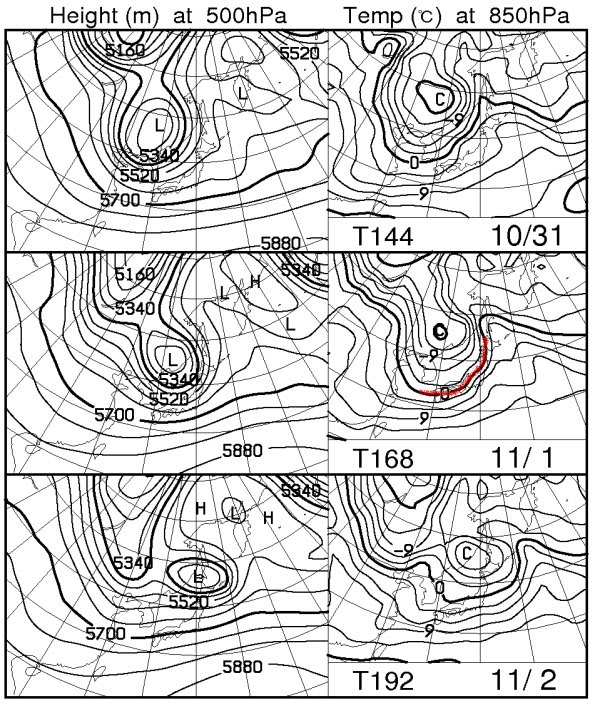
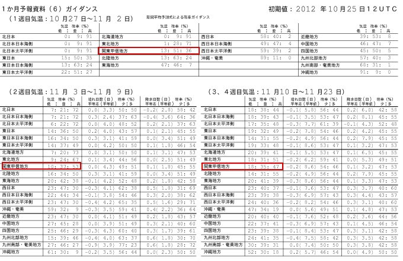
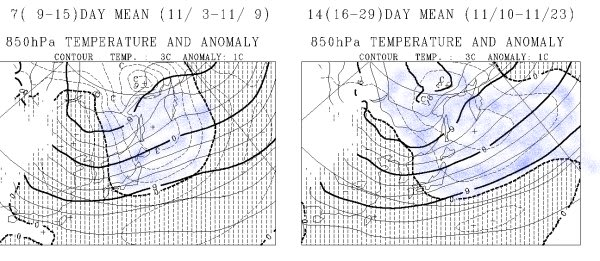

# 2013シーズン初！今週末のスキー場の天気は？Yeti編

📅 投稿日時: 2012-10-27 02:01:44

ってことで．

今シーズンも懲りずにやります．

スキー場の天気予想．

今回は，Yeti編．

えー．

私は，志賀高原補正をかけて天気図を読むテクニックはありますが．

Yeti補正パラメータは身に着けておりませんので．

精度は多少低いかも…

でも，行ってみよう！

というわけで．

この週末のイエティです．

天気予報が言うとおり，土曜は晴れますね～．

気温も上がり，日が射すので．

雪は結構緩むでしょう…

で．

日曜．

意外と，午前中は持ちそうな気配．

晴れとまでは言いませんが…

昼近くまで雨は降らずにいてくれますかね．

降ってもぽつぽつ程度．

本格的に降り始めるのは…

昼過ぎですかね．

運がよければ，午後3時くらいまで持つかも．

…で．

その後の天気なんですが．

[専門天気図](http://n-kishou.com/ee/exp/exp.html)の，週間予報支援図，FXXN519を見ると…

赤く示した線．11月1日の850hpaの0度線が，本州にかかっています．

…これは，山間では雪になる目安．

11月1日は，全国のスキー場で，初積雪のニュースが流れるでしょう！

…しかし．

しかし，だ．

FCVX15，1ヵ月予報資料 ガイダンス月平均 を見ると…

こんな感じで．

赤く囲んだ部分，関東・甲信の気温予想．

11月3日以降は，50％前後の割合で．

例年より気温が高くなりそうなのだ…

さらにFCVX12 1ヵ月予報資料 アンサンブル平均図でも…

こんな感じで．

11月3日以降は，青く色を塗った例年より気温が高いエリアが，東日本をすっぽり覆っており．

なんだか，11月いっぱいは．

2007/2008シーズンの11月の奇跡の大雪のような，恵みの雪は．

期待できなさそうなのだった…(涙)
