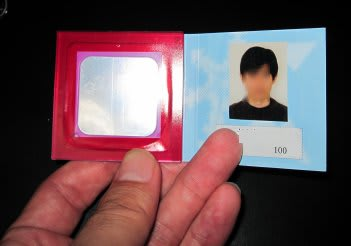

# 志賀高原のシーズン券が届いたよ

📅 投稿日時: 2011-11-24 01:17:17

本日は．祭日のようですね…

しかし．

私はいろいろな理由でスキーに行っておりません（涙）

とりあえず．

本日は[予想通り](ec54d07cd7f58427e9cf596cc79b66c22.md)ちょっと気温が上がり気味で，雪が少し減ったみたいですな．

でも，[湯の丸もオープン](http://www.yunomaru.co.jp/)したみたいで．

さてさて．

我が家の必須アイテムが，無事届きました．

じゃじゃーん．

志賀高原のシーズンパスです！

あ，2枚あるのは，私と妻の分で2枚です．

去年は…

こんな感じでICチケットが埋め込まれた…

こういうコンパクトサイズでしたが，

今年はゲートシステムが変わったので，それに伴ってカードになりましたね～．

しかし，一応顔写真部分はぼかしを入れてますが．

ぼかしがない状態でも，なんだか心霊写真みたいなぼんやりした写真なのが気になる…

とりあえず．これまでよりずっと感度が良くなり，

アンテナにチケットをぴったりくっつけなくても大丈夫になったという

ゲートシステム．

どんなになったか楽しみ．
