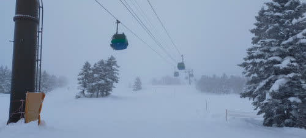
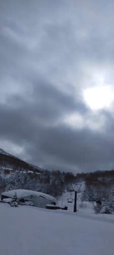
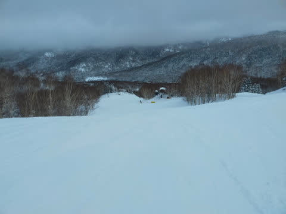

# 2022/1/15(土)の志賀高原スキー場は…終日曇りながら，冷え冷えトップシーズン雪質で平日並みのガラガラ！！

📅 投稿日時: 2022-01-16 00:17:46

ってなことで．

この週末も志賀高原へやってきてますが…

いやーーー．

金曜日の朝までの積雪1mは半端なかった

感じで，ゲレンデはムチャクチャ積もって

ます…！！

ただ，志賀高原の登りの道路は昨日と違って

ちゃんと除雪されてます！

いつもの志賀高原の登りの道路を登って

これる車なら大丈夫です…！

ってなことで．

いつもの焼額朝イチの営業開始前に

並びますが…

今日はいつもより列が短い感じで，

今日はあんまり混まなさそうな予感…！！

で．

8:30の通常営業開始と同時にゴンドラに乗って

山頂に行くと…

気温は-12℃と，

　-10℃をちょっと下回る程度

という予想はおおむね当たりです…！

そして，残念ながら晴天ではなく．

　朝のうちは雲が残る

という予想通りの曇り空でスタート．

昨日は1m積雪のバフバフ新雪だったけど．

今日はその雪がしっかり圧雪されて…

柔らかめの圧雪の上に1-2cmの軽い新雪が

乗った滑り良いバーン！！

うっすら新雪が乗っているので，シマシマ

ではないけど．

トップシーズンらしい，冷え冷え最高雪質の

勘違いバーン！！

この時期ならではの柔らかめの，

エッジがガッツリ食い込む最高の

ヤケビクオリティ―圧雪！！

…いつも思うのですが，

焼額の圧雪クオリティーはすごい．

志賀高原で圧倒的に圧雪が上手いのは

焼額です．

本日，志賀高原の他のスキー場は金曜の

モフモフ雪をきれいに圧雪しきれず，

バーンに段差がかなりあったようですが…

今日の焼額の圧雪はピカピカフラット！

そして…

正月休み＆3連休が終わった今週．

滑りに来てる人は少ないのか．

ゴンドラはゲートの外まで並ぶことは

なかったし…

バーンは終日ガラガラ！！

雪が柔らかいのでバーンがすぐに荒れるかと

思ったけど，

驚くことに，今日は冷え冷えやわらかトップシーズン

雪なのに，終日フラットという，恵まれた一日！！

で．

午前中は予想通り雲が多めでしたが．

昼になってくると，雲が薄くなってきて，

空が明るくなってきましたよ！！

さぁ．

太陽もうっすら見えてきたし．

予想通りなら，雲が切れてこれから

すっきり晴れるはず！！

気温は冷え冷えでゲレンデはガラガラなので．

後は晴れてくれれば文句なし！

さぁ，予想通りなら晴れるはず…

だけど…

あれ？

まだ日が射してないですね…

午後になりましたが…

うむ．

…

いや．

晴れてる．

これは，晴れだ！！

…これは，私の心の中では晴れですね．

Skier_S基準では晴れです！

これは晴れてます！

皆さま．

（心眼で）ご覧ください！

この見事な晴天を…っ！！

…嘘です．

すみません．

晴れてません（激泣）

予想外しました…

今日は営業終了まで，雲が切れない

曇り~うす曇りの一日でした（泣）

ってなことで．

今日は予想を外して，全く晴れ間の無い

曇り空の一日でしたが，

ゴンドラ待ち時間も全くなく，

「今日は平日か？？」と勘違いするほどの

ガラガラのフラットバーンを営業終了まで

ひたすらグルグルし続けられた，

シアワセな一日でした…

いやー．

志賀高原に来て，もうかなりの年数がたちますが．

今シーズンは，史上最高クラスに積雪が

多いシーズンです…！！

明日もすっきり晴れず，雲が多めかもしれませんが，

ガラガラで雪も良く，朝イチは冷え冷えシマシマの，

いい一日になりそうな予感…！！

## 💬 コメント一覧

### 💬 コメント by (みこみん)
**タイトル**: Unknown
**投稿日**: 2022-01-16 12:38:53

こんにちはー☀️

志賀高原、今日は朝からポカポカ最高ですね〜⛷

朝イチ焼額、お昼ジャイアント、今から奥志賀へ行きます〜どこも雪質最高なので、思い切り滑って楽しみまーす⛷

因みに、今の気温は、ジャイアント＋4度でした☀️

春スキーのような暖かさです😀

### 💬 コメント by (みこみん)
**タイトル**: Unknown
**投稿日**: 2022-01-16 12:51:41

私は、明日帰るのですが、明日も晴れると良いな〜☀️

Sさんは、今日までですか？

### 💬 コメント by (レインボー74)
**タイトル**: Unknown
**投稿日**: 2022-01-16 14:35:26

日曜日の志賀高原情報

朝の上林-6℃　蓮池-6℃。晴れて絶好のスキー日和。幸せ度満開です。

パノラマの壁はシマシマ勘違いバーン。カラマツも、オリンピックもGSもシラカバも、どこもかしこも、パウダーはないけど快適です。

FTでは仲間が狂ったように(？)かっとばせる好条件。ヤケビの圧雪には隙がないからこそできるんですよね。

でも、明日からの人口密度の薄い平日に期待を込めて、午前終了。

### 💬 コメント by (Skier_S)
**タイトル**: この週末も良かった…！
**投稿日**: 2022-01-17 02:42:38

＞みこみんさま

今日は良かったですね～！！

予想通り，ちょいプラスに気温が上がりましたが，焼額は

終日最高雪質でしたよ～！

私は月曜から当然のごとく仕事があるので，残念ながら日曜で帰ります（涙）

＞レインボー74さま

いやーー．

今日の焼額はよかった！！！

あさイチは間違いなくシーズンベストでしたね！

そして，ラストまでパノラマの壁は最高でした…

