# なんと．焼額山スキー場がGoogleストリートビューで見れるようになってるよ！

📅 投稿日時: 2016-09-25 03:51:12

そうなんですよ．

どうやら，9月20日に公開されたようで…

[志賀高原観光協会のWEBページ](http://www.shigakogen.gr.jp/news/entry-320.html)によると．

中央エリア（サンバレー，丸池，蓮池～西館，東館，寺子屋，一の瀬），

焼額，

熊の湯

横手・渋

のゲレンデがストリートビューで見れるとのことなので．

とりあえず，見てみました～！

まず．

これは…

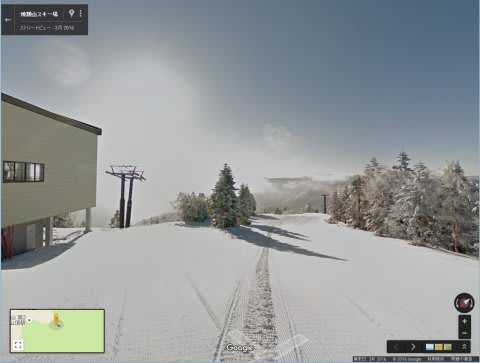

をををを～！

いきなりの焼額第1ゴンドラ！

それも．これは…

朝イチピカピカバーンじゃないですかっ！！

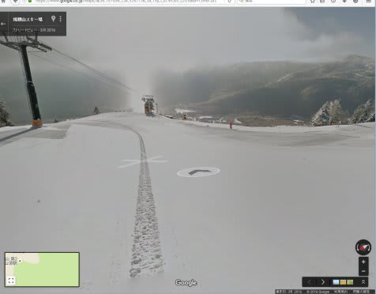

うほーーーー！

気持ちよさそう～．

どうやら，影を見ると．

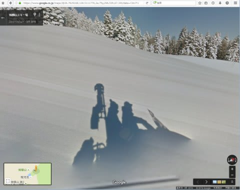

ここは，スノーモービルに撮影機材を乗せて．

朝イチのオープン前に撮影したようですね…

オリンピックコースとGSコースの分かれ道．

左側のGSコースに行ってみます…

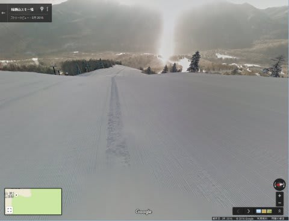

気持ちよさそう～っ！！

振り返ると…

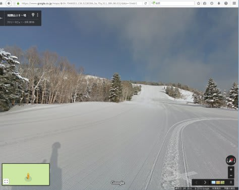

うむ．

いつもの見慣れた景色が！！

…そして．

コースをたどって，ゴンドラ乗り場までやってきました…

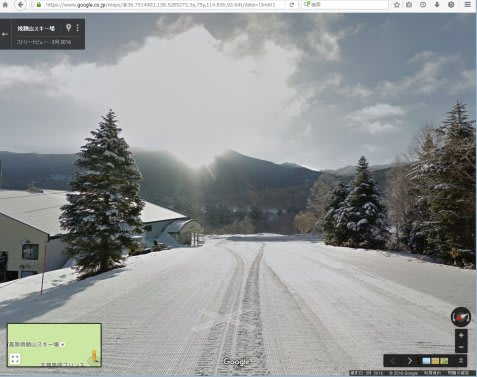

すごい．

焼額のコースを，完全に追体験できるよ…

ちなみに，オリンピックコースもちゃんと見れます．

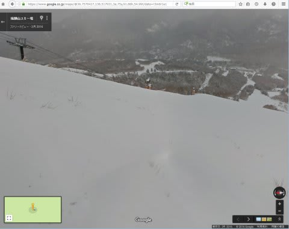

でも．

3月の雪不足の時に撮影したようで．

ブッシュがいっぱい出てますね～（笑）

そして，コブだらけのスーパーGSコースも…

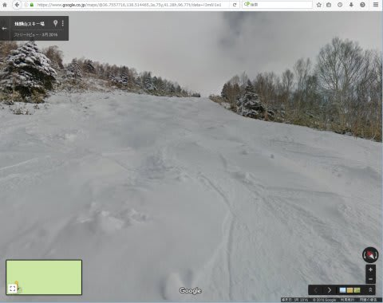

ここは，スキーヤーが撮影機材を背負って

撮ったんだろうなぁ…

白樺コースも，朝イチピカピカの

よだれじゅるじゅる状態のバーンが写ってます！

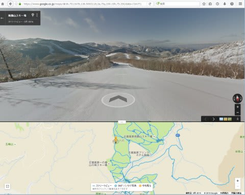

…すごい．

エキスパートコースをのぞく全コースが

ストリートビューでたどれるよ…

ちなみに．

一の瀬をはじめとする，中央エリアも

ほとんどのコースが撮影済みのようですが…

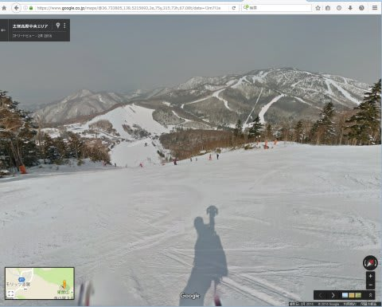

うむ．

撮影機材を背負ったスキーヤーの影が

映ってますね．

一の瀬は営業時間中に撮影したようで．

スキーヤーがいっぱい写ってます．

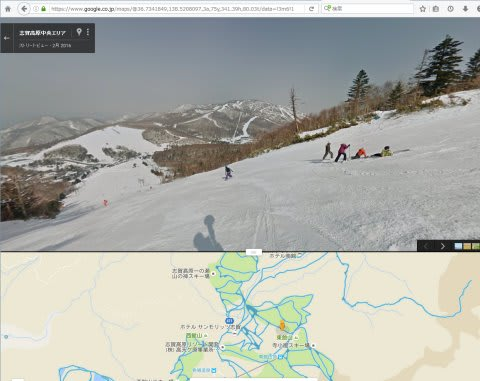

…そして．

転倒した人も記録に残されてます（笑）

あ，なぜか．

一の瀬ダイヤモンドと奥志賀だけ，夏の景色でした

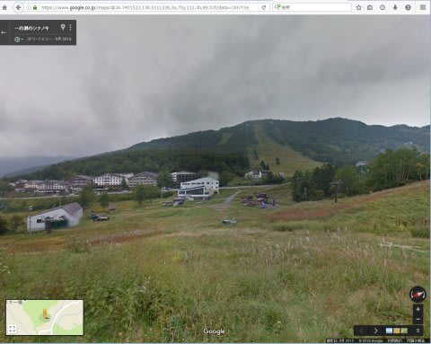

なんでだろ？

…って感じで．

志賀高原のほぼ全域がカバーされている，

このストリートビュー．

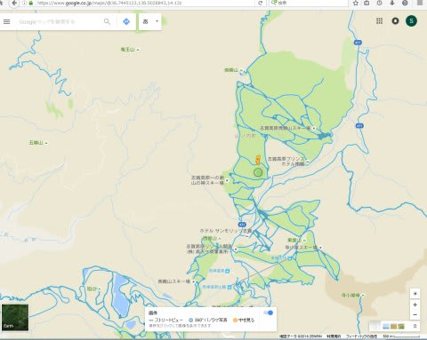

これを見ると…

スキーの禁断症状が悪化すること請け合いです（^^;

あーーーー！

また，こんなゲレンデが滑りたい～っ！！！！

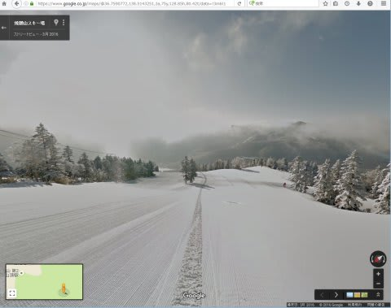

＃これは…この時期には目の毒．

＃目の毒だ～っ！！！
