# 2026シーズンモデルのスキー板，試乗レポート速報版！その5…HEAD & BLIZZARD編

📅 投稿日時: 2025-04-23 01:43:43

🏷️ カテゴリ: [スキー板試乗](c0bd8048615710cee890e403a36cc9a2b.md)

えー．

昨日は早く寝てしまい，

（と言っても，寝たのは深夜2時近く）

Blog更新が昼になってしまったので…

今日はちゃんと起きてBlog更新！！

偉いぞ！！自分！！

ってなことで．

本日も，志賀高原の特派員から写真が

送られてきてるわけですが…

今日の志賀高原も，晴天の一日だった

ようです…！

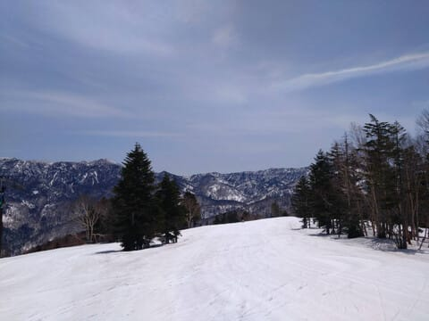

でも，気温が山頂でも+10℃を越え

ちゃってたので…やっぱり今日も

気温が高かったようです（泣）

こんな日は，晴れないほうがいいん

ですけどね…（ちょい涙）

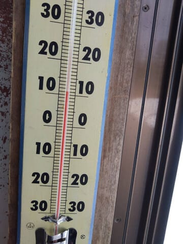

気温が高かったので，朝から雪は

緩み気味で．

急斜面はマシだったものの，緩斜面は

かなり滑りが悪い雪だったようで．

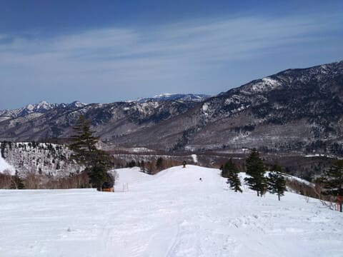

…まぁ，ガラガラだったこともあり．

人が滑ってない雪は汚れが浮いてきます

から…

今日は緩斜面では板が滑らない

一日だったようです（泣）

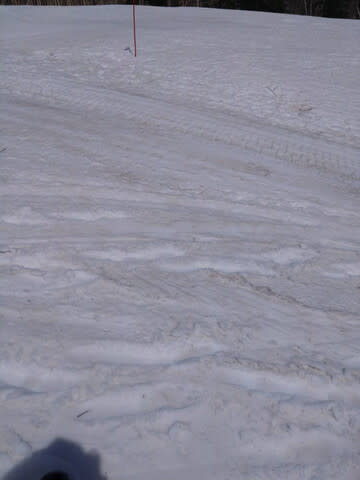

そして…

強い日差しで雪もやられていき．

日曜で最終営業だったオリンピックコース，

一日でかなり雪が解けましたね…（泣）

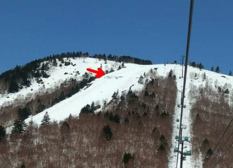

滑っている人はほとんどおらず，

コースはゴーストタウン状態の貸し切り

バーンだったのは良かったようですが．

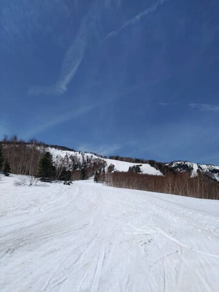

うーん．

でもこの時期，雨も嫌だけど，あまり晴天に

ならずに，雪が解けないでいてほしい…

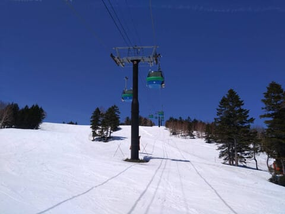

ってな感じの志賀高原ですが．

今日は高温で雪がかなりやられたというのに．

深夜1時現在，志賀高原では雨になってます（泣）

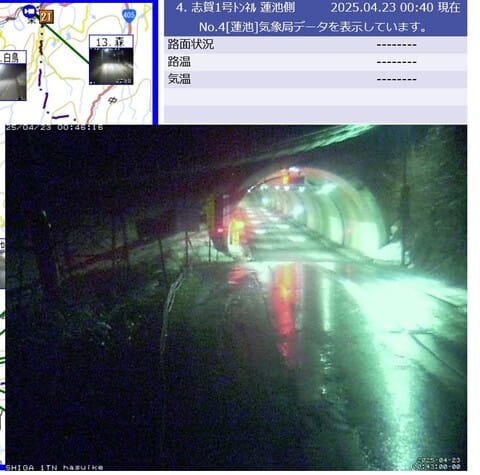

（[北信建設事務道路気象状況カメラ](http://hokushin.pref-nagano-roadcamera.jp/)より）

この雨は，23日の昼から夕方くらいまで

降り続けそうなので…

また雪が解けるなぁ…

で．

雪が大量に積もった後に高温が続いている

せいで…

4/23にオープン予定だった志賀草津道路，

雪崩のためにオープン延期になったようです…！

オープン予定は未定なので，今週末に草津越えで

志賀に行こうと思っていた方は，ご注意を…！！

（[草津町ホームページ](https://www.town.kusatsu.gunma.jp/www/contents/1745224462995/files/292kaijo-enki.pdf)より）

とりあえず，この高温傾向は4月25日には終わり，

26日はちょいと冷えて，27日以降から2-3日は

平年並みの気温に戻りそうです…

ってな感じで，

ここまでで普通のBlog記事1本分くらい

ありそうですが，ここから本題へ．

2026シーズンモデルのスキー板の試乗の

速報レポート．

本日はヘッドとブリザード編です！！

〇HEAD WORLDCUP REBELS e-SL EVO Speedblue 168cm

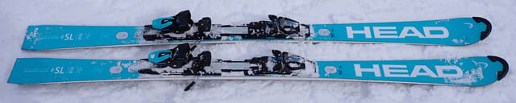

基礎小回り．

来季，どんな正式名称になるかよくわからない

ですが，2025モデルはカタログでは

WC SL-REBEL FIS EVO SPEEDBLUE

という名前になってますね…

板にはe-SLって書いてあるけど，SL-REBELと

いうのがメーカー公式名称なのかな？

とりあえず，FIS公式マークがついたSL板

だけど，FISモデルよりプレートが優しく，

長さも168cmというモデル．

結構グリップが強く，張りも強め．

フレックスが強いので，踏まなければあまり

たわまず，見た目から想像するよりは

ロングターンで滑ることができます．

ただ，サイドカーブが小さいので，

角付けをしていくとサイドカーブに乗って

回っていく．

グリップが強いので，どちらかというと

板の行きたい方向に板が回っていく感じ．

たわみが板に溜まって，それが解放される

というバネ感で小回りになっていくという

よりは，サイドカーブに乗ってレールターンを

していく感じの板．

グリップもフレックスも強いので，スピード

耐性は結構高めの，ゲレンデ履き小回りと

しては体力・脚力がある人向けの板．

〇HEAD  WORLDCUP REBELS E-RACE PRO 165cm

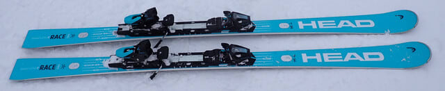

基礎オールラウンド

165cmでもR=13.9m と比較的大きく，

小回り特化よりオールラウンド性を狙った

板で，PROはレースモデルと同じWCR

プレートが着きます．

この板もかなりフレックスはしっかりした

感じ．

板自体はやはり小回りモデルよりは縦目に

落ちていく感じだけど，角付けを強めると

小回りに持っていけます．

ただ，これもe-SL同様，最初はたわみという

より，サイドカーブに乗ってレールターン的に

回っていく感じ．

ただ，スピードを出していくとたわみ始め，

たわみの開放スピードが速めなので

小回りになっていく板．

しっかりしたフレックスとグリップで，

あまり踏まなければ大回り，

しっかり踏んでいくと反応が早く小回りに

なっていくという，オールラウンドっぽい

性格をもつ板．

〇BLIZZARD FIREBIRD SRC 165cm

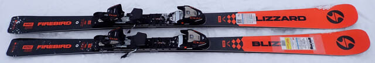

基礎小回り．

踏めばよくたわみ，たわみ量がコントロール

しやすく，ぐっとたわませればたわみに沿った

深い小回りが決められて，ターン弧の

自由度がかなり高い感じ．

強くたわませれば板に圧が強く溜まり，

その圧が切り替えで早すぎず遅すぎず，

気持ちよく解放されるので，深いターンを

しながらも加速していけるように感じる，

快感度が高い板．

圧のたまりと開放は，ピストンプレートの

効果もあるのかな？？

ずらしのコントロール性も悪くなく，低速や

急斜面でのずらしの小回りもやりやすい．

非常によくできたサンドイッチ板の

見本のような板でした！
