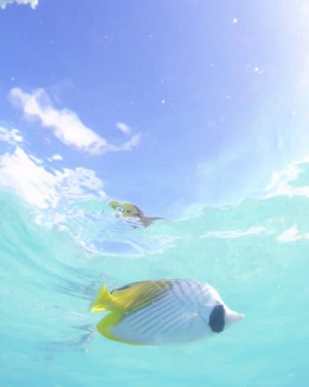

# 2009年　初の海外子連れダイビング旅行記　24　Trial pics

📅 投稿日時: 2012-09-23 00:51:13

というわけで．

かねてから計画し.

タヒチ渡航前からシミュレーションしていた，

「アレ」

を実行しよう！

…と決断し，カメラと3点セットを持って海へGo！

「アレ」とは…

「水面そばで空を見上げ，雲と魚が一緒に写っている写真を撮る」

という，いつかやろうと思っていた写真撮影のことだっ！

＃「アレ」って何だろう？って期待してた人の「なーんだ」という声が聞こえるっ…

大体，出来上がった写真のイメージは脳内にあります．

これを実現するためには，

「水面のそばで太陽と反対の空に向けてカメラを構え，

カメラと水面のわずかの隙間に魚が通るのを撮る」

ことが必要です．

で．

ひたすらカメラを構えて

「たまたまカメラと水面のわずかな隙間に魚が偶然通りがかるのを，ただ待つ！」

という果報は寝て待て戦略では，

思うような写真が撮れたころには，ランギロア在住4年目くらいに

なってしまっているでしょう．

というわけで．

午前中に娘が喜んで放り投げていたパンの登場．

バーの前の海に入って…

こんな感じで，パンくずをカメラの前にばら撒きながらの

撮影です．

まず最初に，太陽の位置からカメラの向きを決める，と．

太陽を背にする位置で，自分の影が写りこまない方向を探し出して…と．

んで．次に．

空はきれいに写るけど，カメラと水面の間に魚が通れるだけのスペースがある…

というベストな水深を，何枚か写真を撮って，その結果に基づいて決めます．

…これは．

撮影した結果がすぐに見れるデジカメだから可能な方法で，

銀塩だと絶対無理な方法ですね…．

ここまで決まったところで．

カメラの前にパンを投入！

一気に魚が寄ってきます

どわー！

魚多すぎ．

これはちょっとパンをばら撒きすぎたか…

ちょっとパンの量を調整して…

…しかし．なかなか思ったタイミングで魚が通らないよ～．

通ったと思ってシャッターを切っても，デジカメはタイムラグが

大きいので，尻尾しか写らなかったり，先読みしてシャッターを切ったら

今度は早すぎたり…

う，上手くいかない…

で，カメラを固定していると魚を画面の中央に捕らえらんないから，

魚を追いかけながらカメラを動かしていったら，

今度は空が写らなかったり，

カメラを上に振りすぎて太陽が画面に入っちゃったり…

（でも，これはこれで面白い写真かも）

かれこれ30分以上．

レリーズ枚数70枚以上．

やっと，何枚かイメージに近い写真をゲット．

うーーーん．

まだ完成度はイマイチだけど，シャッターラグのある

コンパクトデジカメではこれが限度か… 

とりあえず．

かねてからの計画の「魚と空」って写真は撮れたので．満足．

…かな？
