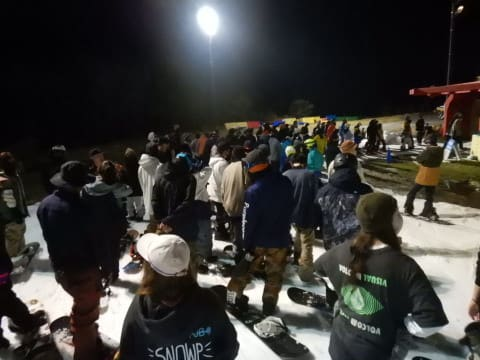

# 2021/11/6(土)もイエティ滑ってきたよ！速報レポート…オープン後2週間でコース幅も増えたし，混雑も先週よりマシだったかな

📅 投稿日時: 2021-11-07 01:22:45

🏷️ カテゴリ: [2022スキー滑走日記](cc9cb73e4320f6a97af6fccc37587a61a.md)

ってなことで．

本日もYetiで滑ってきました～！

今日も帰宅が遅かったうえ，

明日もなぜか朝6時起きで出かけなくては

ならないので←あと5時間ないんですけど？？

今日のイエティの状況，速報モードにて！！

えー．

まず，

晴天で始まった本日．

オープンから2週間たち，

その間一度も本降りのどしゃ降りに

ならなかったので．

今シーズンは順調にコース幅が

広がってますね～！

雪の厚みも，いつものこの時期より

結構厚めな気がしてて．

そのせいで，今日は終日コースに穴が

あいて，土が出てくるようなところは

一か所も無かったです！！

今日も快適だったのはオープンから

1時間も無くて．

朝10時になるとリフト待ちもそこそこ長く

なりました…

今日の待ち時間ピークはこのくらい．

平均3～5分待ちくらいかな…

でも，先週土曜の混雑よりマシ！！

とはいえ．

やはりコース上の人口密度は高く．

コース上はこんな感じなので，人の間を

縫って滑る感じです…（ちょい涙）

でも，先週よりリフト待ち少なかったのが

良かったかな！

で．

昼間は人が多く，あまり気持ちよく

飛ばせなかった…

となると．

当然ナイターオープン直後のシマシマを

狙うのだ！！

うほー！！！

前に他人がいないシマシマ，最高！！！

と，気持ちよく滑れたのも2本が限界．

3本目からは，コース上の人口密度も

昼間と変わらないくらい高くなり…

今日はナイターでもクワッド＆ペアの2本

リフトが動いていたのに，リフト待ちも

結構伸びたので．

ナイターは1時間ちょいで切り上げました…

ちなみに，今日の天気は曇り．

朝のうち日が射すこともあったけど．

午後2時ごろから小雨が，30分ほど

パラパラと降り続きました…

うーん．昨日の予想をしている時，

「もしかしたら雨が降るかも…？」

とも思ったけど．

「でも，前回も同じ天気図で降らなかったし，

　今日も降らないよね…多分」

と思っていた，予想が外れました(涙）

ただ，30分の雨もそんなに強く降ってないし．

雪が解けるほどじゃなかったです！

まぁ．先週土曜よりは空いていて，

リフト待ちも心持ち少なめで．

コース幅も雪の厚みも十分あったので．

予想以上に楽しめる一日でした…

ってなことで．

午後2時ごろのイエティを滑った動画を

また上げておきます…

そこそこ混んでるけど，水曜の手に汗握る

動画より人は少ないかな？

とりあえず，また明日詳細レポート

やりますので，お待ちください～！！

## 💬 コメント一覧

### 💬 コメント by (真美子)
**タイトル**: Unknown
**投稿日**: 2021-11-07 12:42:50

skiシーズン到来おめでとうございます。いつも楽しく拝見させていただいております。

ここ数年左ターンをする都度に、板がバンバンとして制動出来ずにいました。思いきって昨日（6日）カンダハー横浜店で、板と靴を購入しました。板はオガサカKS-NV　ブーツはFISCHERのザカーブGP95　12月27日から2泊3日でデビューです。その時、スキーヤーさんにお会いできるといいなーと思っています。

### 💬 コメント by (ひゃくりん)
**タイトル**: 初めてコメントさせて頂きます。
**投稿日**: 2021-11-07 12:50:28

私は奥志賀高原に滑り行くことが多く、

Skier_S//さんの志賀高原天気予報や

ゲレンデレポートを毎週、

参考にさせていただいています。

あと、私もレヴォーグに乗っているので、

勝手に親近感を持ちながら

車関係の記事も楽しく読んでいます。

この日は、私もイエティで滑っており、

動画の最後のほうで私が映っていたので、

コメントさせて頂きました。

これからもゲレンデレポートを

楽しみにしていますので、よろしくお願いします。

### 💬 コメント by (Skier_S)
**タイトル**: 今週末もイエティなのかな…
**投稿日**: 2021-11-08 04:22:37

＞真美子さま

をを！板とブーツ新規購入ですか！

12月27日から2泊3日…

私は12月30日に志賀入りなので，残念ながら日程が合わなさそう…

もしかしたら28日休めたら日帰りするかもしれませんので，

その場合は焼額でお会いできるかも？？

＞ひゃくりんさま

コメントありがとうございます～！

私と同じく，LEVORG乗りでいらっしゃいますか．

そして，同じくBlog書いていらっしゃるようで…

読ませていただきました．

濃厚なイエティレポート書かれてますね．すごい…

これからもご愛読のほど，よろしくお願いします～！

