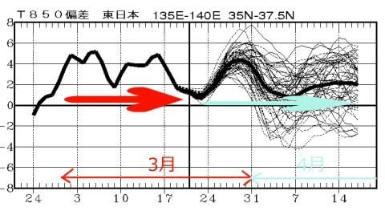
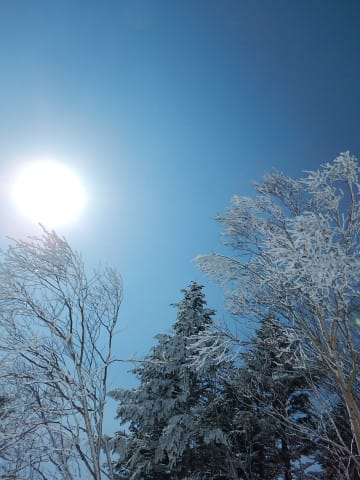
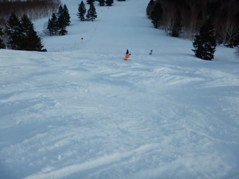
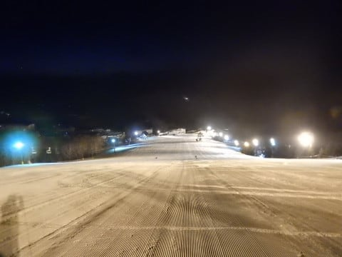
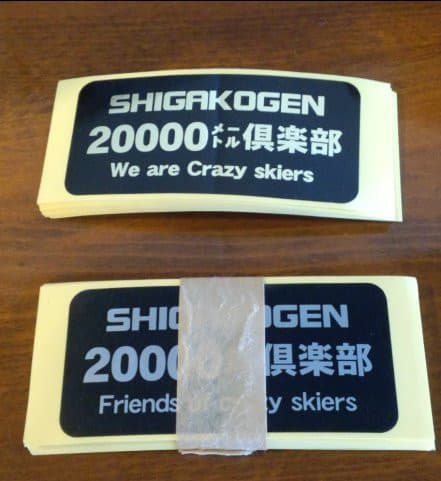

# 実録！20000mチャレンジ…友人の20000mチャレンジに付き合ってみた

📅 投稿日時: 2018-03-23 02:19:12

🏷️ カテゴリ: [スキー雑談](c1f9d2cb7478308da16419928ea3945e9.md)

えー．

異常高温の日々が続いた3月も後半に入り．

暖かさもそろそろひと段落着いて．

きっとこれから冷えるに違いない！！

と．

一か月予想図を見て．

赤矢印で示したように，3月に入ってからこれまでの実績が，

平年比+2～5℃程度の高温の日々が続いたのはいいとして．

水色矢印で記すこれから先の期間も，平年より

気温が1～5℃高い日々がづづきそうなのを見て．

平年より冷えそうな気配が全くないじゃないか

と，かなり落ち込んでいる，Skier_Sです．

これは，ヤバいよ…

ホントにヤバい．

3月に入ってからずっと，4月中旬まで，

平年より冷えることが全く無いというのは，

どゆこと？？？（泣）

このGWまで，雪がもつのかな…？？？（涙）

無駄に寒かった，12月1月の冷えっぷりを，

ちょっと3月4月に分けてほしかった…

ってなわけで．

本題へ．

先々週の日曜日．

…そうです．

[早朝からナイターまで行った，あの日](e0967db243a7f34f2705c7f9d32fbc6c0.md)．

一緒に滑りに行った友人が，

いきなり

「20000mチャレンジをするっ！！」

というのに，なぜか付き合うことになったので．

その実録をば…

とりあえず．

その友人．

指導員資格も持っているし．

かつて某都道府県連の技術選にも出ていた，

ガチのスキーヤー．

その日は，ゲレンデレポートでも報告したように．

6時半の早朝営業スタートから滑り初め．

人も少ない早朝のうちは，ひたすら

アホのようにノンストップで滑り続け．

…早朝だけでしっかりゴンドラ10本（標高差4500m）．

その後，通常営業になっても人が少な目で．

さらにGSコースのコンディションが結構良くて．

午前中も引き続き，アホのように滑り続けて

いたわけですが…

午前11時半ごろ．

そろそろ昼休みを取ろうという友人が

ポツリと．

友人「あれ？iSKI，もう標高差16000mも行ってる…」

私「そんなバカな．[私のAltimax](e055e39247b67045bf291db13565c2339.md)はまだ10000mだと言ってますが」

友人「iSKIが不正確なのかな？」（と，私に画面を見せる）

私「…なんだか，登り標高差が12000mで，下り標高差が16000mってなってますが？？」

友人「ホントだ…これだと，4000mも地球にめり込んじゃってるよ…」

私「…iSKIって，かなり不正確みたいですね…

　今はゴンドラがトップスピードに入ってないので，

　焼額ゴンドラはせいぜい1時間4.5本ペース．

　6時半から11時半まで，5時間で休まず滑って22本．

　第1ゴンドラは標高差450mなので，

　9900mが理論値．私のAlitimaxが正解です．

　…iSKIの16000mは，理論値を超えてます．物理的に不可能です」

友人「そうですね…まだ10000mしか滑ってないのか…」

ってな感じで会話してたのですが．

友人「…営業終了の4時半まであと5時間ありますね」

私「そうですね」

友人「だとすると，残り時間もこれと同じペースで滑りつづければ，

　20000m行きますね」

私「…理論的にはそうですが．現実として不可能です」

友人「20000m越えられそうなチャンスはそうそうないから，チャレンジするっ！」

私「……やめておいた方がいい気が…」

ってことで．

なぜか20000mチャレンジをすることに．

しかし，ホントに早朝からこれまでのアホほど飛ばす

ペースを，午後もキープできるのか？？

午後は疲れも出てくるし，

雪も荒れるから，

午前と同じペースをキープするのは難しいんだけど…

とりあえず．

そのままのペースでひたすら1ゴンを回しつづける

2人．

そして．

そうです．

20000mチャレンジですから…

友人「お昼はこんなこともあろうかと．

　ゼリー飲料を持ってきました！」

と．

ゴンドラの中で，お昼代わりのカロリー補給用

ゼリー飲料を採る友人…

休まず，止まらず，トイレに行かずという基本

動作を確実に実行するため．

「ゴンドラ飯」という，20000m越えのためのスキルを

身に着けたようです…

そして．

午後もひたすら1ゴンを滑り続けますが．

…当然，午後になると雪が荒れてくるわけで．

それまで調子よく滑っていた友人も．

午後2時半ごろ．

友人「…今何m？」

私「16000mちょい欠けくらいです」

友人「あと4000m…ゴンドラあと9本…」

私「あと2時間なので，ギリギリ行けるかどうかの

　数字ですね」

友人「そろそろきつくなってきた…」

私「早朝から午後2時半まで，8時間休まず滑ってるん

　だから，当たり前です．

　…普通なら，8時間トップスピードで滑り続ければ

　疲れます」

友人「まだ2時間あるのか…」

そろそろ疲れているころですが．

これからが20000mチャレンジの本番．

雪はだんだん荒れて，日が当たる斜面は重い

雪が蹴散らされた凸凹状態．

この凸凹を蹴散らすのはかなり疲労を増しますが．

この中をまだ2時間滑り続けないといけないのだ！

そろそろ，1本1本滑るのがつらくなってきた

ころのはず…

友人「思ったよりきつい…」

私「当たり前です．

　20000mを舐めてはいけません」

友人「早朝から滑っても達成できるかきわどいのに，

　通常営業だけで20000m行く人っておかしい…」

私「今さら分かりましたか．

　あの人たちはありえないほどとてつもなく異常なほどおかしいのです」

そして．

残り1時間となったころ…

朝から9時間滑り続けた友人の疲れも

ピークに達し．

磨かれて固くなってきたバーンでは

ずれずれのセーフティー滑りに

なってきてます…

友人「私のiSKIでは，余裕で20000m超えてるんだけど…」

私「でも，相変わらず下り24000m，登り16000mと，

　不思議な値を示してますね」

友人「どうやら地球に8000mほど潜ってしまったようです」

私「いや，潜ってませんから．

　…iSKIはあてになりませんね…

　今，18000m弱です．

　まだ残り2000m以上あります．

　これから滑れるのは，ゴンドラあと3本と第3高速が

　1本くらいだから…営業終了まで，

　1500mしか行けません」

友人「ってことは，4時半までで19500m…」

私「惜しかったですね…」

友人「惜しい…」

私「…今日は一の瀬ナイターもありますが」（ぼそ）

友人「行きますっ！！！

　ナイター行きます！」

私「…殊勝な心掛けですね」

友人「ここまでやったんだから，20000m超えないと

　帰れません！」

私（早朝からナイターまで滑り続けることになるとは…）

ってな感じで．

体力キープするための，傾かない滑りになっていく友人に

ついて行きながらの残り1時間．

日が暮れると，雪が荒れた斜面がそのまま固まって，

滑りにくくなっていき…

最後の最後の体力がつきかけているところで，一番体力を

消耗する雪になっていくという苦行．

友人「きつい…20000m，予想以上にきつい…」

私「…分かりましたか…」

友人「ここまで休まず滑り続けなきゃならないとは…」

…そうでしょう．

慣れてない人がいきなり20000m行こうとしたら，

体験したことのない量を，休みなく滑り続けなくては

ならないので…

普通の精神をもった人は，チャレンジしない方が

いい世界です．

そして…

4時半の営業終了時点で19500m．

惜しいっ！！

友人「…ナイター決定ですね…」（半分死にながら）

私「今日，朝2時に家を出てきたのに…

　早朝からナイターまで行くことになるとは…（涙）」

ということで．

夕食が終わってから．

6時半からの一の瀬ナイターに繰り出す二人．

友人「まさかとは思いますが．

　Sさんのことだからナイター最後まで滑るとか，

　そんなこと言いませんよね」

私「さすがの私も，今日は朝2時前に起きてるので，

　途中で帰ると思います…」

ってな感じで滑り始めた一の瀬ナイター．

緩斜面を数本滑ると，ついに20000m突破！

友人「そ，そろそろ帰りましょう…」

私「せっかくお金払ったんだから，もう少し滑りませんか？？」（さっき言ったことを忘れてる）

友人「…」

ってなわけで．

リフトが動いていると帰れない病を発症しかけていましたが．

この日は日曜だったので，低速の一の瀬ファミリーナイター．

リフト乗車時間が長いのに，滑るのは一瞬で

身体が温まらず．

身体が冷えてきました…

だもんで．

夜8時半ごろ

私「…リフト営業時間が残り30分ありますが．

　切り上げますか…」

と，

大変珍しく，残り30分で切り上げる私．

いや．

でも，ホントに疲れてたんだもん．

リフトストップまで，精神力がもたなかった…

そして，結局．

この日は21000m達成！

友人はめでたく，KonSukeさんからゴールド認定を

いただき．

ゴールドステッカーを受け取ったのでした…

（ゴールド達成者が受け取る，ゴールドステッカー＆配布用シルバーステッカー）

…

…でも．

今から振り返ると．

私が友人と一緒に20000m滑る必要は

無かった気がするんだけど…！？？？

ついつい友人の20000mチャレンジに付き合ってしまい．

今シーズン2度目の20000m越えをしてしまっていたのでした…

## 💬 コメント一覧

### 💬 コメント by (FCAMEL)
**タイトル**: 焼額山に水？
**投稿日**: 2018-03-23 14:15:38

最後かもしれない新雪を期待して本日焼額山に参上。

しかし、新雪は数ミリ。

朝はガスで視界悪く足下も柔らかめのバーンとグサ雪が交互のなんとも言えないコンディション。唯一の救いはなぜかオリンピックのみ昼過ぎまでコンディション良く荒れず、わりとハイスピで回せたことでした。

日中の降雪は当然、、、

焼（額山の）石に水（混じりの雪）！

凍れ！焼額山！

### 💬 コメント by (べー)
**タイトル**: Unknown
**投稿日**: 2018-03-23 17:10:38

私も今日から来てます。

気温は午後2時頃山頂でｰ1℃でした。

午前中は多少風も吹いてガスったりしましたが今は穏やかで晴れています。

高天ヶ原は大量の殺人コロコロでした(^^;

### 💬 コメント by (かず)
**タイトル**: Unknown
**投稿日**: 2018-03-23 18:29:00

金土日の予定がでしたが足が痛いのでもう明日で帰ります　かなりキツイ１日でしたよ

### 💬 コメント by (Goku)
**タイトル**: Unknown
**投稿日**: 2018-03-23 18:59:05

お友達、Sさんと一緒で良かったですね。

iskiのデータを鵜呑みにして、20000mいった！と思ったら実は駄目だったなんて、あまりに残酷ですから。

### 💬 コメント by (しんちゃん)
**タイトル**: 2回も達成って凄い!
**投稿日**: 2018-03-23 22:06:18

今シーズン、20000m2回も達成しているなんてさすがＳさん、すごいですね。

お友達も、Ｓさんという証人をもって20000m達成できたので、正真正銘のＧＯＬＤ保持者ですね!!

指導員資格者をも苦行に貶める、恐るべし20000mチャレンジ(+_+)

### 💬 コメント by (Skier_S)
**タイトル**: 今週末も春の陽気になりそう
**投稿日**: 2018-03-23 23:47:19

＞FCAMELさま

あら…そんなに湿った雪だったんですか．

朝の気温自体はそこそこ冷えたっぽい感じに

見えたんですが…

もう少し冷えてくれないとダメっぽいですね（涙）．

＞べーさま

コメントありがとうございます～！

今日は一応そこそこ冷える予想だったんですが，

昼間も気温はマイナスキープだったんですね．

午後は晴れてよかったですね…

でも，殺人コロコロ大量発生ですか．

明日の朝はいいコンディションになってることを期待！

＞かずさま

きつかったんですね…

明日からは天気が回復しそうですが，

明後日はまた春の雪になりそうなので，

明日滑って帰るのが正解かも．

また明日お会いしましょう！

＞Gokuさま

いや，iSKIはやっぱり参考程度にしか

なりませんね…

かなり不正確な感じです．

やっぱりSKILINE復活してほしい…

＞しんちゃんさま

なぜか2回も20000m突破してしまいました．

今回は，20000m超えたよりも，朝2時に家を出て

早朝からナイターまで滑った方が効きました…

こんなことするもんじゃありません（笑）

### 💬 コメント by (Unknown)
**タイトル**: 途中経過の把握方法？
**投稿日**: 2018-03-26 22:19:07

この記事を見て ASC（垂直上昇の合計） DSC（垂直下降の合計）の存在を思い出し

SUNNTO VECTOR を持って行きました。

（同じゲレンデを回す場合 LAP（回数）で十分なので単なるカウンター扱いだった）

使ってみて気付いたのですが LOGBOOK は記録を終了するまで数字を見ることができません。

Altimax は途中経過も見ることができるのでしょうか？

それとも都度終了・開始させて最後に暗算で合計するのでしょうか？

### 💬 コメント by (Skier_S)
**タイトル**: Unknownさま
**投稿日**: 2018-03-27 01:59:08

えーっと．

それは，AltimaxとVectorの大きな違いで．

Altimaxは，ログ記録中に左下のボタンを押すと．

ログスタート時から現時点までのASC，DSC,

LAPが見られるんです…

Vectorにはない機能です．

私もマニュアルを見て，Vectorにこの機能が無いことを

知りました…

### 💬 コメント by (Unknown)
**タイトル**: コンパスなんて要らないのに・・・
**投稿日**: 2018-03-27 02:41:39

確かに EN のユーザーズガイドには記述がありました。

納得です。

LOGBOOK を停止させちゃう誤操作が多発して、この機能を削ったんだろうか？

### 💬 コメント by (若杉勲70)
**タイトル**: やっとスマホ買いました。
**投稿日**: 2018-03-27 06:46:51

追突されてからあまりスキーに行けなくてストレスがたまったのか、顔にタイジョウホウシンがでて、暇なので、スマホデビューしました。早速エスサン訪問。20000チャレンジの記事、楽しかったです。また訪問させていただきます

### 💬 コメント by (Skier_S)
**タイトル**: 今日も夜が遅い…
**投稿日**: 2018-03-28 04:53:55

＞Unknownさま

Altimaxのこの機能は，時計モードでも

高度計モードでも気圧計モードでも，

どのモードからもワンタッチでログが

確認できるので便利です…

Vectorは使ったことが無いのですが，

この機能が無いと不便ですね…

何でなくしちゃったんですかね？

＞若杉さま

帯状疱疹ですか！

よっぽどストレスが溜まったんですね…

お大事に…

スマホデビューですか！

ゴンドラの中でも私のBlogが見れるので，便利ですよ（笑）．

ここしばらくお会いできていませんが，

また焼額でお会いしましょう！

