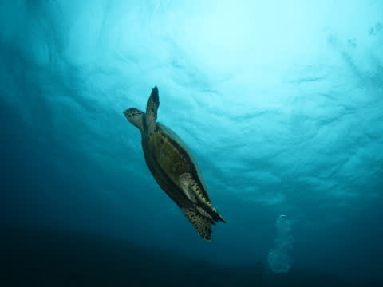

# 2015年10月　子連れで西表へダイビング旅行その5…そして，西表の2本目へ．

📅 投稿日時: 2016-08-28 03:00:57

ということで．

1本目が終わり，ボートを2本目の場所へ

移動しますが…

相変わらず，天気が悪いなぁ…

と思っていたら，かなり雨がひどくなってきて．

船の上でレインコートを着ないといけないくらいに（涙）．

雨に打たれて，結構寒いんですけど（泣）．

というところで，雨にぬれつつ水面休憩を

ちょっととったあと，そうそうに2本目へ．

1本目のポイントに近い「クロミスヘブン」

という名のポイントですが…

いや，結構サンゴがきれいじゃないですか！

見渡す限り元気なサンゴって…

国内の海では久しぶりに見たよ！

石垣島のサンゴはかなり壊滅してしまい，

かなり寂しい思いをしたけど…

なんだ～．

西表，サンゴ元気だよ！

嬉しいなぁ…

と，思っていたら．

おっと．

カメさん発見！

これは…

甲羅の後ろのギザギザがあるので．

タイマイですね．

みんなで周りを取り囲んじゃったので，

居心地が悪くなったのか．

「なんだよ，もー．

　せっかくゆっくりしてたのに…」

とでも言いたげな感じで．

泳ぎ去っていきました…

そのあとも，サンゴの元気な群生の上を

流していきますが…

いや，まだ国内に，こんなにサンゴが元気で残ってくれていた

ところがあったとは！

嬉しい限り…

と，泳いでいたら．

また，さっきのタイマイさんと再会！

「なんだ，おめ？また来たのか？」

「もう～．食事の邪魔しないでね」

今度は泳ぎ去らず，しっかりお近づきになれました…

そして，カクレクマノミちゃんを眺めたり…

こちらはセジロクマノミ．

そのあとも，元気なサンゴの上を…

たっぷり泳いで…

いや，昔は石垣島近辺も，こんなだったなぁ…

などと思いつつ．

たっぷりきれいなサンゴを堪能したら…

そろそろボートの下に戻ってきたので…

Exitです．

いやー．

良かった．

安心した．

西表近辺，まだまだサンゴが元気で，

嬉しい限りっ！！！
