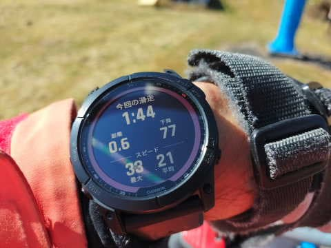
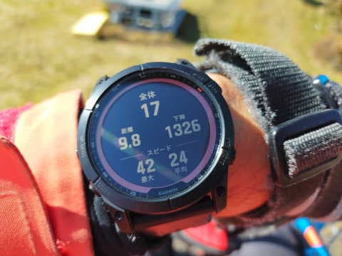
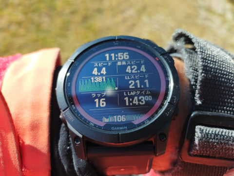
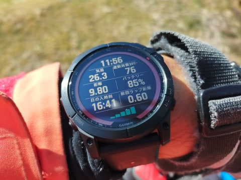

# Garmin Fenix7Xのスキーモードを使ってみた…滑ってる途中の時計画面はこんな感じ

📅 投稿日時: 2022-11-16 01:04:59

えー．

残念ながら，15，16，17日とちょっと冷えるけど．

そのあとまた気温が上がっていき，

19，20日の週末は気温がかなり上がり，

20日の日曜日は雨になりそうな今日この頃．

皆様いかがお過ごしでしょうか（時候の挨拶）

うーーーーん．

19日の熊の湯オープンはあきらめたほうが

よさそうな感じですね（涙）

その翌週，26日オープン予定のスキー場は

多いので，その次の週末までに冷えて

くれるといいんですが…

ってなところで，本題へ．

山歩きのお供として，もう手放せなくなった[Garmin Fenix7X](e516b23a4874189de2e9208be87fa5184.md)．

ただ，こいつは山登りだけのために

買ったのではなく．

スキーの記録を取るのも目的だったわけで．

Garmin Fenix7Xのスキーモードは

どんな感じかを，

イエティで何回か使ってみたので，

さっそく報告してみます…！

まず．

スキーモードに入れたとき，

基本画面は2画面あって．

まずは一本前の滑走の記録を

表示するこの画面．

一番上：前の1本滑るのに要した時間

真ん中：前の1本の滑走距離と前の1本の滑走標高差

下の列：前の1本の最高速度と前の1本の平均滑走スピード

そして2画面目が，記録開始時からの

全ての滑走記録を表示するこの画面．

一番上：何本滑ったか

真ん中：記録開始時から何㎞滑ったかと滑走標高差何m滑ったか

一番下：記録開始時からの最高スピードと平均スピード

で，

この基本の2画面以外にも，好きなだけ

画面を追加することができて…

追加した画面に，自分が選んだ好きな

データを表示させることができます．

私は2画面追加しました．

追加した1画面目はこいつ．

基本的にスキーしている間はこの画面を

表示することにしていて．

普段滑っているときに見たい表示を

この画面に集めました！

一番上：現在時刻

2列目：今のスピードと，記録開始時からの最高スピード

3列目：標高グラフと前の1本の平均速度

4列目：滑った本数と前の1本滑るのにかかった時間

5列目：心拍数

ただ，実際使ってみると，1本前の平均速度は

要らないな…と思って．

今は3列目の右側を，トータル滑走標高差に

変えています．

これで，この画面にしておけば，

普段見たい標高差や何本目か，

最高スピードどのくらいかが見れるし．

滑ってる途中に，滑走スピードを

リアルタイムで見ることもできます！

そして，追加した2画面目は，

普段見るわけでないけど，ときどき

知りたいな…と思うことがある情報を

詰め込みました！

一番上：現在時間

2列目：温度と消費カロリー

3列目：記録開始時からのトータル滑走距離と電池残量

4列目：日が沈む時間と，1本前に滑った滑走距離

5列目：GPS電波受信強度

…温度計は，ウエアの袖に入れて外気に

さらされない状態では，体温を拾って

高い温度になってしまい，気温はわからない

ですが…

ってな感じで．

これら4画面をオートスクロールではなく

手動スクロールにしておいて．

普段は3画面目を表示させっぱなしに

しています．

画面表示を好きなようにカスタマイズ

できるので，欲しい情報を1画面にまとめて

表示させられるのがいいですね～！

あ，因みに地図画面も表示させられますが．

スキー場マップは日本のスキー場はそんなに

対応していないみたいで．

志賀高原やイエティは確かスキー場マップが

ないので…

おそらく単なる地形図が出てくるのかな？

これまで表示させる設定にはしてなかったので，

地図を表示させるとどうなるか，次回試してみます…

ってなことで．

滑っているときの画面はこんな感じですが．

滑り終わった後のログデータがスマホや

PCでみれるので．

それがどんな感じかは，また次の機会に…

とりあえず．

朝9時から午後6時までの9時間，

スキーモードでGPSを動かしっぱなしに

しても，電池は10％ちょいしか

減らないので，電池持ちはすごい

いいですよ～！！！
