# 6月13日の月山速報…リフト乗り降りはたいへんだけど，大斜面はまだいける

📅 投稿日時: 2015-06-13 22:33:03

🏷️ カテゴリ: [2015スキー滑走日記](c09ea645cfc085f86dfcd80f49599dd89.md)

ということで．

今日，明日で月山に来ていて．

本日は山形市内に泊まりなんですが．

今日は夜遅くなってしまったので，速報モードで…

えー．

本日の月山ですが．

天気は曇りと晴れが交互にめまぐるしく変わるような感じで

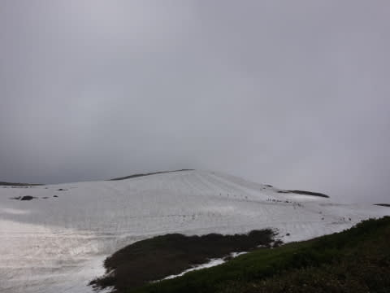

やはり．

6月第2週としては，雪は少なめかな～

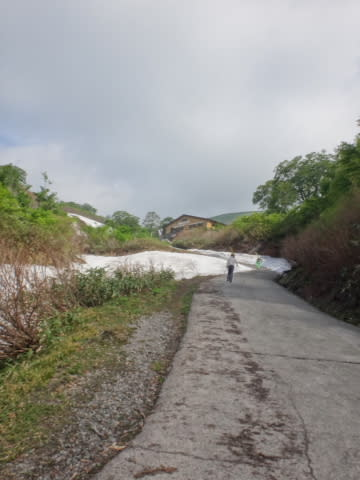

例年よりかなり早くにクローズになった沢コース．

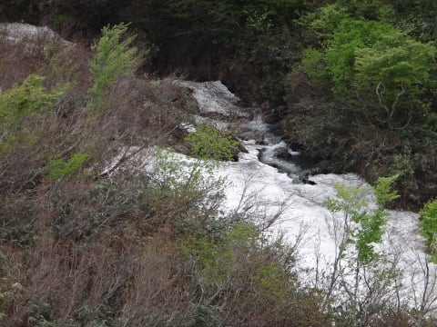

…まさに，沢だわ．川になってます．

滑れるような感じではないかな～

雪が少ないため．

リフト降り場からゲレンデまでは，こんな道を100mくらい

歩かないといけないという，6月下旬の状態に

なっちゃってます．

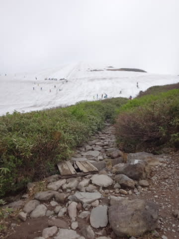

乗り場までも滑り込めないので，

ゲレンデからリフト乗り場までも，かなり歩きます…

って感じで．

リフト1本30分以上かかる状態ではありますが．

とはいえ．まだリフトが滑れて．

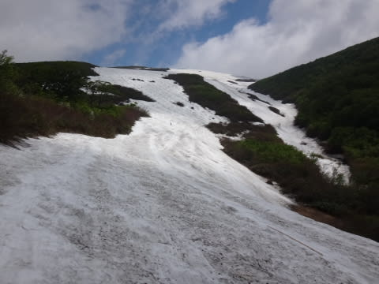

大斜面も一番細い部分で，ラインは2-3本まで

ほそくなってますが，基本的にまだいけます．

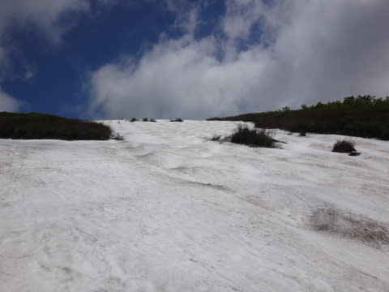

トレーニングにはいい感じのコブができてますね～．

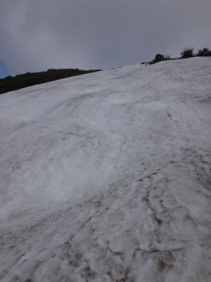

とはいえ…

リフト乗り場までの通路はそろそろちとヤバげな感じ．

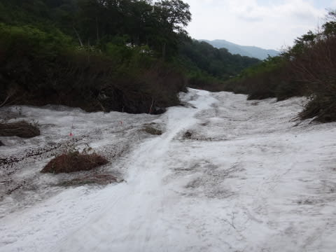

だというのに．

大斜面も…

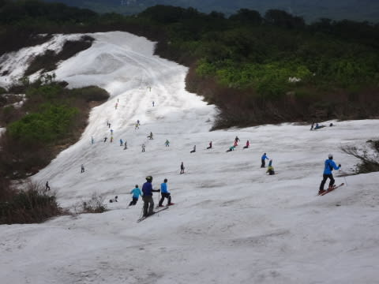

Tバーも．

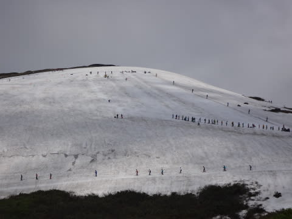

今日は人が多かったですね～．

…まぁ，リフト待ちはそんなになく，駐車場も車は

少なめでしたが．

ということで．

まだ大斜面が滑れる月山．

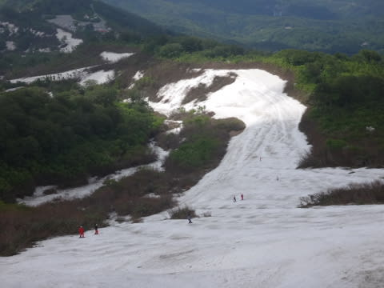

明日も滑ってきます～
