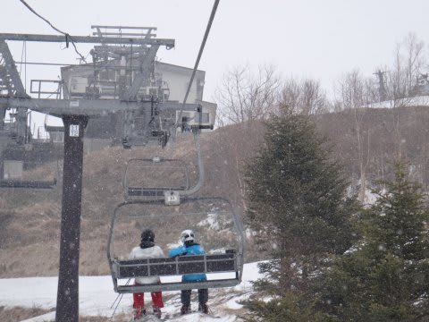

# 4月20日土曜日の志賀高原は…季節はずれの雪！

📅 投稿日時: 2013-04-20 19:31:10

本日は．

すばらしい一日だったのだっ！！！

まず．

早朝は，[天気予想](tsakamot2001e.md)通り．

マイナス8度という，この時期ではありえない冷えひえの気温で始まりました！

ゲレンデに出てみると…

上にうっすら新雪が乗ってますが…

下地はしっかり硬い，スピードが出るバーン！

うほー！

4月下旬としては，最高に近いっ！

カチカチアイスバーンってわけではなく，エッジを効かせることができる，

しっかり硬く締まったコンディション．

今日，大回り板を履かなきゃいつ履くんだっ！！！

って感じで，快楽の大回り，大回り，おおまわりっ！

早朝スキーは人も少なく，がらがらで超最高っ！

超最高の大回りをひたすら決め続けて…

10時になっても，まだこんな感じ．

…幸せ…

2週連続，こんなに良いとは…

神様，ありがとうっ！！

昼近くなっても山頂の気温は0度近く，雪は表面がやわらかくなってきた程度で，

ドボドボにはならず．

さらに，ゴンドラも超がらがらで，コースに人がいないので．

まったく雪が荒れない！

うひょーーーーー！

最高．最高だよ…．

で．

で．

なんだか．

昼1時過ぎくらいに…

なんだ．これは…っ！？

なんだか，すごい勢いで雪が降り始めたんですが．

あっという間に，白くなっていくんですが．

ゲレンデの上にも，積もり始めてきたんですがっ！

なんと．この時期に．こんなに雪が降るなんてっ！

＃降っても夜から…って昨日の天気予想は外してしまったけど…（涙） 

って感じで．

今日の焼額．

終日気温が低かったので，午後になってもそんなに雪が荒れず．

さらに，午後は上にうっすら新雪まで乗るほど，しっかり冷え込んだ一日で．

4月のドボドボの雪になることなく．午後までしっかり大回りを楽しめ．

(ゴンドラストップ時でもこんな感じ)

んもう，4月下旬というのに，神様ありがとうっ！

3月よりよかったかもっ！！！

って感じの．

さいっこうの一日だったのでした！！

志賀高原，今も結構雪が降ってますよ～！！！

PS．昨日から予想天気図が結構変わって，日曜は低気圧がかなり

　南を通って，予想より気温が冷えそう…明日も終日冷えて，

　降るのは雨ではなく，雪です！

とりあえず．

私の[ひごろの行いが良かった](e5491f7ba5ec4b342301a9cd259d781ed.md)ってことが証明されましたね(笑）．

## 💬 コメント一覧

### 💬 コメント by (aqura)
**タイトル**: Unknown
**投稿日**: 2013-04-21 14:54:34

Skier_Sさんの、幸せ感がたっぷり伝わってきます)^o^(

楽しんじゃってください。

### 💬 コメント by (Skier_S)
**タイトル**: aquraさま
**投稿日**: 2013-04-22 00:53:03

日曜は，もっともっと幸せだったのだっ！！！

すごい楽しんで着ましたよ～っ！！！

