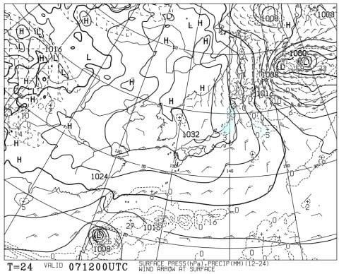
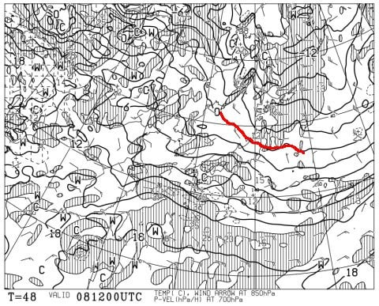
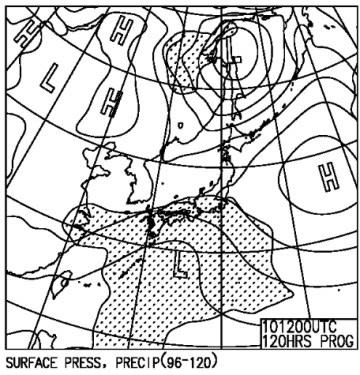
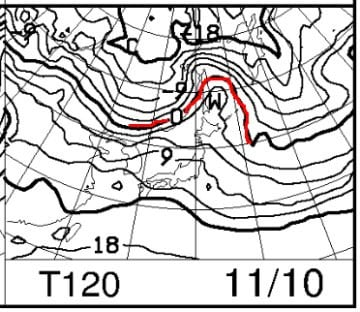

# 11月9，10日の週末のイエティと軽井沢スキー場の天気は？…土曜は曇り~晴れ，日曜は軽井沢は曇り，イエティは時々雨で気温が上がるよ（泣）

📅 投稿日時: 2024-11-07 02:47:22

🏷️ カテゴリ: [スキー天気予想](c6554f5c3c106093b511a8daae23757e8.md)

えー．

イエティは7日(木)にはオープンするかと

思ったけど…

7日も臨時休業のアナウンスが出ましたね(泣)

（[イエティホームページ](https://www.yeti-resort.com/)より）

ただ，ライブカメラを見ると，

コースは一旦圧雪が入って山がつぶされ，

コース造成の準備が進んだように見えますが…

確かにもう少し雪が足りない感じ（涙）

（[WNIライブカメラ](http://webcam.wni.co.jp/KAC24326/loop.html)より）

しかし，10月に3日間だけオープンした後，

そのあと11日間営業を休んでえんえん雪を

造り続けたのに，まだオープンできないとは…

この10月~11月，いかにひどい高温だったか

よくわかる…

まぁ，8日(金)にはオープンすると信じたい

ところですが．

7，8日はあまり気温が上がらないし．

9，10日の週末は間違いなくオープンすると

思います！！

ちなみに．

日付が変わって7日の午前2時半現在…

志賀高原は気温が氷点下に落ちてます！

硯川では-2.2℃！

…降水量もあるようなので，カメラは

真っ暗で何も映ってないけど，おそらく

雪が降ってるんじゃないかな？

カメラにうっすら雪が張り付いてるようにも

見えるし…

明日はうっすら積もるかも！

（[北信建設事務所道路気象状況カメラ](http://hokushin.pref-nagano-roadcamera.jp/)より）

とりあえず．

今週末は軽井沢に加え，イエティも復活

しそうなので．

スキーシーズン水曜深夜恒例，今週末の

スキー場の天気予想を行ってみましょう…！

まず．

7日(木)の地上天気図は…

日本海側にうっすら降水域がかかる，

今シーズン初めてお目にかかる冬型の

天気図です…！！！

この日の850hPa気温は，0℃線が

志賀高原より南に下がって．

軽井沢よりも南くらいなので…

軽井沢も氷点下に下がりそう！

志賀も軽井沢も，今シーズン初の

人工降雪が打てそうな気温！！

続く8日(金)の地上天気図は…

高気圧が張り出して，晴れそう．

晴れなくていいから，雪が降って

欲しいんだけど…

この日の850hPa気温は．

うーん．もう赤い0℃線は東北まで

去ってしまってます…

まぁ，午前中くらいまでは志賀なら

人工降雪機ギリ動かせるかな？

そして，週末の9日(土)の地上天気図は．

南から怪しげな低気圧が近づき．

イエティにかなり迫ってます．

イエティは曇り，軽井沢は晴れかな．

この日の850hPa気温は…

もうダメですね(涙）

赤い0℃線が北海道まで上がり，

軽井沢やイエティには水色の+6度線が

近づいているので…

平年並みか，それよりちょいプラスまで

気温が上がり始めてます(泣)

冷え冷えボーナスは8日までで終わりです…

そして10日(日)は，

太平洋側に網掛けの降水域がかかっている

ので…イエティは曇り~雨．

軽井沢は降水域がかかってないので，曇り．

この日の気温は，+9℃線が軽井沢よりも

北に上がるレベルなので…

また，平年より+3℃くらい高いレベルに

戻っちゃいます(泣)

あぁ…冷えるのはわずか2日ちょいの

期間だけだったか…

ってなことで．

まとめると．

7日(木)：今シーズン一番の冷え．

　軽井沢も朝晩は人工降雪機が動かせるかも？

　イエティは人工降雪は無理．アイスクラッシュ

　がんばれ．

　軽井沢は基本的に晴れる．

　冷えて晴れて，軽井沢は結構いいかも．

8日(金)：朝冷えるが午後に向かい気温上昇．

　天気は軽井沢は晴れ，

　イエティは晴れ→曇り．

　気温がそこまで上がらず雪はそんなに

　緩まない．

9日(土)：気温は平年並みに戻る．

　太平洋側は低気圧が近づくので，

　イエティは曇り時々晴れ，

　軽井沢は晴れ

10日(日)：気温は平年比+3℃くらい．

　イエティは曇り，運が悪いと午後ポツポツ

　液体が降ってくるかも．

　軽井沢は終日曇り，時折日も射す．

　日が射すと暖かく感じる．

という感じでしょうか…

とりあえず，日曜はイエティでもしかすると

ポツポツ降るかもしれないけど…

日曜の低気圧がわずかに予想より北に

ズレると，パラパラくらいの雨になるかも…

逆に南にずれれば雨の心配はないです．

日曜のイエティの天気の予想精度は

まだ低いです…

で．

何度も予告していますが．

この7，8日のボーナス的な冷え込み

(と言っても平年並みの気温だけど…)が

過ぎると．

また16日ごろまで，平年比+4℃くらいの

気温が続きそうという，

すごい悲しい予報が出ています(涙)

はい．

9日以降16日まで，志賀高原でもまったく

人工降雪機を動かせる気配はありません．

16日に横手・熊の湯がオープンする確率は．

おそらく．

私がこれから頑張って必死にスキーをやって，

オリンピックに出られる確率と同じくらいかな…

あるいは．

これから私が必死で仕事をやって

いろんな炎上案件を無事終わらせて．

11月16日以降毎日，平和なサラリーマンの

ように夜は家に帰って夜ご飯を食べられて，

土日は仕事をせずにのんびり過ごす…

という生活ができる確率と同じくらいか…

…うん．

この両者を比べると．

オリンピックに行ける確率の方が，

まだ高い気がしてきた…(絶望感)

## 💬 コメント一覧

### 💬 コメント by (かず)
**タイトル**: Unknown
**投稿日**: 2024-11-07 18:59:40

こんばんは！お久しぶりです 今シーズンもおねがいします  Sさんシーズン券はどれにしました？

### 💬 コメント by (Skier_S)
**タイトル**: ＞かずさま
**投稿日**: 2024-11-08 02:14:44

お久しぶりです～！

私は今シーズンも全山シーズン券にしました…

