# 2021シーズンの志賀高原中央エリアのリフト営業期間が出たよ！…え？一の瀬11月20日オープン！？？

📅 投稿日時: 2020-10-19 00:58:29

えー．

シーズン券の販売が10月21日（水）スタートという

案内が出たので．

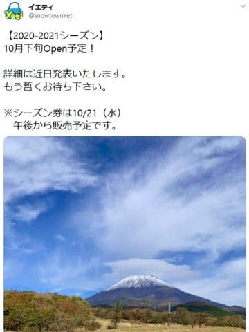

おそらく．

イエティのオープン，10月23日（金）なんじゃないか…？

…と思い始めている，Skier_Sです．

狭山が10月31日の週末のオープンの可能性を考えると．

おそらくやっぱりその一週間前を狙ってくるんじゃ

ないかな…？？

うーん．狭山とYetiでチキンレース状態で，

どちらもまだ正式オープン日を公開して

いないのが微妙な感じですね…

しかし，10月23日なら，もう，

今週オープンなんですけど…

ホントに今週末オープンするのかな？

とりあえず．

おそらくあと1週間，遅くともあと2週間で

シーズンインです！

だもんで．

この日曜は，直前になって天気が良くなる

予想に変わってくれたので．

シーズン直前トレーニングがてら，また

今日も山へ登ってきました～！

…でも．

車で近づいていくとき．

…うげ．

土曜の降雪で，山頂が白いんですが！？？

まさか，積雪があるとは…っ！

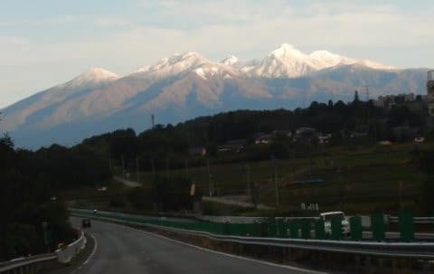

ってなことで．

登ってみても真っ白だし．

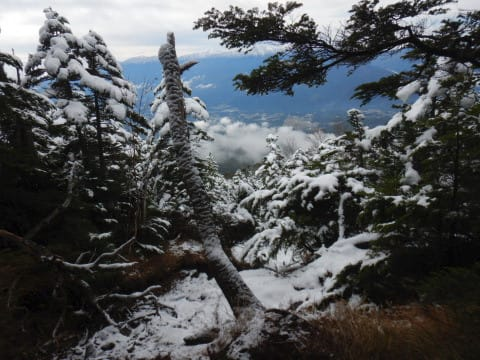

山頂付近は，こんな急登のゴロゴロ

岩場を．

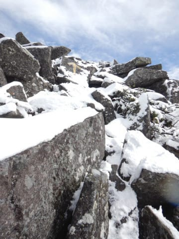

かなりの深さの雪を踏み固めながら，

滑らないように登ったのですが…

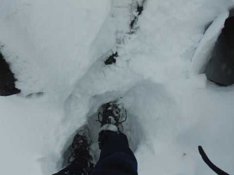

登ってきたところを振り返って．

滑って落ちたら死ぬ

と，今日も思ったのでした…

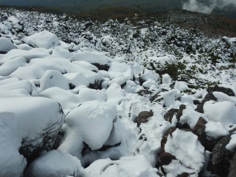

もう，山頂は完全真冬だし．

久しぶりに急斜面の雪の上に立てて．

スキーシーズンのトレーニングとしては

良かったかな…！←何か基準が狂っている

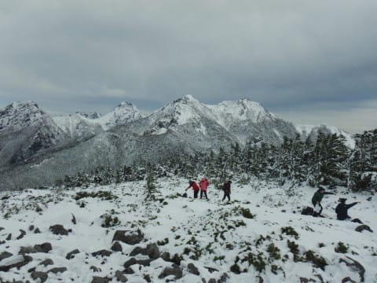

…ということで，一足先に雪面に立って

来たわけですが．

いやー．やっぱりホンモノの天然雪を見ると．

シーズンへの気分が高まりますね～！

（かなり怖かったけど）

ってなことで，本日の本題へ．

えー．

本日，志賀高原中央エリアのリフト営業期間の

案内が公開されてました！

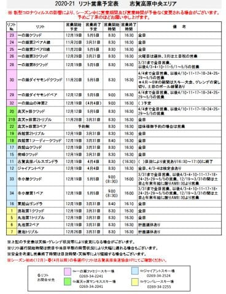

（[志賀高原中央エリアホームページ，2020-21 リフト営業予定表](http://shigakogen.co.jp/wp-content/uploads/2020/10/20-21%E3%83%AA%E3%83%95%E3%83%88%E5%96%B6%E6%A5%AD%E4%BA%88%E5%AE%9A%E8%A1%A81.pdf)より）

…これまでと何か変わったのか？？

わずかな違いも見逃さない，志賀高原マニアの

視点でじっくり見てみますが…

…

…え！

えええ！？？？

一の瀬ファミリーペア，ダイヤモンドクワッドが

11月20日オープン！？？

そして，高天も11月28日オープン！？

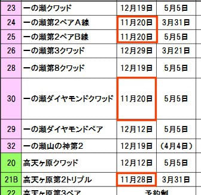

えええ！

これまでの中央エリアでは考えられない

アグレッシブな営業努力じゃないですか！！

どうした…

何があったんだ．

…やっぱり，

横手と熊の湯が11月14日オープン

ってのに刺激されたのか？？

うーん．

まずは嬉しいニュースじゃないですか！

それ以外のリフトは…

概ね12月19日オープンを目指すようですね…

って，一の瀬ファミリークワッドも12月19日！？？

…それ，オープン遅くない…？？

まぁ，高天ヶ原はそれより1週早く，

12月12日にオープンしてくれるようだけど…

まぁ，昨シーズンは雪不足で運転開始が

遅れに遅れまくったからなぁ…

昔は12月第1週から動かしてくれたのになぁ…

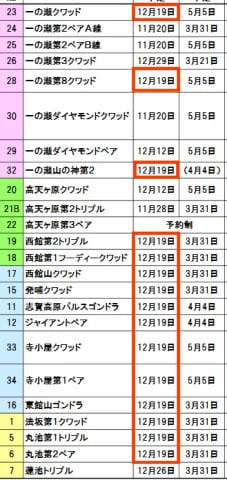

今は雪が少ないから，シーズン初めに

スキーヤーを滑らせないでおいて，

その間に人工降雪をしっかりつけて

おかないと，GWまでもたないんだろうなぁ…

しかし．

東館・西館や丸池サンバレーも同じ12月19日

オープンだけど．

人工降雪が無いこれらのスキー場は，

ホントに12月19日にオープンできるのか，

逆の意味でちょっと心配ではある…

そして．

今度はシーズン終了の日程を見ると．

赤枠で囲ったリフトがGWの5月5日まで

運転のようですが．

GWまで営業するのは一の瀬＆寺子屋エリアと，

これまでと変わらずですね…

それ以外のリフトは基本的には3月31日で

営業終了のようで．

ここも従来と変わりませんね．

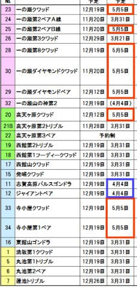

…ただ，青枠で囲った，ジャイアントと

パルスゴンドラ．

これだけは，4月第1週の土日まで動かして

くれるようですね…

…でも，なんでこの2本だけ，4月4日までなの？？

…そして．

私がいつも気にするこのリフトも…

まだ，（予定）となってますが．

やっぱり4月4日でリフトを止めて．

それ以降は焼額・奥志賀と中央エリアを

ぶった切るようです（涙）

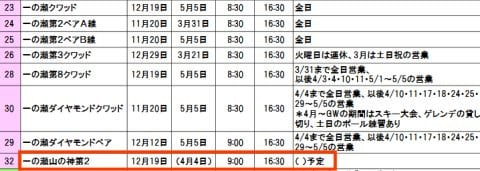

ダイヤモンドも焼額も5月5日まで

やるというのに．

なぜ，両者の行き来を4月以降は

させないようにしてしまうのか…（涙）

ということで．

11月20日にオープンを目指すらしい，

珍しく例年には無い気合を入れてきた

中央エリアですが．

やはり，4月はいつも通り，焼額・奥志賀と

別居状態に入るようです（涙）

…まぁ．

昨年はコロナ騒ぎで4月途中でスキー場が

終わってしまったことを考えれば．

来るシーズン，4月4日以降の心配を

していられる状態

になるなら，まだラッキー…

…というくらいで，ポジティブに捉えて

おきましょうか…（解せないいろいろな闇を飲み込みながら）

## 💬 コメント一覧

### 💬 コメント by (ゆーき)
**タイトル**: Unknown
**投稿日**: 2020-10-19 07:39:59

日当たりのよいダイアモンド、たしかに短いからスノーマシンをがんばらなくてもよいかもしれないけど、GWのことまで考えるなら、やっぱり一ノ瀬クアッドのほうだよね・・・って思いますね。

### 💬 コメント by (通りすがり)
**タイトル**: Unknown
**投稿日**: 2020-10-19 07:44:25

イエティのオープンは10月末だから今週のオープンはありませんよ。創雪もまだまだでこれからっぽいです。

志賀は新たにスノーマシンを導入するからでしょうね。

### 💬 コメント by (Unknown)
**タイトル**: Unknown
**投稿日**: 2020-10-19 07:47:51

12月19~20日と全山2日券付（実質6800円+1000円チケット）で申込みましたが、どのくらいリフト動いてるのかな

奥志賀+焼額山がしっかり滑れれば良いのですが

### 💬 コメント by (アリス)
**タイトル**: 情報にお礼
**投稿日**: 2020-10-19 07:59:09

Skier_S様

リフト運営情報ありがとうございます。

山の神のリフト運営は反則ですよね？

4/4以降は焼額山～一の瀬間はバスか自家用車での移動しか手段がない。

まさかスキー担いで徒歩で移動とか。

解せないです。

### 💬 コメント by (横須賀のウルトラセブン)
**タイトル**: 蓼科山
**投稿日**: 2020-10-19 08:36:37

徒然さん久しぶりです！わが故郷Ｍ78星雲で過ごしておりましたが、スキーシーズンが近づいてきましたので、地球に戻ってきてます（笑）ブログ10執念おめでとうございます！今度は銀婚式まで楽しみにしてます。

写真の山は蓼科山では？結構雪が降ったんですね！

セブンも山好きで、蓼科山は頂上がすごく広い山だ

ったかと。あと一ヶ月もすればシーズンイン志賀でお会

いしましょう！！

### 💬 コメント by (mae)
**タイトル**: Unknown
**投稿日**: 2020-10-19 22:43:57

雪がかなり降ったのですね。編笠山でしょうか？

### 💬 コメント by (Skier_S)
**タイトル**: まさか狭山オープンが11月12日とは…
**投稿日**: 2020-10-20 00:39:09

＞ゆーきさま

ファミリーとダイヤモンドが11月20日オープンって，11月の早いうちから

両方に人工降雪を同時に打つってことですよね…

まだ雪が解けちゃうリスクがある11月の早いうちから両方のスキー場に

雪を打つとは，中央エリアにしては太っ腹な判断ですが．

確かに一の瀬正面バーンも気合を入れて雪を打ってくれることを期待したいですね…！

＞通りすがりさま

仰せの通り，狭山オープンが11月12日とアナウンスされたので，

10月23日オープンはなさそうですね（涙）

＞Unknownさま

12月19，20日ですか…

雪が多い年と少ない年でえらい差がありますから…

運がよければ奥ゴンもヤケビ1ゴンも動いてますが，

運が悪くて昨シーズンと同等だと奥志賀は全滅，ヤケビは2高＆4ロマのみなので．

今年は多い年であることを願うばかりですね…（祈）

＞アリスさま

うーーーん．

山の神は，2019シーズンは「4月第1週まで」との予定でしたが．

実際はGWまで営業してくれたんですよね…

今シーズンも，あくまでカッコ書きの予定なので，

GWまでやってくれることを願いましょう…（祈）

←祈ってばかりだな

＞横須賀のウルトラセブンさま

お久しぶりです～！！

10周年お祝いありがとうございます．

写真の山ですが…山頂付近のゴロゴロ具合は蓼科山っぽいですが，

そのそばの編笠山です！

蓼科山，山頂がゴロゴロ岩で無意味に広い山ですよね（笑）．

しかし，セブンさんも山好きだったんですね！

シーズンインまであと1か月．

また志賀高原でお会いしましょう！

＞maeさま

…あの写真だけで，編笠山と当てるとは…！！

今回，観音平スタートじゃなく富士見高原スタートだったんですが，

富士見高原側からの，雪が無くても手ごわい最後の岩石帯の急斜面，

途中で引き返す人続出の積雪量でした…

足跡を見ると，同じルートは私の他にあと2人ほどしか

登ってなかったと思います．手ごわかった…

