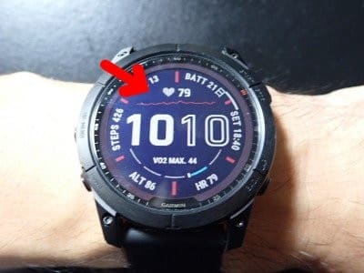

# 新しいスマートウォッチ，Garmin Fenix7Xを買ったよ！その3…まずは標準ウオッチフェイス

📅 投稿日時: 2022-08-15 03:49:25

（Garmin Fenix7Xのレポート全16回のもくじ

機能説明，登山用地図の作り方，登山で使ってみた…など

は[ここをクリック](e516b23a4874189de2e9208be87fa5184.md)）

ってなことで．

ちょっと途中に丹沢山の登山日記を

挟みましたが．

今日は，Garmin Fenix7Xのレポートの

続きをば…

[前回，初期設定が終わった](e8a4031c5f00a0136f84bf2194acd6d7c.md)ので．

早速，使ってたみた感じのレポートですが．

まずは時計の基本機能，ウオッチフェイス

についてです…

もう，めちゃくちゃ機能があります．

ありすぎて楽しすぎる感じ．

どんな機能があるのかをざっと書くだけでも…

【スマートウォッチ機能】

・各種ウォッチフェイス

・スマホメッセージ通知

・ストップウォッチ・タイマー・アラーム

・世界時計

・音楽ダウンロード・再生

・ソーラー充電

・スイカ（非接触カード支払い）

・ライト

【ライフログ系】

・心拍，酸素飽和濃度

・睡眠測定

・ストレス測定

・ボディバッテリー

・呼吸数

・歩数計

・消費カロリー

【アウトドア情報】

・気圧計，高度計，コンパス

・天気

・日の出，日の入り

・潮汐

・地図＆ナビ

【運動解析】

・VO2Max

・レース予想

・フィットネス年齢

【アクティビティ】

・ラン，バイク，登山，スキー，

　バックカントリースキーとか

　数え切れないほど

【アクティビティログ】

・いろいろ

と，これだけあって．

さらに，アクティビティ毎に覚えきれない

いろんな機能があるし．

アクティビティログだけでも

ご飯が3杯いけるほどの盛りだくさんな

楽しみがあります…

とりあえず．

まずはスマートウォッチの基本機能から

説明してみると．

まぁ，こいつが普通の時計状態のウォッチフェイス．

そのほか，標準ですでにインストールされてる

ウオッチフェイスだけで，こんないろいろ

種類があります…

　

　

　

　

　

　

　

　

　

　

　

　

まぁ，標準ウオッチフェイスは全体的に

地味…というか．

ポジティブな表現でいうと，シンプルな

デザインのものが多いですね…

でも．

このウォッチフェイス．

それぞれがさらにカスタマイズできるように

なっていて．

例えば，このウオッチフェイス．

矢印で示したこの8カ所の表示内容を

レイアウトメニューでそれぞれ好きな

表示内容に変えることができます！

例えば．

矢印部分の表示を変更して，

現在のVO2Maxに基づいた，

5km走のレース時間予想や…

本日の消費カロリー数．

日付，月．

日の入り，日の出…

上の水色と黄色いバー，

黄色が太陽が出ている時間．水色が

太陽が沈んでいる時間を示していて，

あとどのくらいで日が沈みそうかが

感覚的に分かるようになっています．

そしてこいつは…

リアルタイム心拍とその変化グラフ．

こいつは，後で説明する

ボディーバッテリーの値とグラフ．

さらには…

この表示を2分割やさらに3分割にもできて．

この例では2分割で，標高と日付・曜日を

表示したりと．

表示できる項目は一例を示しただけで，

もっといろいろ選べます…

これだけの情報を8カ所，好きなところに

好きなように表示できるようカスタマイズ

できるので．

画面は地味だけど，いろんな情報が

表示できる，数字マニアにはたまらない

感じ！

とりあえず，Garminさんは．

なんでもカスタマイズできる

というポリシーなんだな…

と，分かってきました．

さらに，標準のウォッチフェイス以外にも．

Garmin IQというアプリを使って，

追加のウォッチフェイスを時計にダウンロード

することもできます…！

これについては，次回！

## 💬 コメント一覧

### 💬 コメント by (油漏＠あちこち)
**タイトル**: Unknown
**投稿日**: 2022-08-15 07:20:43

Garminのランニングウォッチ935を愛用しています。トレーニングページがカスタマイズできるのが素晴らしいと気に入っています。

ランニング中は一枚目の画面で距離、ペース、経過時間、二枚の画面で心拍数と時間を表示しています。山歩き（遅いけどトレランも参加しています）時は、二枚目の時間を標高に変えています。

揺れを伴う走りながら老眼で確認するので、一画面に集約すると確認が難しくなります。

※VO2MAX44はかなり高いと思います。私の時計では、山歩きのVO2MAXとランニング時のそれでは５位差が出ます。ランニングで測ると50近く行くのではないでしょうか。

### 💬 コメント by (Skier_S)
**タイトル**: ＞油漏＠あちこちさま
**投稿日**: 2022-08-16 04:20:59

あら！Garminユーザーですか！

ForAthrete935を選ぶって，ガチのランナーなんですね．しかも，トレランもされるとは…

トレーニングページの表示が選べるの，すごいいいですよね…！

VO2Max44，いいんですか？ランナーの人は50台の人が多いので，あんまり大したことないなぁ…

とちょっとがっかりしてたんですが．そうなんですね…ランで測るともっと高い数字が出るんですか．

でも，私は平らな所を走るのが得意でない…というか，好きじゃないので，

ランをする予定はないのですが(笑)．

