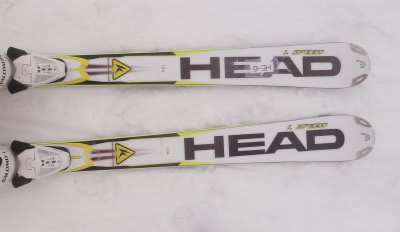
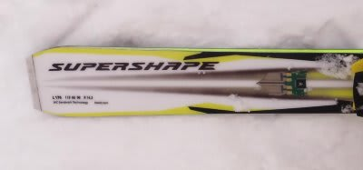
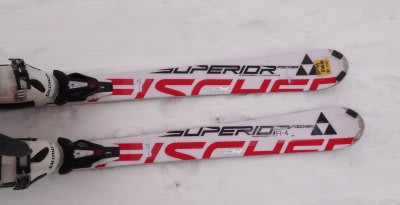
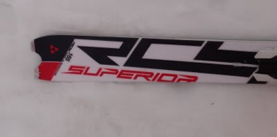

# これで一区切り！　2012/2013シーズンモデルのスキー試乗レポート　HEAD＆FISCHER編

📅 投稿日時: 2012-03-30 00:00:13

さてさて．

長きに渡った，八方での試乗会レポートも今回が最後です．

今回は，HEAD1機種，FISCHER1機種です．

うーん．でも，久しぶりの試乗会面白かったなぁ．

また今シーズンにもう一回行きたいなぁ．

-----

○HEAD

HEAD Supershape i-Speed 170cm

大回りベース基礎板．

履いた瞬間．

「うーん．HEADだ」

履いた感じはウッドコアサンドイッチっぽい感覚で，

メタルが入った張りの強い感じもなく，

低速ではどちらかというとむしろぺらぺらした感じの

履き心地．

ゆっくり滑っていると，

こんな柔らかくていいの？

…という感じがするんですが．

スピードを出していき，速いバタバタした感じの入力

に対しては，しっかりとこらえる硬さが出てきます．

ハイスピードになっていき，切り替えから谷回りで板が

強い力を受けるようになっていくと，それにあった強い

反力が出てくる感じ．

うーん．やっぱり，これはHEAD独特の乗り味なんだけど．

これがIntelligenceの効果なのかなぁ．

そのため，スピードを出してもしっかり大回りに入れます．

グリップさせても滑れますし，ズラしにも容易に入れられるので，

ずらした小回りもOK.

操作性はかなりクラシックな感じで，完全キャンバー板の

操作が求められます．切り替えでトップを押さえていく

動きを入れたほうがきれいに回っていきます．

荷重点はくるぶしよりもつま先より，土踏まずから母指球辺り．

今年モデルは乗ったことないんですが，昨年モデルからも

そんなに大きく変わっている感じは無いですね～．

見た目があんまり変わってないからそう思うのかな？

とりあえず，あまりにも無難すぎて，衝撃がなかったので

あまりインパクトがなかったのが残念．

○FISCHER

FISCHER RC4 SUPERIOR Racetrack　165cm 

うーむ．

何用の板か，良くわからないんですが．

小回り基礎用なのかな？？

この板は…クラシカルなウッドコア平板のスラローム板の乗り心地ですね．．

SL競技用そのものの履き心地なんですけど．

テールが半円状に切られているので，ルックスもFISCHERの

競技用みたい…．

R14と，小回り板にしては比較的大き目のラディウスですが．

比較的前後動が必要．抑えるポジションもトップ寄り．

板が仕事をするより，自分がしっかり動いていく必要があります．

回転弧のコントロールは乗り手がマニュアル操作する感じ．

ターン後半，しっかり回してテールまで乗っていき，そのあと

荷重ポイントをトップ目に戻していく動作が必要です．

フレックスはすごい硬いです．

しっかりスピードを出してガッツリ荷重してたわませて

いかないと，きれいに回ってきません．

結構手ごわい．

かなりハイレベルなSL競技板っぽい感じ．

うーーん．

私が履いて楽しめるレベルの板じゃないなぁ…

もっと上手い人が履く板のような感じです…
