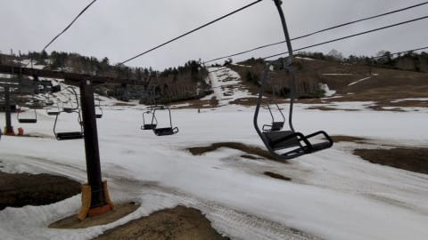
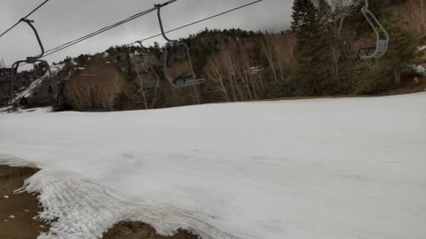
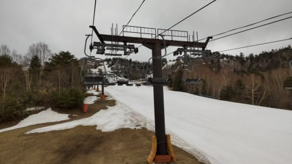
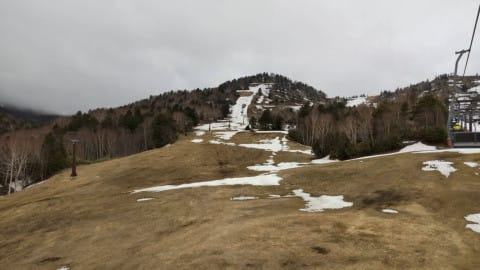
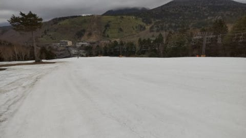

# 5月15，16日の週末は雨にならなさそうだけど，夏並みの高温(涙)…そして2021/5/11(火)志賀高原熊の湯スキー場特派員情報！

📅 投稿日時: 2021-05-12 02:08:25

えー．

昨日の記事にちらっと書いた

ように，今週は13，14日あたりに

雨になる予想でしたが…

今の天気図だと，志賀やかぐら．

13，14日は降らずに済みそうです！

降ってもぽつ・ぽつとくる程度かな．

そして，16日の日曜も雨予想でしたが…

なんとかギリギリ雨にならずに

済みそうな気配になってきました…！

…ただ．そのかわり，

15日，16日の週末は．

「夏か？？」

と思う天気図なので．

すごい気温が上がりそう…(泣）．

15，16日は6月下旬から7月並みの

気温になるんじゃないかな？？

むちゃくちゃ暑くなるので，

板の滑りは激悪になりそうな

感じ(涙）

うーむ．

やたら晴れて暑くなるくらいなら，

雨の方が，板が滑るし混まないから

いいかも…←終わった人の発想

ってなことで．

本日も熊の湯スキー場に行っていた

特派員からのレポートです…！

朝から気温が低めで，肌寒かったらしい

11日の火曜ですが．

今日もガラガラだったようです…

そして．

早朝にちょっと雨が降ったらしく．

バーンは緩み気味だったものの…

気温が低めで，日も射さなかったので．

板は滑って，結構楽しめたようです…！！

しかし．

午前10時ごろでも，滑っているのは15～6人

だったという報告だったのですが…

実質，貸し切りですね(笑)．

いやホントに，誰も滑ってない！

…でも．雪は減りましたね…

第3緩斜面，7日の金曜まではまだ滑れた

のに…

もうこんな感じに(涙）

ってな感じで

熊の湯の営業も，あと残る5日間ですが．

送ってもらった写真を見る分には．

この土日まで，なんとか雪は残りそうな

感じかな…！

…土曜の高温で一気に解けなければ

だけど…

土日でかなり雪が減りそうなので．

熊の湯に行くなら，土曜の方が

いいかも！？？

## 💬 コメント一覧

### 💬 コメント by (ikkun)
**タイトル**: Unknown
**投稿日**: 2021-05-12 15:20:24

お疲れ様です 度々m(__)m

はい 先月は珍しく？まとまったお仕事が4件(泣)  しかも一つはブーツを買ったスキ－に力多めなスポーツ屋さんに お仕事頂きましたしm(__)m  有難い事です………だからではないですが…こちらのお陰様で(笑)少しずつ心が動いてマスカット(笑)  て云いながら 薄手jacketcleaningに出してしまって昨日でした  ヤバいです❗

### 💬 コメント by (Skier_S)
**タイトル**: ＞ikkunさま
**投稿日**: 2021-05-14 01:56:12

今シーズンはまだ終わってませんよ～！

熊の湯は土曜で終わりですが．

横手もかぐらも滑れますよ…

