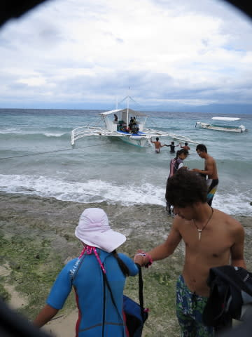

# 2015年8月　子連れでモアルボアルでダイビングその3…モアルボアル初日の朝

📅 投稿日時: 2015-10-22 01:53:23

さぁ．

なんだか，私のブログらしい感じになってきましたよ～．

夏と冬の話題がミックスされて，季節感を失ってきましたよ～．

ということで，この4日間．

冬→夏→冬→夏，と言った感じで．

また，夏の話題に戻るのだっ！

---

って感じで.

モアルボアル初日の朝がやってきたわけですが．

…到着した昨晩は，暗くてわからなかったけど．

部屋の前からの眺めは，こんな感じで．

…オーシャンビューではないけど，リゾートっぽい感じかなぁ…

で．部屋からちょっと横を見ると，こんな風に海が見えてて．

10mも歩くと，すぐ海の前に出られます．

…が．

…けれども．

…なんだか．

これはちょっと…

かなーーり，海が荒れてませんか？？

かなりの強風で，海がざっぱんざっぱん波立ってませんか？？

…こ，これは…

今日，潜りに行けるのかなぁ…（涙）．

ちょっと海況に不安を感じながらも，

朝食を食べに，ホテル敷地内のレストランへ…

今回の宿は朝食がセットになっていて．

こんな感じのアメリカンブレックファーストか…

フィリピン風のブレックファーストが選べます．

朝食を食べて，のんびりコーヒーを飲んでいると．

そろそろダイビングの集合時間．

今回利用したダイビングショップは，

自分たちが泊まっているホテルからは，徒歩2-3分の，

すぐそばにありますが．

初日はショップの人がホテルまで迎えに来てくれるので，

ホテル前の，こんな道を…

ショップの人について行って，歩いていきます．

こーゆー，いかにもフィリピンの田舎っぽいところを

歩いていくと…

やってきたのは，

「エメラルドグリーンダイビングセンター」

オーナーが日本人の，完全日本人向けのショップです．

建物が新しく，結構きれいなお店ですね～

ショップに着いてから．

私　「…今日は，すごい風が強いですね」

ガイド　「…ここ数日，この風のおかげで波が高くて…」

私　「潜りに行けるのか心配だったんですが」

ガイド　「行けます．今日は潜りに行けますが…

　　潜れるポイントは，かなり限られます」

私　（がっくし）

という感じで．

これだけ海が荒れているのに，潜りに行けるだけ

まぁラッキーだと思わねば…

というような状況らしく．

とりあえず，このショップのオーナー＆ガイドの小宮山さんから

「今日は波が高く，潜れるのは沿岸のこのあたりだけになります」

という，潜りに行くポイントのブリーフィングを受けて．

ショップの前の海から，ボートに乗り込みます．

…波が高いので，乗り込むのも一苦労…

そして，フィリピンの海へ繰り出しますが．

…ああ．

天気も悪いし．

波も高いし．

かなりちょっと残念な感じ…（涙）．
