# 2019/12/28(土)の志賀高原スキー場，速報レポート！…年末寒波の積雪がついに！焼額，奥志賀ほぼ全面オープン＆トップシーズンの雪質！路面状況は完全雪道

📅 投稿日時: 2019-12-29 06:26:58

🏷️ カテゴリ: [2020スキー滑走日記](c282e9230de179e245c7334eabeb0a3b3.md)

ということで．

本日，日帰りで志賀高原に行ってきた

わけですが．

…むちゃくちゃ積もりました！！！

本日朝の焼額山の駐車場，

昨晩から止めてあった車は，

雪のオブジェ化してました…

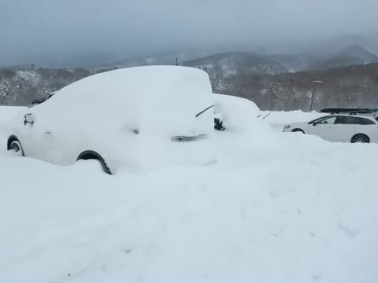

いやーーー．

積もった．

積もったよ．

昨晩から，40～50cmの積雪が

あったんじゃないかな？！！

そのおかげで，登りの道路はかなりの

本格雪道道路でしたが…

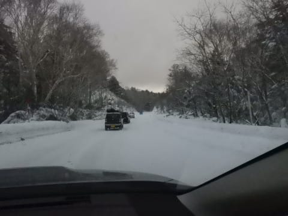

焼額山は，本日から1ゴン，２ゴンが運転で，

パノラマ，GSコースがオープン！

そして，明日からイーストコースがオープン！！

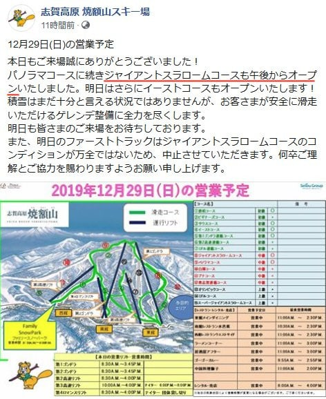

（[焼額山Facebook](https://ja-jp.facebook.com/yakebitaiyama/photos/a.533933973368620/2610225545739442/?type=3&theater)より）

奥志賀は第6リフトを除き，ほぼ全面可能に！

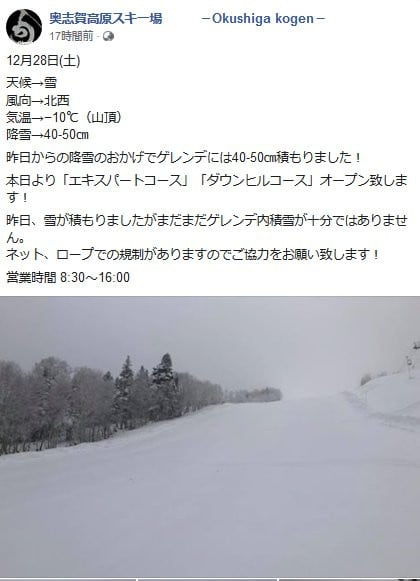

（[奥志賀高原スキー場Facebook](https://www.facebook.com/okushiga.kogen/posts/1467943256689311?__xts__[0]=68.ARA6b3BGvXYylFs2S-3og5Tt-JfVraAcrD3AyyqtWIHwj4Y1rYZ7WQ73CLLHeaJNq0bhXo6lkKRjE0xEKBCnBhsiUzSnbaD9c2IstDddWrAzrsy45F2h7QHO2XyJZOi2oe2k8Y-kmenBcwKuAzr1_4j-m4E_8bsMkFVJPFIu7AAqGqUE3zMx7w2bo-gjMRKwZAKElNXKhwu9BdxCRcF_3ahUlB1DHTPrsNjM7vgpYCRqm9ZZiDOasAXM1A0YkcrZeb6vEDfXUbprSm6xehK9iOD1KHvesBQWKN8j4Gjt__NFOWDGGRTE-6tJRVKd7rfZys3H9rnme9JjH3JFQisEYGqexA&__tn__=-R)より）

中央エリアも，

・山の神

・タンネの森

・ブナ平

・蓮池

が滑れるようになったようですね…

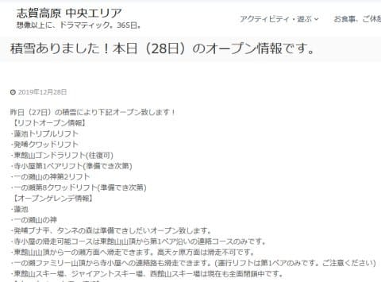

（[志賀高原リゾート開発HP](http://shigakogen.co.jp/archives/5256)より）

…寺子屋もオープンしてますが，

ペアのみなので，実質行って帰って

来るだけの感じです…

東館山も，ゴンドラは動き出しましたが

往復乗車のみで，まだ滑れません（涙）

とはいえ．

奥志賀，焼額エリアはほぼ全面可能に

なりましたっ！！！

素晴らしい！！！

ってな感じで．

本日，28日ですが…

ついにわが生息地，←だから，住んでないってば

焼額第1ゴンドラが営業開始っ！！

（パチパチパチ）

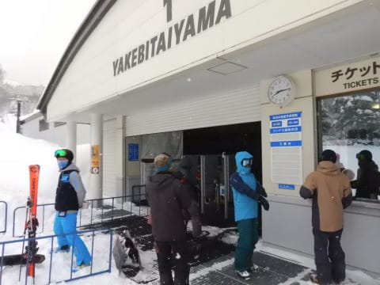

いやー．

7か月ぶりに帰ってきたよ，

第1ゴンドラ…

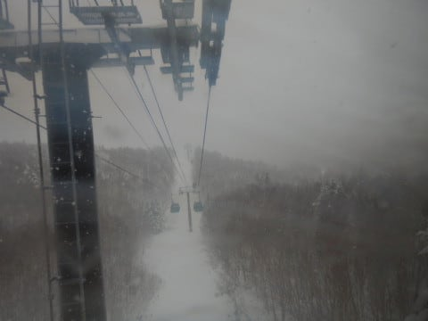

山頂の積雪は，コース脇は

ブーツ～脛パフ！

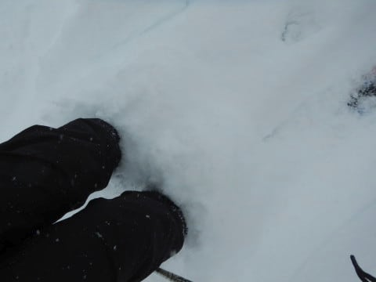

いやーー．

先週までとうって変わって．

完全ハイシーズンの景色に

なりました！！

ただ．

午前中は第1ゴンドラ側のGSコースが

滑れず．

滑れたのは第2ゴンドラ側のパノラマ

コースのみ…

第1，第2の2本のゴンドラでパノラマコースへ

人を送り込むので，

パノラマコースの人口密度，なんだか

すごいことに…（涙）

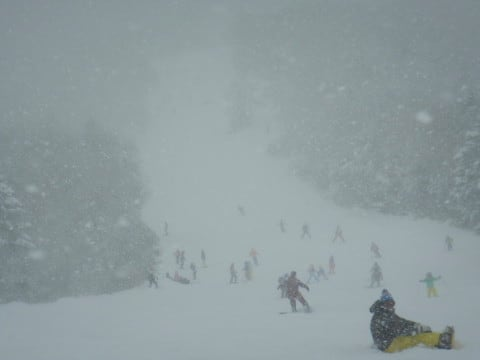

そして，第2高速リフトもすごい

混んできました（泣）

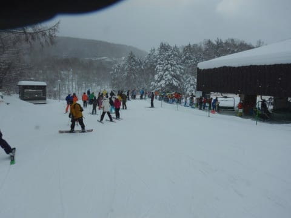

幸いなのは，第2ゴンドラ側の

パノラマコース，第1ゴンドラからの

アクセスが悪いため．

第1ゴンドラはガラガラだったことでしょうか…

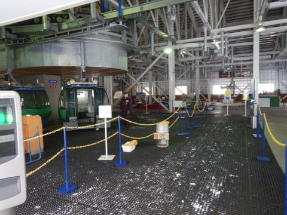

でも．

パノラマコースのこの人口密度に

耐えられない…（泣）

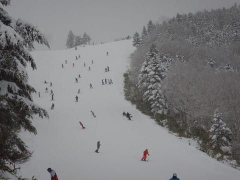

ってなことで．

…あれ？

これは焼額に忠誠を誓った人間が，

来てはいけないところでは…っ？？←先週と同じパターンだな

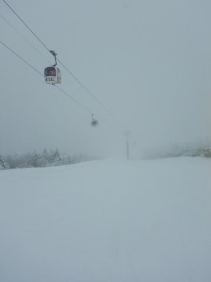

そうです．

奥志賀高原へやってきました～！！

奥志賀ダウンヒルコース，

人工雪が無いにもかかわらず，

完全トップシーズンの雪質で，

ブッシュの心配はなく．

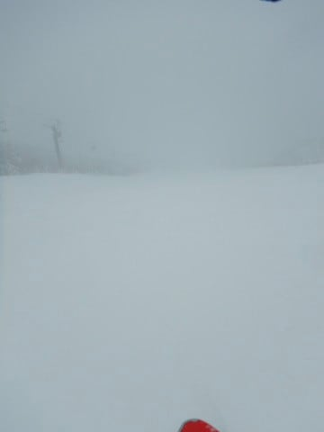

3壁部分は非圧雪で，

パフパフもあり…

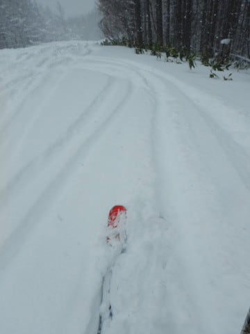

そして，奥志賀ゴンドラも

搬器数台程度の待ちで，

ガラガラ！

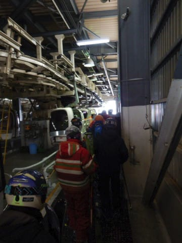

素晴らしい…

とても3日前まで，全く滑れる

気配がなかったとは思えない！！

ビバ！年末寒波っ！！

そして，奥志賀第2高速側の

エキスパートコースも…

もう，完全ハイシーズンの

ゲレンデ状況！！

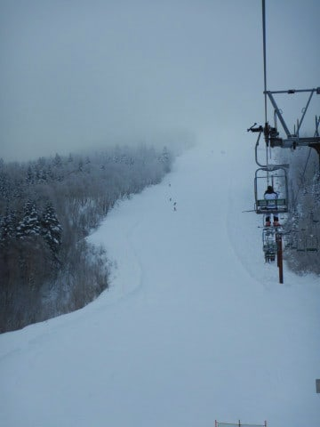

ブッシュらしきものもなく，

年末休というのに，リフトは

飛び乗り！！

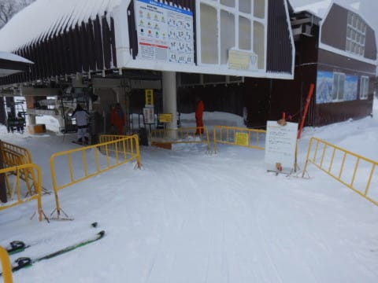

いやーーー．

今日は奥志賀が良かったのでは…？

と思ってたら．

午後2時ごろ，ちょいとゲレンデが

荒れてきたころに…

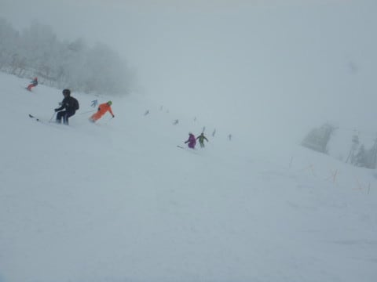

なんと．

わがホームコースである，←ホームコースって，なに？？

焼額の1ゴン側，GSコースがオープンしたという

ニュースが！！

これは全力で，焼額に戻らないと！！

…と，戻ってきました焼額．

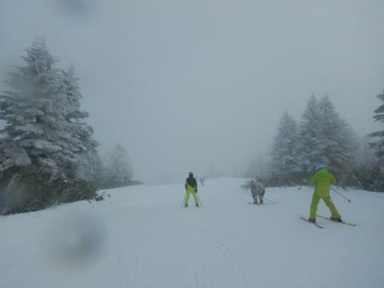

うおおお！！

ホントにGSコースオープンしてる！

まさか今日オープンするとは思わなかった！！！

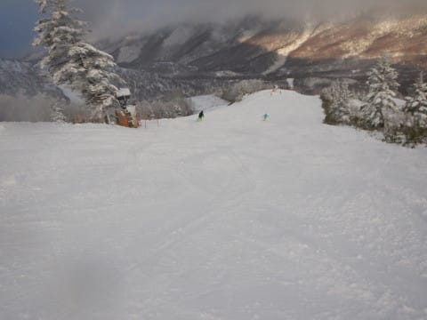

雪はたっぷり，

雪質は冷え冷えトップシーズンレベル．

午後にオープンしたばっかりで，

雪もそれほど荒れておらず…

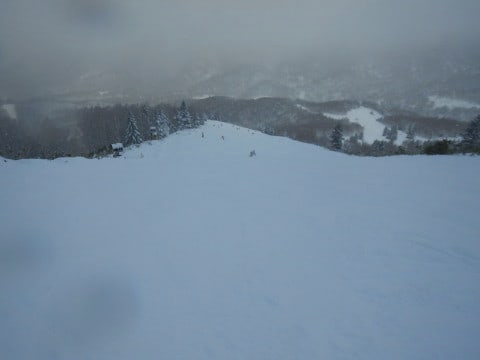

そして，ゲレンデの一番下まで，

ちゃんと雪たっぷり！

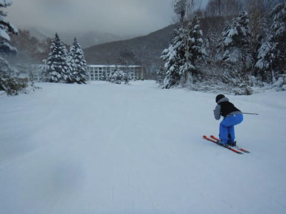

いや…

最高…っ！！

今シーズン初めて，天然雪で滑れた日が，

こんなに恵まれてていいの？？

完全トップシーズンですよ！これ！？？

…って感じで．

激烈に喜びながら，いつもの最終ゴンドラまで

かっ飛ばし続けたのでした…

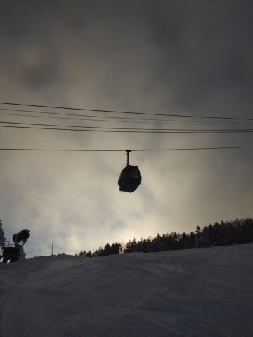

…

…しかし．

今日は雪が良かった…

うーん．

でも，焼額のゴンドラ営業終了が

15:45って早すぎるよなぁ…

もっと滑りたい…

…

…

はっ！！

なんだ，これは！！

日帰りのはずなのに，

なぜダイヤナイターのゲレンデに！？？

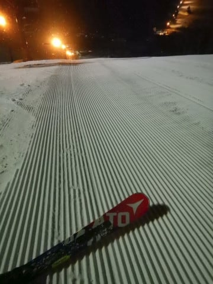

…いや．

ホントは，今朝は3時過ぎに起きて

日帰りなので，

ナイターを滑らずに帰ろうと思ったのですが．

本日一緒に滑った某読者のまーくんさんに

誘われてしまい．←全然「某」読者になってないから

どうしても断れなくて，仕方なく…←いや，実は結構行く気マンマンだったんじゃないの？？

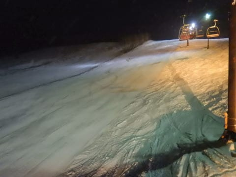

しかし．

ゲレンデは，おそらくトップシーズンでもそうそうない，

柔らか最高雪質のピカピカ圧雪バーン！！

もう，快楽のまま傾き倒せる，最高官能バーンで．

…日帰りだけど，ナイター滑ってよかった

と，心から思えるシアワセバーンを．

ついついリフトストップまで滑って

しまったのでした…

そして，帰宅朝5時（涙）

帰りの高速で途中2時間寝てしまったとはいえ．

かなり激しい日帰りでしたが．

それだけの労力を払った価値はある

一日でした…

いや．

もう，志賀高原の奥志賀・焼額エリアは

トップシーズン入りしました．

まだ，オリンピックコースや白樺コースは

オープンしてませんが，

4シーズン前の雪不足の年に比べれば，

ずっとマシな状況まで回復しました…！

30日の夜に，また悲しい雨になりそうですが．

そのあとは，31日から1日にかけて．

今回の27日から28日にかけてと同じように

積もりそうです！！！

（31日は，27日と同じような荒れ荒れ吹雪っぽい…）

いやーー．

年末年始，ちゃんと滑れそうで良かった…

## 💬 コメント一覧

### 💬 コメント by (まーくん)
**タイトル**: Unknown
**投稿日**: 2019-12-29 06:46:08

昨日はありがとうございました！

やはり20000mクラブは恐るべき滑走スピードですね！

次会う時はs様のように膝擦りロングターンが出来るようにしておきます（笑）

### 💬 コメント by (musi)
**タイトル**: Unknown
**投稿日**: 2019-12-29 17:44:37

日帰りお疲れ様です。

私達家族は、29日から志賀高原に来ているのですが、午後から寺子屋もオープンになりました。メインは奥志賀を滑っていたのですが、ホント数日でこれだけかわるのか！楽しい一日でした。ギャンブル成功でした。

焼額のパノラマは、今日もそこそこ混んでいましたし、コブが形成されていましたが、柔らかい雪で私の腕前でも楽しめました。明日は、熊の湯、横手山に行ってみようと思ってます。

### 💬 コメント by (Skier_S)
**タイトル**: 明日は…雨（涙）
**投稿日**: 2019-12-29 23:19:06

＞まーくんさま

今日の午前の志賀高原は楽しめましたか？？

焼額朝礼メンバーに歓迎されたようですが(笑)

また志賀高原に滑りに来てください～！！

＞musiさま

おそらく，今日まではいい感じだったと思います．

今日までは…

30日は，昼ごろから雨になるかも…

そして，31日は吹雪を覚悟しておいてください．

30日，そんなにひどい雨にならないことを祈りましょう！

