# 2007年8月　三宅島ドルフィンスイム＆ダイビング旅行記　その9

📅 投稿日時: 2013-09-20 01:06:42

えー．

タイから帰ってきたというのに．

まだ続く，三宅島レポート．

…こうやって，過去の文章を載せている間に，

必死にタオのレポートを書いているという…

ということで．

今日も三宅島レポート，Go!

--

さて．

日曜の朝．

朝食を食べていると，今日も

「本日，火山ガス濃度が高くなると予想される地域は…」

という放送が．

「ああ，噴火があった島なんだなぁ」と思い出すけど．

こんな放送が入らないと，噴火があった島だったことを忘れるほどの

のんびりしたいい島です．

さて．

今日は午前に2本ダイビングのあと，午後14:40分三宅島発の

船で帰る予定．

1本目はボートダイブで，宿とちょうど反対側にある港から船が出るので，

ダイブショップの車に乗せてもらって島を半周．

…んだけど．

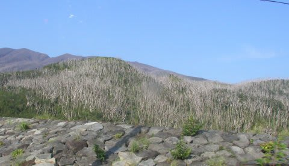

車窓から眺めていると，火山ガス高濃度地区は木が立ち枯れてますねぇ…

噴火後放置されているらしい建物も…

高濃度地区以外は，普通ののんびりした景色なんですけどね～．

って感じで，しばらく車に揺られると，

島の反対側の小さな港に到着．

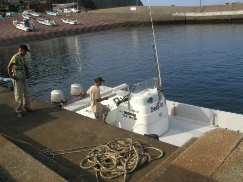

伊ヶ谷ってところらしいですが…

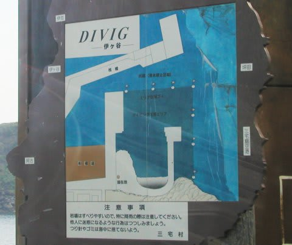

…DIVIGって何？

＃DIVINGの間違いだとはおもうんだけど

こんな感じの小さな船で沖に出て，エントリー．

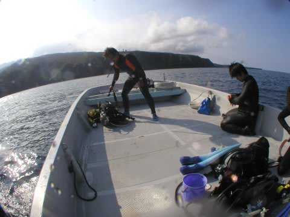

今日のゲストも2人と少人数！

ゆっくり潜れて，いいですね～．

透明度は10mプラスくらいかな～．

水面付近の水温は27度とあったかいです．

エントリーしたすぐに，キンギョハナダイやら…

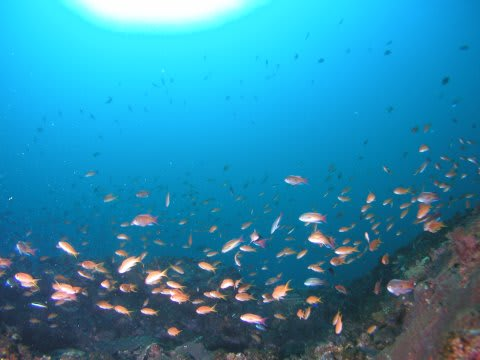

アカオビハナダイやらが出没．

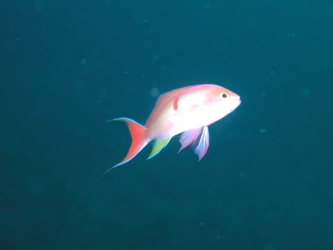

その後，キンチャクガニ，ミヤケテグリのチビなど，

小物を見ながら深場に落として行きますが…

深いところは水温20度！

つべたい…

深いところには，マツカサウオやら…

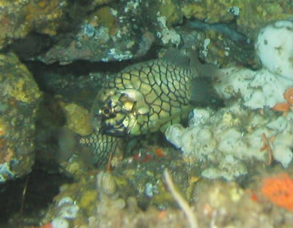

キビレマツカサなどもいましたが．

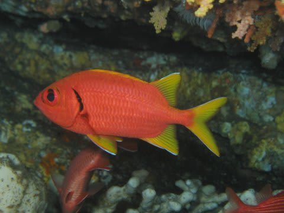

ううううーむ．

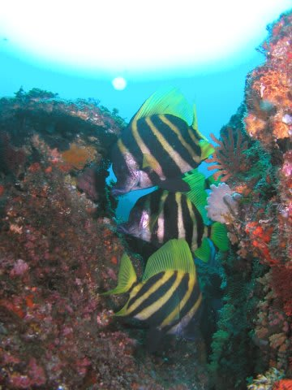

きれいではあるんだけど…

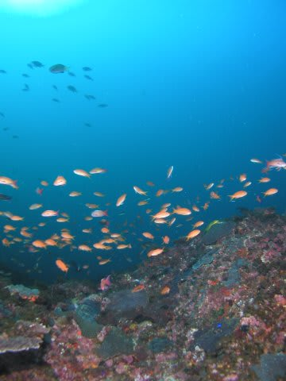

昨日の方が見所が多かったかな？

1本目をエグジットして…

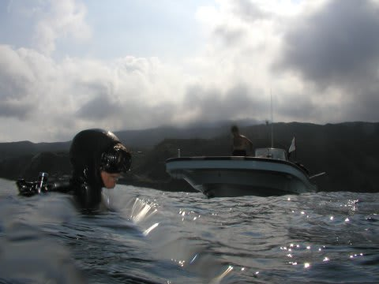

港へ戻りますが．

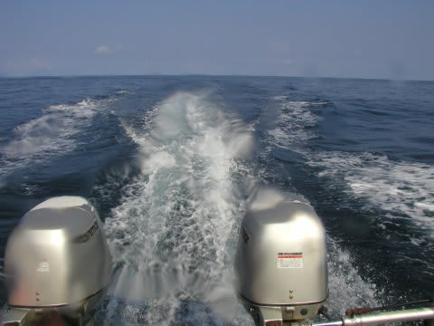

うーむ．

…やっぱり，昨日潜った大久保浜の方が，いろんなものが見れて

面白かったなぁ．

…ってことで．

次の午前の2本目はビーチダイブ．

車に乗って，次のポイントへ向かいます…
