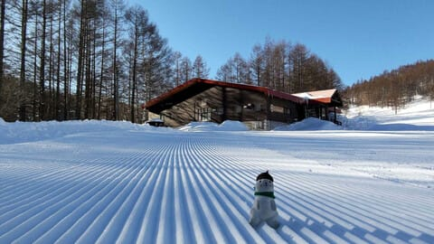
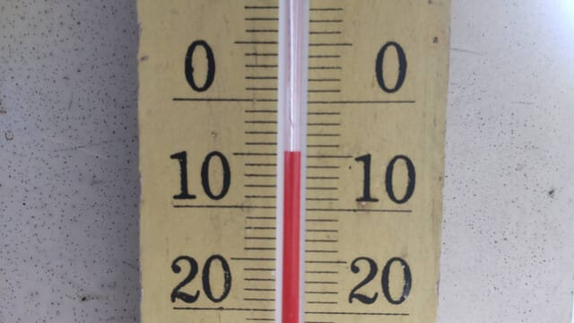
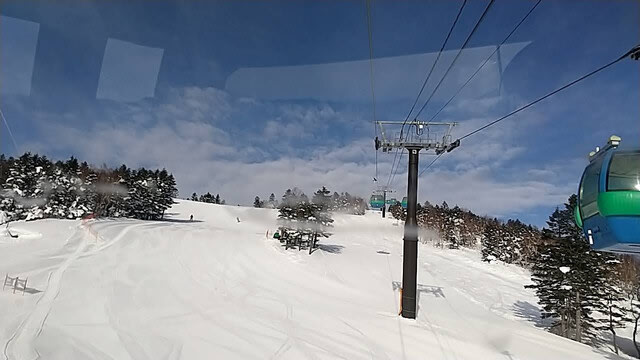
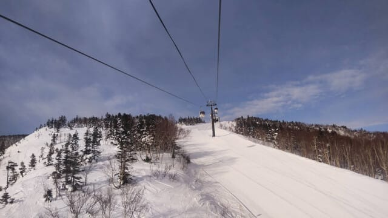
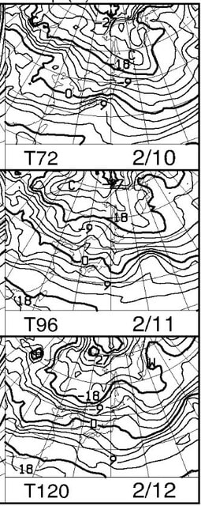
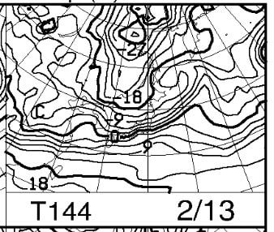

# 2月10～13日は高温だけど，志賀高原なら雪の天気図になってきた

📅 投稿日時: 2023-02-08 07:53:30

🏷️ カテゴリ: [日記](cc4b5682fb7b8b144980957a978653fb0.md)

どうやら疲れがたまっていたのか，

昨日は日付が変わる前に耐えられずに布団に

入ってしまい，そのまま朝まで寝てました…

久しぶりに7時間以上，人間らしい睡眠時間が

取れた気がする…

ってなことで．

昨日，2月7日も志賀高原特派員からゲレンデ

写真が届きましたが…

朝イチでも-5℃と，この時期としては気温が

高く，昼間は結構あったかかったみたいで…

バーンは結構堅めにしまった圧雪に

なってきたようですが…

焼額の特派員からのレポートでは，

しまっていてスピードが出そうな，スピード派

にはたまらない感じのシマシマ写真が

送られてきました…！

天気は朝イチは雲が多かったものの晴れ！

…その代わり，晴れて気温が上がり，

昼間の雪はちょっと緩み気味だったんじゃ

ないかな…

で．

先日の記事で，11日から気温が上がり，

13日はやばそう…と書きましたが．

最新の天気図を見ると…

うむ．

10日から12日は，850hpaの0度線は

普段の2月にしては北上するものの，

志賀高原にギリギリかかるかどうか

くらいまでしか北上してませんね…

これなら，志賀なら降れば雪！！

そして，一番やばかった13日も…

うん．

0℃線はギリギリ志賀より南ですね…！！

この日は全国的に降水がありそうだけど．

この気温なら，志賀では液体ではなく

雪が降りそう…！

志賀にしては重めの雪でしょうけど，

重めの雪のほうが積もるので，雪が少ない

今年はありがたいかも…

…これからまだ天気図が変わる可能性は

あるものの．

2月の志賀で液体が空から落ちてくる

という最悪の事態は避けられそうな予感…！

## 💬 コメント一覧

### 💬 コメント by (副院長)
**タイトル**: Unknown
**投稿日**: 2023-02-08 08:48:03

S様、13日は何とか雪になりそうですか。ありがとうございます。レインボー75様、私の板は小回り系の板ですので、ゲレンデではついていけませんが、よろしくお願いいたします。

### 💬 コメント by (レインボー75)
**タイトル**: Unknown
**投稿日**: 2023-02-08 21:02:13

水曜日の志賀高原情報

今日は湿気を含んだ固めのバーン。ずっとやけびで過ごしました。

いつもの勘違い快楽バーンに慣れっこの私には、曇りで視界も悪いし、なんか楽しくない一日となりました。昼は二高の中華「獅子」。

愛車がミッション故障から復帰。415000円は痛すぎます。明日から使えるのが嬉しい

けど、この憂さはスキーで晴らしてやる！

皆様、クルマは大切に。

### 💬 コメント by (だい)
**タイトル**: 今週末は混みそう？
**投稿日**: 2023-02-08 23:10:38

こんばんは、だいです。

2月は今週末しかチャンスが無いので行くことにしたのですが、宿の予約が随分入っていました。

今週末は物凄く混みそうな予感がしています。今年は3連休ではなかったので油断していました…

### 💬 コメント by (Skier_S)
**タイトル**: 今週末は雪だけど気温は高め
**投稿日**: 2023-02-09 02:04:54

＞副院長さま

志賀は，雨は降らすに済みそうです～！！

＞レインボー75さま

今日はバーン硬かったんですね…

今晩からちょっと積もるので，少しは回復するといいんですが．

あと，車復活良かったですね！修理費凄いですが…

＞だいさま

今週は土曜が祭日なので，土曜休みじゃない人も土日連休で

混むと思います…

### 💬 コメント by (富山県民)
**タイトル**: Unknown
**投稿日**: 2023-02-09 07:41:36

今週末は白馬村の八方尾根に行く予定です。

今週末こそはすっきり晴れてほしいです。

ただ気温が高いために雪質はあまり良くなさそうです。

### 💬 コメント by (Skier_S)
**タイトル**: ＞富山県民さま
**投稿日**: 2023-02-10 01:42:26

今週末，八方ですか…

土曜は朝のうちは曇りそうですが，じき晴れます！

日曜は晴れですが…

暖かい春スキーみたいな雪質になりそうです…

標高が低いところは辛いかも．

### 💬 コメント by (富山県民)
**タイトル**: Unknown
**投稿日**: 2023-02-10 17:45:22

今週末ですが土曜日は飯綱リゾート、日曜日は八方尾根に行く予定です。

日曜日は晴天になりそうです。

今年やっと週末に本格的に晴れそうです。

今までは平日ばかり晴れていて虫唾が走ってました。

### 💬 コメント by (Skier_S)
**タイトル**: ＞富山県民さま
**投稿日**: 2023-02-11 03:20:30

これまで，晴れの週末に恵まれなかったんですか…

志賀は日本海側のスキー場より晴れの確率が高いので，結構晴れる週末が多かったです．

今週末は良い週末を過ごせると思いますよ～！！

