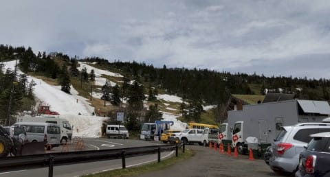
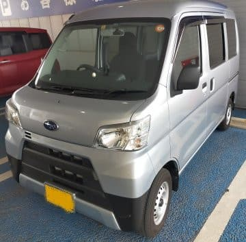
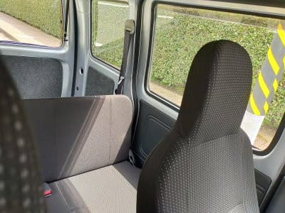

# スバル サンバーバンに乗ってみた…そして，2021/5/20(木)の渋峠スキー場特派員レポート！

📅 投稿日時: 2021-05-21 02:41:03

えー．

本日も，まずは志賀高原の渋峠スキー場から

送られてきた，いつもの特派員レポートで

スタート！

今日も朝から+10℃近い気温でスタート

だったようですが…

この下の写真のの右端，電源車が見えますね．

雪が解けないと地下送電線の復旧工事が

できないとのことで，GWの落雷による

停電からまだ復活していない渋峠．

今シーズンの残り期間，リフトはずっと

この東電提供の電源車で動かすようですね…

で．天気はちょうどいいうす曇りで，

雪の表面は日差しで緩まず，結構

いい感じで板が滑ったようです…！

ただ．そろそろコースの一部，狭くなって

来たところが…(涙）

で．

今日も下から見て右側のウェーバー

コースはオープンしなかったようですが．

昨日に引き続き，コースへは雪出しを

していたようなので．

週末に向けて，コースを休ませて整備を

続けているウェーバーコースの方が，

いいコンディションでも滑れるかも…？

ただ．

特派員によると，今週末オープンするかも…

と言っていた海和ゲレンデ．

週末に動かすのはちょっと厳しそうかも…

という話でした．

でも，渋峠はコース整備を必死にやっているので．

渋峠は今週末はまだ滑れそうですね！

ってな感じで，

本題へ．

以前，記事にしたように．

我がVMG LEVORG君が[ビルシュタインダンパーの
不具合のため，フロントストラット交換となった](ee207ef0909a693896d92eec8da439062.md)わけですが．

一晩車を預けることになったけど．

なかなか代車の手配がつかず，

修理の日程が決められなかったところ…

ディーラーさん「Sさん！やっと代車手配できました！」

私「良かった…」

ディーラーさん「ただ…」

私「ただ…？」

ディーラーさん「手配できたのが，サンバーバン

　なんです…軽四のバンです」

私「サンバーバン…っ！？？」

　(あの，郵便配達とかで使ってるあいつか…？？）

ディーラーさん「これでもいいですか…？」

私「…むしろ，めったに乗れない車なので

　乗ってみたいです…」

ということで．

なぜかLEVORG 2.0Lの代車がサンバーバン…

2日間サンバーを乗り回してみましたが．

これはきっと，

SUBARUの全車種で最もパワーのある車と

SUBARUの全車種で最もパワーの無い車

のコントラストを楽しんでください…

という．

ディーラーさんの粋な計らい

ですね！←ちょっと違う

この車．

おそらくサンバーバンでも下から2番目の

グレードになる，「トランスポーター」．

一応，シートはビニール地じゃなく

ファブリックだし．

パワーウインドーもついてます！

ただ，リヤシートはベンチタイプ．

そして，自動ブレーキなどの

サポートは無いグレード．

ただ…

軽四バンって，久しぶりに乗ったけど…

昔に比べると，進歩してるなぁ…

何と．アイドリングストップがついてる！

…アイドリングストップって，

バッテリーやオルタネータも大型化

しないといけないし．

さらにブレーキサーボもバキューム保持

ソレノイドとかもいるし．

各種センサーいっぱい積まなきゃいけない

から，かなり金がかかるんだけど…

今は軽バンもアイドリングストップが

標準なのか！

そして．

ステアリングが電動パワステだ！

…昔は商用バンはパワステ無しが

あたりまえだったのに…

まぁ，ステアリングやシフトノブ，

インパネはそれなりの造りだけど．

アイドリングストップ時や燃料消費率で

メーターの照明色が変わったり．

いろいろ進化が…

とりあえず．

走ってみると…

…エンジンパワーが．

エンジンパワーが，

圧倒的に足りない…

アクセルベタ踏みでも，

LEVORGで軽く踏んだ時より

加速しない…！

エンジン音だけ盛大に盛り上がるけど．

車が前に進まない！←軽商用バンをLEVORG 2L 300psと比べてはいけない

…でも．加速フェーズが終わり，

定常走行に入れると．

うわ．

意外とエンジン音，静かだわ…

3気筒の安っぽいパタパタ感はない．

加速時が騒がしいから，相対的に

静かに感じるだけかもしれないけど．

街乗りでクルーズしている分には

結構静か．

そして，減速時は車が完全に停止する前に

エンジンがストップする，アイドリング

ストップ機能が働き．

車両停止時も静か…

ただ，アクセルを踏むと賑やかになります．

また，CVTでも5速ATでもなく，

4速ATなので…

スピードを出した高速道路とかでは，

賑やかだろうな．

そして，足回りだけど．

空荷で乗ったからか，かなり硬めの

しっかりしたダンピング．

おや？？

意外としっかりした足じゃないか…

と，横Gをかけてみたけど．

この車．運転席の下あたりにエンジンがある

完全ミッドシップで．

エンジン搭載位置も低いし…

空荷だと，かなり重心が低いぞ！！

空荷時のロール，車の背の高さから

想像するよりよっぽど小さい！！

そして．

この車，リヤは3リンクリジッドサス．

これ，ロールしても対地キャンバーが

変わらないという．

普通のサスなら，かなりバンプ側キャンバーを

ネガティブにセットしないと出せないような，

ロール時に適切なキャンバーがバッチリ

出るサス．

(路面から突き上げ食らったりした時の乗り心地や

安定感は独立懸架に劣るけど…)

だもんで…

ロールの少なさと，ロール時の対地

キャンバーの適切さが相まって．

横Gをかけた時のリアのグリップ，

意外にも，全然抜けない！！

リアの接地感が半端ない！

ミッドシップ＆超低位置搭載

エンジンと合わせ，びっくりする

スタビリティの高さ…！！！

この車．空荷で横Gをかけていった時の

ロールの少なさ，ロール時のリアの接地感の

抜けの無さ，ミッドシップならではの

スタビリティの高さは…

私にとっては衝撃レベルでした(笑)．

すごい．

見た目から予想した走りよりは，

各段にいい感じでした！！

いや．

今後，峠の下り坂で，空荷の

サンバーバンに後から迫られたら，

ヤバいんじゃないか…？？

と思うほどでした(ちょっと誇張あり）

そして．

意外と電動パワステの制御も良くできていて．

しっとり感とまでは言えないまでも，適度な

反力と路面インフォメーションがある，

いい感じのステアリング．

下品な脈動や変なキックバック，高速時の

オーバーアシストによる不安定感があった

昔の激安油圧パワステに比べれば．

全然進化してる！！

ということで．

エンジンは驚くほど非力ながら．

ミッドシップ＆低重心＆リアリジッドサス

という組み合わせで，

意外と面白いじゃないか

と思わせた，サンバーバンだったのでした…

PS

この車もウインカーレバーを操作した後

中立に戻っちゃう仕様なんだよな…

ウインカーを止めたいとき反対側に

操作するってのがちょっと慣れない…

## 💬 コメント一覧

### 💬 コメント by (ikkun)
**タイトル**: Unknown
**投稿日**: 2021-05-21 15:24:24

あらま(笑) 確かにでかくなり乗り心地も良さそうですね？ 私しは軽トラオンリーなので(泣) しかもマニュアルです(笑)「私し運転で来るかな？」とATだけ運命の大先輩でしたが(笑)  ちなみにプリメーラ4WDwagon乗っておりましたなあ(笑)懐かしい

### 💬 コメント by (ダウンヒル)
**タイトル**: Unknown
**投稿日**: 2021-05-21 17:51:10

いつもブログ更新いただき、お疲れ様です。

期待していた通りの素晴らしい試乗レポートですね。

かつて···何も考えずPLEOを街乗りカーにしてた頃、同乗者が言っておりました。

ツレ「軽のくせに４気筒積んで、独立懸架なんだよね。」

私「え？そうなの？まあ、スバルだからねぇー。こだわるよねぇー。」

こんな、とは言っちゃ、メーカー担当とかに怒られるかもしれないけど、商用向け的なところにもこだわっているところは、さすがです···スバル。

### 💬 コメント by (しんちゃん)
**タイトル**: 道を譲ります
**投稿日**: 2021-05-22 01:36:22

これからは、峠の下り坂で，空荷のサンバーバンに後から迫られたら道を譲ります(笑)。頭文字ＤのAE86のように、ドライバー次第では勝てないかもしれませんね。

今後レボーグの代車は「サンバーバン」で、なんてことにならないように祈っています(笑)

### 💬 コメント by (Goku)
**タイトル**: RRのサンバー
**投稿日**: 2021-05-22 10:55:30

昔のＲRの頃のサンバーは志賀を上るには最速でしたね。

志賀高原スキー学校の先生は農家の方が多く、通勤の足に営農サンバーに乗っていました。

RRと言えば、VWビートルもRRだったので、雪道強かったですね。

### 💬 コメント by (Skier_S)
**タイトル**: 明日，かぐらファイナル！
**投稿日**: 2021-05-22 11:19:57

＞ikkunさま

プリメーラ4WDワゴンとは，これまたレアですね．

初代P10プリメーラは私が思う，歴史上の名車だったんですが．

＞ダウンヒルさま

昔はスバルの軽もマニアック…というか，そこまでするか感がありましたよね．

残念ながら，今のスバルの軽は全てダイハツのOEMなので，

サンバーバンはダイハツ製です（涙）

＞しんちゃんさま

多分，空荷ならサンバーバン峠の下り速いですよ．

ブレーキも効くし…

タイヤいいの履かせたらかなりイケるんじゃないかな．

ミッドシップ，低重心というのがすごくいいってのが分かりました…

＞Gokuさま

今はサンバーの軽トラもダイハツOEMになり，エンジンもミッドシップ．

昔とはかなり変わりました…

しかし，クラシックVWビートルで志賀の登りって，

雪道は強そうですが，志賀の登りはパワー的に辛そうですよね(笑)．

### 💬 コメント by (ikkun)
**タイトル**: Unknown
**投稿日**: 2021-05-23 11:41:22

おはようございます❗

先の軽く尖っているちいと古くさい？デザインのではないんです(笑) シートを前に出して仕事にも使いました(・・;)５ナンバーです(笑) お仕事ないけど……車も☆(笑)笑えませんね

### 💬 コメント by (Skier_S)
**タイトル**: ＞ikkunさま
**投稿日**: 2021-05-24 02:42:12

初代P10にワゴンは無かったので，5ナンバーとなると2代目P11プリメーラですね．

3代目は3ナンバーになり，3代目でプリメーラは終わったんですよね…

P11も，デザインはかっこよくて好きでした．

