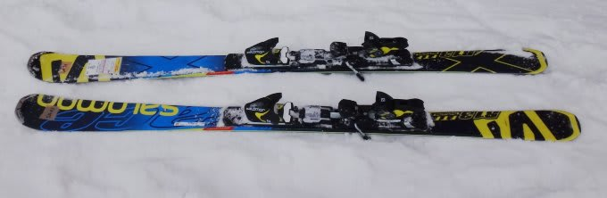
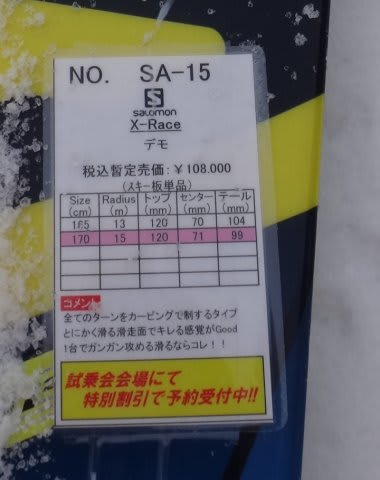

# おまたせっ！2015シーズンモデル，スキー試乗レポート第1回…SALOMON編

📅 投稿日時: 2014-03-13 00:57:51

うーむ．

今日，13日の木曜日はスキー場の気温がぐぐぐっと上がり．

…ヘタすると．

志賀高原も．

…雨になるかもしれませんが…

…でも．

その後，冷えて．

土曜日は冷え冷えのパウダーが降りそう！

…今回の高温で解けちゃった雪が，アイスバーンの下地になりますけど…

その上に，ちょっとはいい雪が積もってくれる感じ…

ってことで（何が？）

2014/2015シーズンニューモデルのスキー板の．

試乗インプレッション第1回目．

まずは，サロモン編です．

試乗コンディションなどは，[こちら](ea0fd11e235cff467b2900de6709d0b20.md)を参考にしてもらうとして…

では，どうぞ～．

○SALOMON X-Race Z12 165cm

エキスパート小回り用．

昨年度からの変更はなく，コスメチェンジのみ．

X-Raceの小回り用としてメインの長さ．

今回試乗したのは，ビンディングは強いX16ではなく，優しいほうのZ12です．

この板．[去年試乗した時](e19d70fc340bd35f15faf68f869cabd07.md)は，柔らかい荒れた雪で．

その真価を全く発揮できなかった感じですが．

今年はアイスバーンの中斜面という，この板にもってこいの

コンディション．

履いたときに，小回り用の板と思えないずっしりとした重さを感じますが．

その重さが安定感を生みます．

ちょっと重いので，板を動かして好きなところに差し込んでいける

感じはなく．

ずらしでコントロールする板ではありません．

かなり強いフレックスの板を，しっかりグリップさせて，たわませて

曲がっていく，カービングマシンです．

気合いを入れてたわませていく感じで，かなりフレックスは強いです…．

フレックスが強いので，Rは13mってよりもずーーっと大きく感じますねー．

16m以上くらい？

私の体重＆技術では，小回りというより，頑張って中回り程度になります．

むしろ，大回りまで余裕です．

逆に，小回りが厳しかったかも…

ハイスピードでアイスバーンを滑った安定感は…

これは．

…これは．

すごい．

すさまじい．

とても165cmの板とは思えない．

165cmの板で，こんなに高速安定性があっていいのか？

180cmの大回り板クラスの高速安定性．

朝イチ焼額の大回りマシンとして行けるレベルの高速安定性だな…

この板は，テールが効く感じ．テールのエッジグリップで板が曲がっていく

感じがします．

テール幅が広いのかな？

ターン中は，板のテールのエッジが食い込み，エッジに乗って

すさまじいスピードで走っていきます．

それも，ばたつきとか全くなく，ありえないハイスピードでもぴったり安定．

硬い斜面を，すごいスピードを出してエッジに乗っていくと，ありえない速度域で

曲がっていく…．

しっかりした雪の整地では，ありえない安定感で超ハイスピードターンが

できる，モンスターマシーンですな．

自分がこのスピードで滑れるのか！

滑走トップスピード，150％増（当社従来比）って感じ．

…ただし．

この速度域．

人がいるゲレンデで，普通に出せるスピードじゃないですが…（汗）．

低速で滑るとか，荒れた斜面でずらしていろんな小技をつかえる

って板ではないので．

うーむ．

人がいない硬い整地スペシャルかな．

でも，そういう斜面ではすごい無敵な板ですね．
