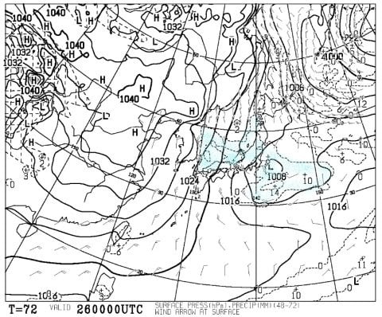

# 1月26，27日の週末の志賀高原スキー場の天気は？…激冷え．土曜は大雪になるかも？日曜も太陽は拝めなさそう

📅 投稿日時: 2019-01-24 01:20:53

🏷️ カテゴリ: [スキー天気予想](c6554f5c3c106093b511a8daae23757e8.md)

ってなわけで．

今週末は，2週間ぶりのスキーに行くわけですが．

…でも．

いきなりインフルエンザとかになったら

行けませんが…

もし，その場合．

トップシーズンに2週連続でスキーに行かない

というのは，

実に，私の記憶にないくらい過去に遡ります…

冬に試験があった，学生のころ以来じゃないかな？

そんなことが今起きたら．

暴れます．

のたうち回ります．

…たぶん．精神的に死ぬでしょう…

ってな感じで．

インフルエンザが流行っている今日この頃．

皆様も，罹患しないようくれぐれも

ご注意ください…

とりあえず．

そういう突発的事態が無い限り．

今週末はスキーに行けるので．

今週は天気図の読み込みに気合いが入るのだ！

…やっぱり先週は，天気図の読み込みにイマイチ本気が出なかった…（本音）

で．

週末の予想の前に．

明日，24日木曜ですが．

地上天気図は縦縞の冬型なので…

志賀高原は，朝に15～20cmくらい

積もってるんじゃないかな？？

25日の金曜も冷え冷えで雪降りが続きそうだけど．

金曜は，雪が積もるほどじゃないかな…

でも．

26日の土曜日．

ヤバいよ～，この日はっ！！

土曜の500hpa図を見ると．

をををを！

大雪になる目安の，水色で塗った-36℃の寒気．

この，真冬の本格寒気が志賀のそばまで下りてきてます！

そして，土曜の850hpa気温を見てみると…

水色の-9℃線が志賀高原より南まで

下がってるので．

この日の志賀高原．

終日-10℃程度の，気温をキープしそう…

いや，寒いよ～！

この日は…

土曜朝9時の地上天気図を見ると．

水色で塗った降水域．

日本海側に，寒気の吹き出しの雲が

出てるので…

積もりそうですね．これは．

土曜夜9時の天気図を見てみても．

これも見事に日本海側に雪雲が

かかってますね…

…だもんで．

土曜は終日冷え冷え雪降り，

終日パウダー供給デーになりそうです…！！

そして．

日曜ですが．

夜9時の地上天気図は…

うむ．冬型が緩んでいるので．

朝まで雪が降ってるかもしれないけど．

昼間は雪はやんでるか，パラパラと

舞う程度でしょう…

日曜の850hpa気温図は，水色の-9℃線が

志賀高原に近づいているので．

この日も冷え冷えの一日になりそうです…

ってなことで．

まとめると．

26日土曜：朝は雪降り．雪の降り始めが早ければ，

　朝までに20cmくらい積もってるかな…

　非圧雪コースはブーツパフ．運が良ければ脛パフくらい．

　朝の気温は-13℃程度と，激寒！

　昼間も-10℃をわずかに上回る程度．

　風が強くないのでまだマシだけど，リフトに

　乗ってると冷えて辛い感じ…

　天気は終日雪が降り続ける．

　かなりの勢いで降るので，圧雪斜面でも

　滑る人が少ないところは，新雪が積もって

　いくくらい．

　夕方はゲレンデは新雪が蹴散らされたモサモサ

　バーンになるか…

　とりあえず，激冷え雪降りの一日

27日日曜：明け方まで雪が降り続ける．

　営業開始のころは，雪はやんでいるか，

　あるいはわずかにぱらつく程度．

　雪がいつ降り止むかによるけど，朝はまた

　20cmくらい積もっているかも…

　朝は非圧雪コースはブーツパフの新雪．

　圧雪コースは柔らかい圧雪の上に，

　うっすら新雪か…

　この日も朝は-10℃以下の気温でスタート．

　昼間も-6～7℃くらいまでしか上がらない，

　冷え冷えの一日．

　気温は一日曇り．

　雪が柔らかいので，午後は人が多いコースは

　ちょっと凸凹した荒れ気味になるかな．

ってな感じで．

この週末は，冷え冷え雪降りor曇り空の天気で．

雪は良さそうだけど．

太陽は拝めなさそうだなぁ…

あぁ…そろそろ晴れた日に滑りたい…

なぜか1月4日，1月19日と．

晴れた日を狙ったようにスキーに行けな

かったので．

1月1日以降，晴れた日に滑ってないよ…(涙）

あさイチ晴天シマシマバーンを滑りたい…（懇願）

## 💬 コメント一覧

### 💬 コメント by (かず)
**タイトル**: Unknown
**投稿日**: 2019-01-24 09:31:40

ウエアーかわってしまったんですね～声聞けばすぐ分かりそうですけど　月曜の朝も期待できないですかね？

### 💬 コメント by (ほっぽ)
**タイトル**: 1/24　志賀高原
**投稿日**: 2019-01-24 22:27:01

Ｓさん

再び今日から志賀高原に戻ってきました。

今日はほぼ終日雪、風もあり奥志賀は１１時から全滅、タマゴンも運休です。

ヤケビは終始パウダーが供給されていました。

余りに寒くて営業１時間前の１５：３０に上がってしまいました。(^^;

明日は晴天でなくて良いので、シマシマ圧雪バーンを滑りたいものです。

あぁ、パウダーもう要らねぇ、って気分です。贅沢な悩みですね。

http://www2.tokai.or.jp/nana_hoppo/

### 💬 コメント by (Skier_S)
**タイトル**: 今週末も冷え冷え！
**投稿日**: 2019-01-25 02:29:35

＞かずさま

ウェアが変わりましたが，板と動き（？）を見れば

分かるかと…

月曜の朝は，まだ正確な積雪の予想は難しいですが．

10cm，運が良ければ20cm近く積もるかもしれません．

＞ほっぽさま

今日はやっぱり積もったんですね…

で，奥志賀は全滅ですか！

ヤケビは無事だったんですよね…

残念ながら，これからしばらくは晴天は望めなさそうです．

今週末も土日とも，24日に近い天気になりそうです…

