# 新型のVN LEVORGを試乗してみた！…その１

📅 投稿日時: 2021-03-05 01:43:30

えー．

本日も，志賀高原の特派員からかなり

大量に写真を送っていただいたので．

定番の，特派員レポート！

本日は，朝は積雪が無く，

あさイチは見事なシマシマバーンで

スタート！

(そしていつものおこみんに癒される)

あさイチの奥志賀山麓の温度計は-3℃と，

ちょいと高め…

焼額山頂は，予想通り-5℃程度だったん

じゃないかな？

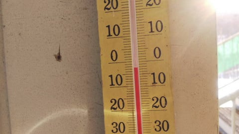

とりあえず，朝イチはすごく

気持ちよさそうなシマシマ！

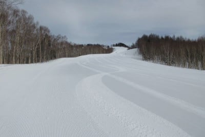

すごくいい感じのシマシマ！

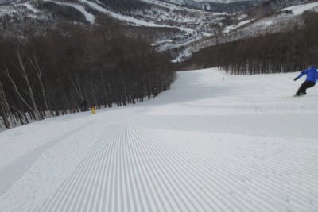

…ですが．

ちょいと硬めだったようで．

表面が崩れると，殺人コロコロ！

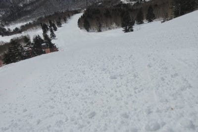

全面コロコロ祭りになっていたようです…

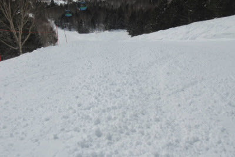

で，天気はすっきり晴れだったので．

標高が低い西館・ブナより低いところや，

日差しの当たる焼額のGSコースなんかは

午前中には雪が緩み，しっとりした春の

雪になっていったみたいですが…

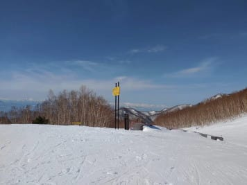

でも，標高が高い寺子屋は．

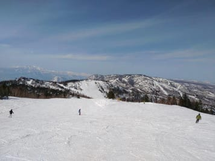

終日けっこういい雪をキープ

してくれたみたいです！

一の瀬正面やパーフェクターも，

午後になってもいい感じのフラットで．

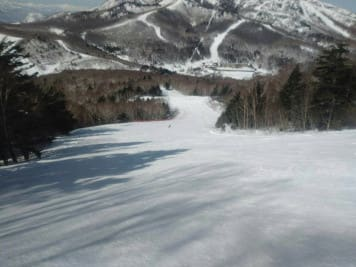

かなり気持ちよく滑れたみたいです！

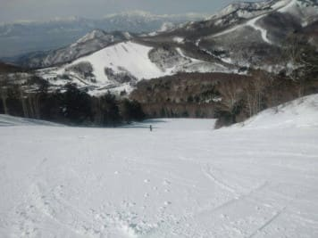

いや．

今日も天気よくてうらやましい…

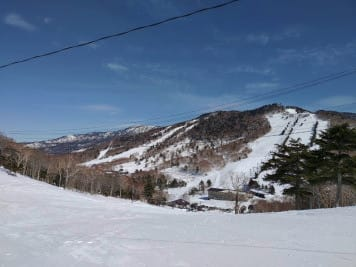

でも．

西舘では，夕方のリフトストップ時も

気温はプラスだったようなので．

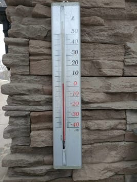

昼間はスーパー春雪，

営業終了時にはシャーベット状の

雪だったようで．

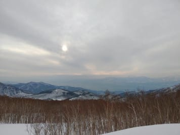

うーん．

3月になると，春だなぁ…

と感じさせますね（涙）

で，日曜にぶっ壊れてお客さんが救出

されていた，ファミリーペアB線．

故障のまま，運休でしたが．

今日は降り場のプーリーを外して

修理していたらしく…

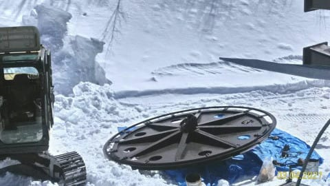

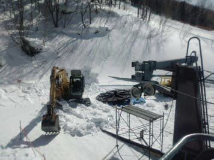

午後に取り付けが終わったようなので，

明日以降は運転するのかな？

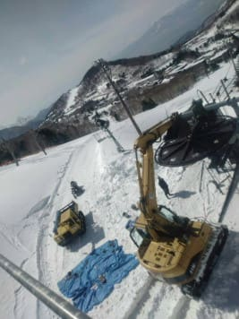

明日…というか，もう今日の金曜は

予想通り，気温が上がる曇り空で，

雪が緩みそうですが．

…もしかしたら．

運が悪ければ，夕方に，ポツポツと

液体が落ちてくるかも…

まぁ，ポツポツですが．

運がよければ湿った雪で済むかも…

という，いつもの特派員レポートのあとは，

本題へ．

昨年10月にフルモデルチェンジした

新型LEVORG．

普通，毎週のようにスキーに行っている

スキーシーズンのこの時期だと，

普段なら車の試乗はできないところ．

今回，コロナ騒ぎでスキーに行けておらず．

ちょうど[うちの車を点検に出す](eb108d5138d414f76b2fc9cfdf34abf3b.md)ついでに，

試乗してきました…！

…形式名VNとなるこの新型LEVORG．

私が乗っている，旧型となった

VM LEVORGからはかなり大きく変わってます…

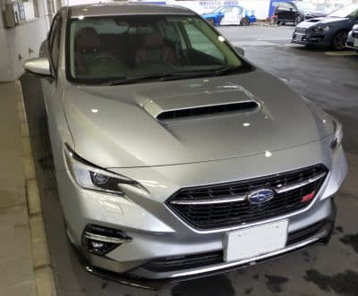

エンジンは，1.6Lの後継となる1.8L．

2.0Lモデルの後継となるグレードはまだ

出てませんね…

ってか，LEVORGにも，いずれ

米国向けOutbackなんかに使われている

2.4Lターボエンジンが乗ったグレードが

追加になる…

という説もありますが．

1.8LでもSTIは400万円を超えるのに，

2.4Lって一体いくらになるのやら…

まぁ，2.4Lが出たとしても，私が買える

値段ではなさそうですね(涙）

ってなことで．

試乗したのは最高グレードとなる，

STI のアイサイトX付きモデル．

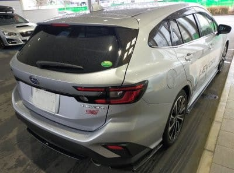

.

内装を見てみると…

私の乗っているLEVORGより質感は

上がった感じがしますね．

マツダ車のような高級家具のような

高品質感というより，フルディスプレイの

メーターや大型ディスプレイで，

未来感がある感じというか…

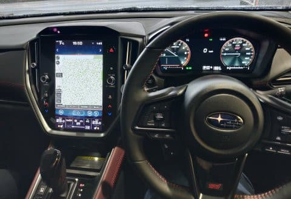

でも，ステアリングやドアトリムの

手触りもいいし．

安っぽいプラスチック感は無く，

高級車の感じ．

でも，400万円を超える車と考えれば，

この程度の品質はあってほしい

感じかな…

シートポジションは先代と現行は変わらず．

視界も全く先代と変わらない感じ…

見切りはよく，視界は広く．

先代，あるいは最近のスバル車に

乗りなれている人は，全く違和感なく

運転できると思います．

ただ，センターコンソールは高く，

シフトレバーも，先代より高い

位置になりましたね．

シートは…

STIモデルなので本革だったのですが．

これ，完全に好き嫌いの問題なんですけど．

私のVMGのアルカンターラ地の方が，

本革シートより表地が滑らなくて

いいかな…

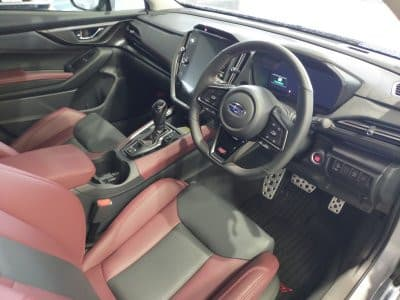

リアシートは…

をを！

数字以上に広くなったように感じる！

新型フォレスターの後ろ座席の広さを見て，

うらやましく感じてたけど．

新型フォレスターと同じホイールベースに

なった新型LEVORG．

フォレスターに見劣りしない，

「これだけあれば十分だろう…」

という後ろ座席の広さになったし．

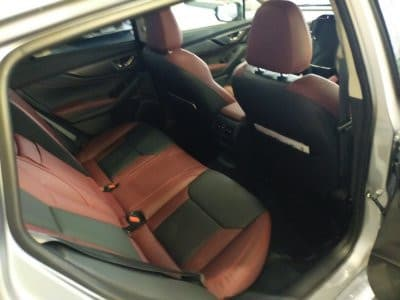

さらに，リヤのエアコン噴き出し口＆リアシート

ヒーターが着いたので．

…これで，後ろ座席の人も暑い＆寒い思いを

せずに済みますね…

現行LEVORG，スキーの行き帰りで

ちょっとリヤシートが寒いようなので，

リアシートヒーターは助かる！

トランクは…現行と同じか，ちょっと

広く感じる程度．

まぁ，インプレッサとかに比べれば

広いので．

普通は十分な広さかな…

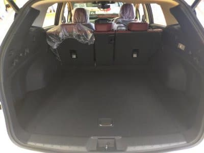

とりあえず．

乗って走らせてみましょうか．

走り出してみると．

出だしのエンジンレスポンスは，

先代の1.6Lで感じた，回転が上がるまで

エンジントルクが乗らない感じは全くなくなり，

アクセルを踏んだ瞬間からトルク感があります．

結構軽快に加速しますね…

トルク感は普段使いには十分以上．

2Lから乗り換えても，普通の街乗り

レベルの加速なら不満は感じません．

ラグも，ほぼNA？というほどターボ感が

ないですね．

…たぶん，かなりタービンが小さいんだろうし．

あと，スロットルの非線形＆オーバーシュート

制御で，走り出しで過剰にスロットルを

開けているんじゃないかな…

で．

アクセル全開時のパワー感は当然のごとく

先代の2Lには劣るけど，普段使うせいぜい

4000回転くらいまでの領域なら，ターボが

詰まる感じもないし．

エンジンのピックアップもいいし．

これだけ走れば，私には十分！！

不等長排気管に戻って，エンジン音が

どうなるか気になってたけど．

エンジン音はVMのLEVORGより静かですね…．

…すごく長くなりそうなので．

続きはまた明日…

(続く)

## 💬 コメント一覧

### 💬 コメント by (オオスギ)
**タイトル**: Unknown
**投稿日**: 2021-03-05 08:02:21

新型レヴォークプログになっちゃいますね❗

私的には、「不等長排気管…」

こちらに反応してしまいました。

当時は、LEGACYワゴンでしたが、あの独特の排気音が良かったですね！スキーに行く前の待ち合わせ場所で、車が来る前に分かると言う…

先輩は、ご丁寧にマフラーまで変えて分かりやすくしてくれました！

### 💬 コメント by (Hide)
**タイトル**: Unknown
**投稿日**: 2021-03-05 09:20:29

BF→BHとLEGACYを乗り継ぎましたが、あの不等長排気管の排気音・・・好きでしたね～

FUJITSUBOのマフラーに変えていたので、あのドコドコ音がコレまた良かった！

今は歳もとったので静かな方が良いです（笑）

### 💬 コメント by (ダウンヒル)
**タイトル**: Unknown
**投稿日**: 2021-03-05 11:10:35

世界ラリーWRCでスバル車（インプレッサ）が覇権を極めていた時期の印象でレガシィに興味がありました。最初のスキー意欲のピークにあったころに買った◯◯タのワゴンが寿命を迎えたのをきっかけに中古のBHレガシィに乗り換えました。定員一杯、２泊分の荷物+スキーセットを積んで運転してもストレスなく走れる。

自分が運転して志賀に通うスタイルなら、絶対スバルを選びます。

### 💬 コメント by (レインボー73)
**タイトル**: Unknown
**投稿日**: 2021-03-05 11:31:26

金曜日の志賀高原情報

朝の上林＋１℃ 　蓮池＋２℃。上衣をまた一枚減らしてゴー！

パノラマ、カラマツ共にいい感じ。サウスでは早くもコロちゃん出現。

ＧＳも快適だけど、気にならない程度のコロ。奥志賀に行こう。エキスパも圧雪されているとの先乗り情報もあるし。

三高は滑りやすいけど満員。そのまま全開でエキスパに飛び込むと、ギャ～、コロコロボコボコ満員！避けてまっすぐ降りただけ。圧雪良好と書いてあったのに、、、

よく見ると端にもシマシマがない。ただ押さえただけなのか？ブレードのアームが故障との噂も。

ダウンヒルも感動なし。しからば寺子屋だ。

あー、コロコロなんてここには存在しない。なんて平和なバーンなんだろう。

### 💬 コメント by (アリス)
**タイトル**: Unknown
**投稿日**: 2021-03-05 11:55:40

Skier_s様

昨日から志賀高原滑っています。

コンディションは、レインボー様のレポート通りです。

やはり平日はいいですね☀️

朝一のGSとオリンピックコースは、この上ない至福感一杯です🎵

### 💬 コメント by (レインボー73)
**タイトル**: Unknown
**投稿日**: 2021-03-05 14:33:20

金曜日の志賀高原情報２

今日も高天の銀嶺でざるそば。高天のＮＨＫコースから勢いつけて橋を上ろうとしたら、どすん。コースが変わって段差がついていました。これは危ない。苦情ものですよ。よう言わんけど。

午後は大会を見ながらズクズクの西館を降りて、昨日最高級の感動をくださったパーフェクタへ。

ところが昨日と違って今日の人達は後の処理が雑！雪の山がたくさんできていて雪はいいけど快適とはほど遠い感じ。

ファミリーも少しだけ荒れていました。

ニゴン山頂＋２℃。ゴーグルにへばりつく湿った雪が降り始めました。。

シラカバ、サウスは軽くとばせたつもりが、スピード計時は、出てない！　ただ気温が上がらなかったので、ブレーキがかかることはありませんでした。

若いだけあって、腰はかなり回復しましたが、所用のため13時終了。今日も楽しかった！　明日は物欲を抑えて！

### 💬 コメント by (northfox)
**タイトル**: Unknown
**投稿日**: 2021-03-05 16:37:29

私は元スバリスト（GC8インプレッサRAのSTI ver（中古）に乗ってました）なのでスバルの話題は今でも気になります。

排気管は不等長に戻ったんですか。当時はドコドコいう排気音は不等長だからと悪者扱いでしたが。

でも私もあのドコドコ音が大好きでした。また乗りたいなぁ。

続きのレポート楽しみにしています。

### 💬 コメント by (Skier_S)
**タイトル**: 明日，あんまり天気良さそうじゃないな…
**投稿日**: 2021-03-06 00:18:53

＞オオスギさま

どうしても，古いスバル乗りはあのドロドロ音を思い出しちゃいますよね…

新型LEVORGは不等長なのに驚くほど静かでしたよ！

＞Hideさま

おっと！BHレガシィ乗りでしたか…

そして，定番のマフラー交換（笑）．

BHは名車でしたよね…

＞ダウンヒルさま

ここにもスバル乗り，そしてBH乗りが…

いや．BH，名車でしたよね．

私も初めてBHのターボに乗った時の衝撃が忘れられません…

＞レインボー73さま

今日もレポートありがとうございます～！

どんな状況でも楽しんでらっしゃいますね（笑）．

明日もあまり天気は良くなさそうです（涙）

＞アリスさま

志賀高原にいらっしゃるのですね！

午後はコンディション悪かったかと思いますが．

いつまで滞在でしょうか…

＞northfoxさま

あ，昔スバル乗りだったんですね…

スバルからの裏切者だったのですね！（噓です）

スバル車はいいですよ～！

ぜひまた乗ってやってください．

