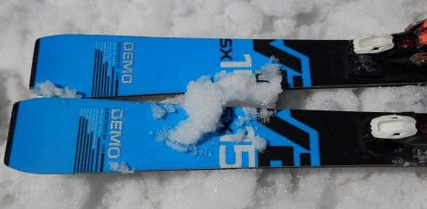

# 2019シーズンのスキー板，試乗レポート第14回…Volkl編その2

📅 投稿日時: 2018-06-09 01:18:53

🏷️ カテゴリ: [スキー板試乗](c0bd8048615710cee890e403a36cc9a2b.md)

ってことで．

…まだエクストレイルの試乗記事などもあるのですが．

徒然スキーヤー日記

な，このBlog．

本日もスキー試乗レポートです！

車の試乗記は明日以降のお楽しみに…！

で．

今回からは，アサマ2000での試乗レポートではなく．

4月21日の志賀高原で行われた試乗会で履いた

板になります．

雪の状態が，アサマ2000より悪く．

一の瀬ファミリーの正面バーン，上部は

少し締まった感じが残っていたけど．

途中からはザブザブの重い雪で，板が滑らない

春雪の状態で滑りました…

だもんで．

固めの雪で履いた時と，かなり印象が違うと

思いますので．

これ以降のレポートは，そのあたり気を付けて

読んでもらえると…

ってなわけで．フォルクル編です．

では，どうぞ～！

---

○VOLKL RACETIGER SX DEMO 168cm

基礎オールラウンド

RACETIGER SL DEMOが小回りスペシャルなのに対し，

こちらは168cmでR=15mという，小回りでも大回りでも

行けそうな，中間的なサイドカーブの板．

ターン始動でトップが早く食いつく，

ロッカーっぽい感じでターンが回り

始めます．

回り始めると，実に良く回ります．

トップが食いついたあと，ターン終盤では

テールがしっかり食いついてきれいに気持ち

よく回り，テールの張りできれいにターンが抜けて

いきます．

結構気持ちいい板です．

結構なスピードまでしっかりグリップするけど，

リアルなトップスピードでは，SL DEMOに

グリップ力や返りの強さで一歩譲るかな～．

でも，リアルなトップスピードの領域以外では，

安定性やグリップはSXで十分かも．

また，ラディウスが小回り専用じゃなく，

無理やり小回りで回ってくる板ではないので，

ゆっくりとしたターンから小回りまで行ける

自由度は，SXの方が高いです．

アグレッシブに小回りを攻めたいスキーヤーで

なければ，普通のゲレンデスキーとして

SXのほうが扱いやすいんじゃないかな…

ってな感じで．

小回りスペシャルならSL DEMOの方がいいけど，

リアルなトップスピードでガッツリ攻めるのではなく，

ゲレンデでのオールマイティー性を求めるなら．

結構なスピードまでも耐えるし．

板も軽くて動かしやすいし．

軽快にかなり楽に気持ちよく回っていくし．

板の走りも気持ちいいし．

結構いい板じゃないかな？？

## 💬 コメント一覧

### 💬 コメント by (ikkun)
**タイトル**: Unknown
**投稿日**: 2020-05-28 09:30:03

これ(^^) GSデモか これが狙い目でしたが……SX は人気でしたからね??(笑) 

またまたありがとうございます(^^)

