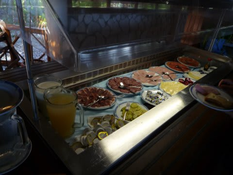
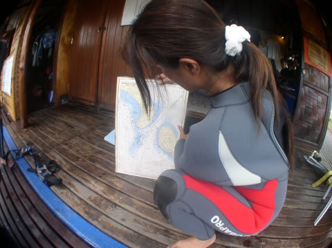

# 2009年　初の海外子連れダイビング旅行記　18　Missing Dolphins

📅 投稿日時: 2012-09-15 00:41:19

ランギロア2日目の朝．

今日もいい天気!!

ホテルでは有料で子供を預かってくれるサービスがあるらしいのですが，

ボラボラで預けて寂しい思いをさせてるので．

今回も1本ずつ夫婦交代で抜けて，子供の面倒を見ることにしました．

朝1本目は私

2本目は妻．

3本目は私

…というローテーションです．

で．

朝1本目のダイビングが，7時15分集合．

んで，ホテルの朝食が7時から．

…えーっと．もしもし．朝食スタートから，ダイビング集合まで，15分しかありませんよ？？？

選択肢は二つ．

15分で掻きこむか．

ダイビングが終わってから食べるか．

…一応，ダイビングがあることを告げると，ビュッフェの

食べ物を持ち帰らせてくれるらしいんですが．

ダイビングが終わる9時ごろから朝食にすると，娘は空腹で暴れだすでしょう．

ということで，7時にレストランに行き，ダイビングに行く私は15分で食事，

妻＆娘は残ってのんびり食事…ってパターンですね．

ホテルの食事はビュッフェスタイル．

パンがおいしい！

焼きたてのぱりぱりクロワッサンやチョコチップの入ったデニッシュ…

いや，ホントにおいしい．

あとはチーズやハム類，フルーツ類．

そして，オムレツはオーダーすると席まで持ってきてくれます．

超でかいオムレツ．卵4個くらい使ってんじゃないか？？

…って食事を15分で掻き込み，そのままダイビングショップへ．

今回のゲストは日本人貸しきり状態．日本人4人のみです．

全員，昨日のイルカを見逃したチームのメンバーなので．

外国人チームのエキサイティングな体験を聴いて，

今日こそは，我々も…という気分満々．

ジュンコさん「今日はイルカ狙いたいですよね…」

全員「イルカ！イルカっ！イルカ狙いでお願いします！！！」

ということで，ティプタパスをイルカ狙いで流します．

今日のガイドはフランス人女性のモアナ．

うううーーーん．

イルカ…

イルカ…

とつぶやきながら，ブルーウオーターダイブ．

周りに何も見えない真っ青な海をひたすら進みます．

モルジブのジンベエサーチダイブに近い感じ．

10分…何も出ず．

15分…何も出ず．

20分後．イルカをあきらめたのか，パスの壁沿いに．

やっと海底が見えた…

ナポレオンが3匹．

カマスの群れ．

写真に撮れないいほどでしたが，遠くをマンタが一瞬通って行きます．

棚の上の珊瑚を眺めつつ流していきます

棚の上ではカメもいましたね～

…結局，イルカとは出会えずダイビング終了．

うーん．

残念っ！

しかし．マンタもカメもナポレオンも出てるのに，

こんな贅沢なダイビングで満足できなくなるとは…
