# 2021/3/29(月)の志賀高原スキー場特派員情報！…朝から晴れ，高温の一日

📅 投稿日時: 2021-03-30 02:43:11

🏷️ カテゴリ: [日記](cc4b5682fb7b8b144980957a978653fb0.md)

ということで．

土日休んだツケか．

今日もかなりクリティカルな状況…(涙）

でも，意地で更新！

記事を書いている時間がとれないので．

今日は特派員情報を手短に…

ってなことで．

日曜は雨模様の残念な志賀高原だった

わけですが．

果たして月曜はどうだったのか？

…朝イチはちょっと雲が多かったものの．

朝から気温は+4℃と高めで

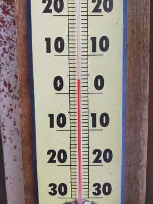

シマシマバーンも，朝からかなり

緩めのバーンだったようですね…

あ，いつものおこみんレポーターが

今日は不在のため．

今日はおこみん無しでお送りしております(笑)．

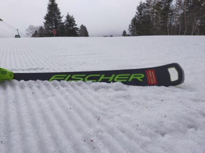

でも，雪の滑走性はよく，シャバシャバの

雪ながら，朝は良かったみたい！

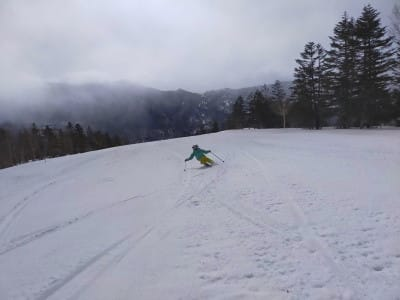

で．今日もウインチ付き圧雪車は直らず．

オリンピックコースは非圧雪だったよう

ですが．

どうやら，この圧雪車の修理は時間が

かかりそうという噂なので．

おそらく今シーズン残り2日，圧雪されずに

シーズンが終わりそうです…

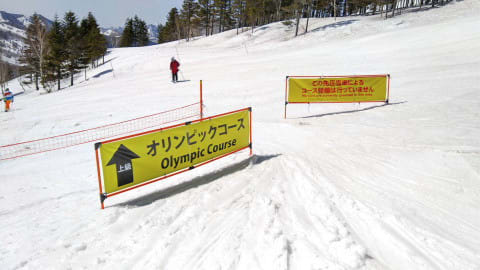

でも，営業開始すぐにすっきり晴れて，

日差しが降り注いだようで…

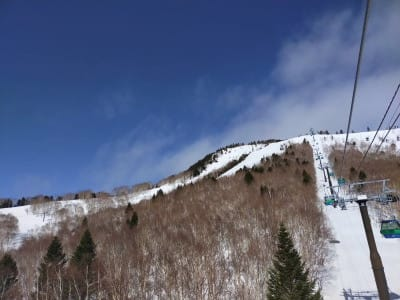

9時半には早くも，顔にザラメ雪が

飛んでくるようなパーフェクト

春雪になっちゃったみたいで．

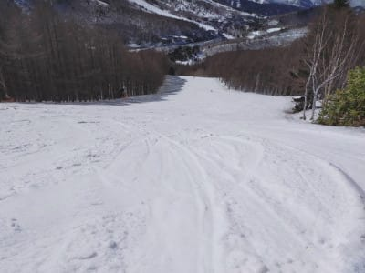

いつもの定番，苦しい時の寺小屋だのみで

寺小屋に行くと．

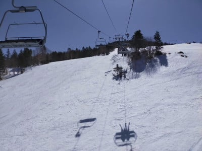

ザブザブ雪ではなかったものの．

昼ごろにはもう荒れ気味になっていた

みたいで…

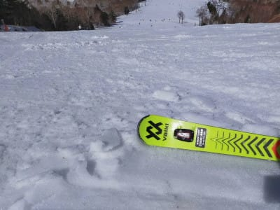

むしろ一の瀬の方が，硬い下地が残っていて，

表面は柔らかいながらもいい感じだった

ようです…

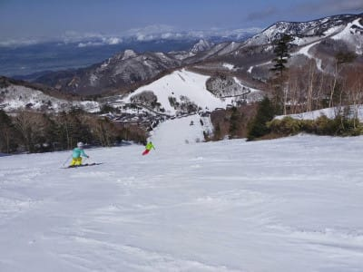

そして．

昼間は気温が+10℃近くに上がっちゃったようで．

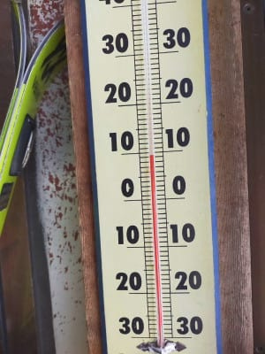

それですっきり晴天ということは…

雪はすごいことになっていきますね(涙）

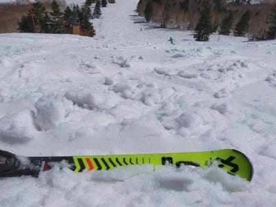

昨日の雨＆今日の高温でかなり

雪解けが進んでしまったようで．

コース脇もかなり土が見え始め…

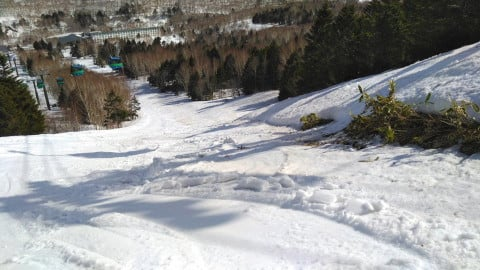

GSコースの一番下，ゴンドラをくぐる

ショートカット部分も，土が出てきてます(泣）

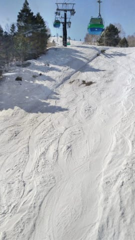

あぁ…

GSコース，営業するのはあと2日

だから，雪が解けても大勢に

影響ないんですが．

まだ4月になってないのに

こんな状況って，何だか寂しい…

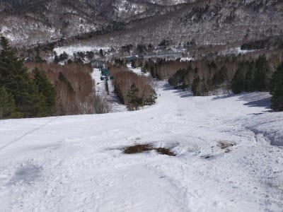

そのほかのコースも，人がいないと

汚れが目立つようになってて…

これって，4月下旬の感じですね(泣）

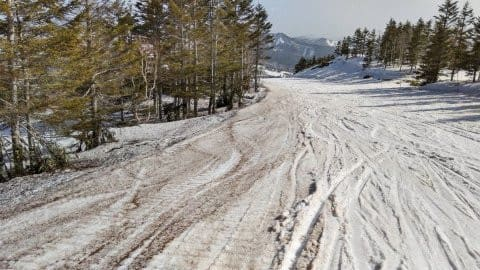

ってなことで．

午後は4月下旬並みの，板が埋もれるような

雪になっていったらしく．

「かなり疲れた」

と，特派員からの一言が入ってました…

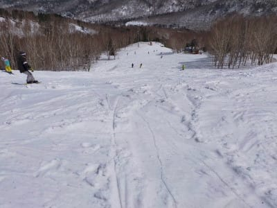

いや～．

1月に積雪がそこそこあったから今はまだ

雪が残ってるけど．

このままの高温が続くと…

GWはヤバいかも？？？

今のところ．

私の踊りの効果が出るのが5日以降らしく←ここ主張しておくところ

長期予想では，4月5日以降はちょっと

冷えそうなので，それに期待かな…

（と言っても，これまで暑すぎたのが平年並みに戻るだけ)

そうそう．

今回の写真の一部を送ってくれた某特派員に

よると．

奥志賀ではこんなサービスをしているようですね．

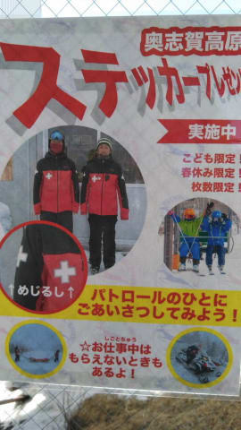

某特派員曰く．

「声をかけるとステッカープレゼントって…

どこかで聞いたことある…」

とのことでしたが．

奥志賀でパトロールさんに声をかけても，

20000mのシルバーステッカーはもらえないので

お間違えの無いように…！！←誰も間違えないから

20000mシルバーステッカーが欲しい方は，

20000mゴールドの方に声をかけてくださいね！

なんだかんだ言って，いつもとあまり変わらない

長さの記事になってしまった…

## 💬 コメント一覧

### 💬 コメント by (うえいと)
**タイトル**: Unknown
**投稿日**: 2021-03-30 08:55:03

朝イチから緩み次第にザラメ

ザラメになるとまだ滑れるが抵抗が大きいと言う志賀にはゴールデンウイークにしかなかった雪です。m(_ _)m

### 💬 コメント by (レインボー73)
**タイトル**: Unknown
**投稿日**: 2021-03-30 15:15:32

火曜日の志賀高原情報

朝の上林６℃　蓮池はなんと８℃　2ゴン上７℃。でも、雪は前日より硬めで悶絶バーン。パノラマから１ゴンへ。最高でした。

ＧＳもまた！　もう何もいらない！　目の前に餌をぶら下げられたら、我慢できないけど。

１時間もすると緩みだしたうえ人もふえたので、寺子屋へ。

今日は人も少ないし気持ちいい。４本で、少しも硬くない快適なファミリー経由でタンネへ。

昨日はお若い貴婦人の案内だったので、今日は一人でおさらいてす。タンネの上から見て右の方を、木を巻きながら滑る。少しずつコースを替えて滑ってみると、空いてるし、なんか楽しい。

そしてまた飽きることなく銀嶺ざる蕎麦。

九時半ごろドクターヘリがダイヤに来たので、また大事故かと危惧したけど、晴れの日には大事故でなくともヘリをもっと使うようにするとか？

昼食後、仲間はジャイアントへ。上部はズクズクだったけど、下部は硬めの締まったバーンだったとか。

私はタンネにハマってました。がらがら快適。

ファミリーへ出ると、生ける伝説コ○○○様と遭遇。らっきです。パーフェクタ、ファミリーとご一緒させて頂いて帰路へ。

サウスは例によってボコボコだけど、今日は滑る雪。

でも、某大国から風に乗せての贈り物が、、、

最近は５月の雪だと聞くけど、５月ってこんなにいいの？そんな時期に滑ったことないから、考えちゃう。

### 💬 コメント by (かず)
**タイトル**: Unknown
**投稿日**: 2021-03-30 18:39:41

日曜は厳しかったです…今週末も雨ですね 来週で終わりかな…志賀高原で有料でもいいですけどこの時期シャワー等入れるところ知ってますか？

### 💬 コメント by (レインボー73)
**タイトル**: Unknown
**投稿日**: 2021-03-30 21:17:38

かずさん、この時期にシャワー？

ここへ来たらシャワーなんかじやなく温泉でしょう。

時間が合えば我が家へ来れば共同浴場、湯田中駅前の楓の湯400円？（私は回数券あります）、みやま温泉、などなどかなあ

### 💬 コメント by (かず)
**タイトル**: Unknown
**投稿日**: 2021-03-30 21:31:50

レインボーさんありがとうございます  この時期だったらもう下まで降りなくても車内凍らなそうなので 上で簡単なのでもあれば楽だな…って思いまして

### 💬 コメント by (Skier_S)
**タイトル**: 春ですね…
**投稿日**: 2021-03-31 02:09:34

＞うえいとさま

今日も滑ってらしたんですね…！

しかし，今日は気温が上がったみたいですね(涙）

そして，まだ3月なのにGWの雪ですか…

さらに黄砂でダブルパンチですね(泣）

＞レインボー73さま

GWもいいですよ！！

何年かに一回は，GWに雪が降って「これがGWか！！！」という

激烈ラッキーコンディションで滑れることもあります．

ぜひ，GWも志賀で滑ってみてください(笑)．

＞かずさま

志賀は，お金を払えばお風呂に入れてくれる宿もありますが…

温泉系の宿なら結構日帰り入浴させてくれると思いますよ．

### 💬 コメント by (ikkun)
**タイトル**: Unknown
**投稿日**: 2021-03-31 23:38:33

今晩は🎵実は学校終わった翌日のこの日……余りの快晴に一人戸隠でした 高妻山？もしっかり見れて 緩いながらもチャンピオン？も行けました❗( *´艸｀)慣れて来ると……急斜面も少し慣れて来ますって( *´艸｀)下手さ満載です❗ゲレンデ中のあのピザまいう➰な店でパスタ頼んで量少なく 駐車場の食堂でざるいったのは内緒です❗(笑)ちなみにスキーのカメラ撮影現場に遭遇しました❗

### 💬 コメント by (Skier_S)
**タイトル**: ＞ikkunさま
**投稿日**: 2021-04-01 03:41:48

あら．戸隠滑ってきましたか．

天気は良くて，気温が高かったけど楽しんで来れたのではないでしょうか．

今シーズンはいつまで滑る予定ですか？

### 💬 コメント by (ikkun)
**タイトル**: Unknown
**投稿日**: 2021-04-02 19:56:21

来週の野沢温泉のスキー試乗会の予定が最後かと( *´艸｀)

### 💬 コメント by (Skier_S)
**タイトル**: ＞ikkunさま
**投稿日**: 2021-04-02 23:41:06

あ，来週でラストなんですね．

志賀はGWまで行けますよ～！

### 💬 コメント by (ikkun)
**タイトル**: Unknown
**投稿日**: 2021-04-08 17:23:14

お疲れ様です❗ 今日は寒いです(・・;) underを着忘れました 

土曜日予定ありなので明日野沢温泉試乗会予定にしましたよ❤️ 雪予想なので(笑)ノーマルtireがちいと心配再(笑) 温かい温泉に入って どちらにも癒されて参りたいなあ(笑)特に やはり 吸収器具?なくなったあれですかね(笑)

### 💬 コメント by (Skier_S)
**タイトル**: ＞ikkunさま
**投稿日**: 2021-04-09 01:34:40

金，土は冷えますよ…

気を付けてくださいね！

吸収器具無くなったあれって…

Volkl SL Master?

