# え？熊の湯，15日(土)で終了？…そして2021/5/12,13日の志賀高原熊の湯スキー場特派員情報！

📅 投稿日時: 2021-05-14 01:52:21

🏷️ カテゴリ: [日記](cc4b5682fb7b8b144980957a978653fb0.md)

ということで．

また，昨日．

夜中に仕事が終わった直後に．

「ちょっとだけ…」と床に横になったら，

そのまま朝まで寝てしまっていたSkier_Sです．

どうせ寝るなら，布団の中で寝ればよかった…(涙)

しかし．GWを挟んでたのもあり，ここしばらく

完全休載の日は無かったんですが…←遅れて昼ごろに更新の日はあったけど

ってなことで．

本日，2日分の志賀高原特派員情報を

お送りします！

…って前に．

今日，特派員の方から知らせてもらった情報

なんですが…

なに？？

今週日曜まで営業予定だった熊の湯．

15日の土曜で営業終了！？？

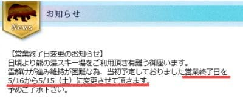

（[熊の湯スキー場ホームページ](https://www.kumanoyu.co.jp/lift/)より)

ええええ！！？？

11日(火)の特派員写真では，まだもちそうに

みえたんだけどなぁ…

残念ながら，今週日曜は滑れない

ようです…

とりあえず，今の熊の湯．

どんな感じか，特派員の写真を見てみましょう！

まず，12日の水曜日ですが…

この日は朝イチは冷え込んで，いい感じの

板が走るシマシマだったようです！

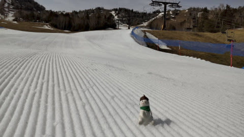

天気もいい感じに晴れていながらも，

板が比較的走ってくれる雪で，

あさイチは良かったみたいです…

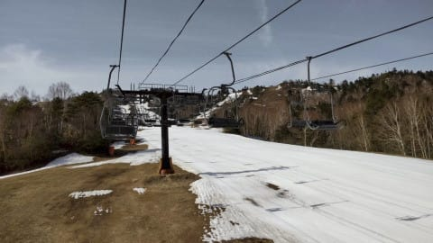

この写真を見ていると．

まだまだ雪がありそうに見えるん

ですけどね～．

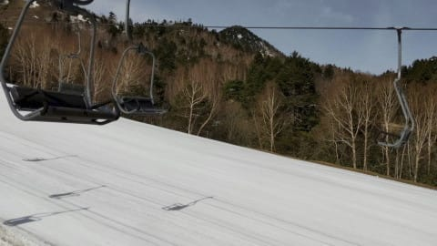

さすがに昼ごろになると，雪が

荒れてきたものの．

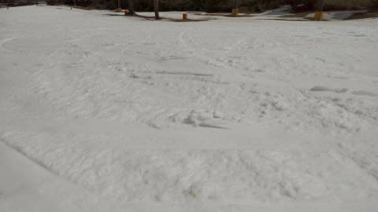

昼ごろまでは，比較的いい感じで

板が滑ってくれて．

この日は良かったみたいです！

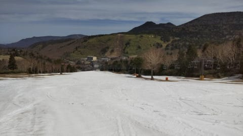

が．

翌13日の木曜は…

朝から気温は+9℃ですか…

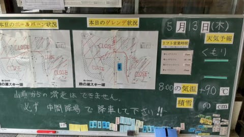

そして，朝イチから雪はユルユルだった

みたいですね…

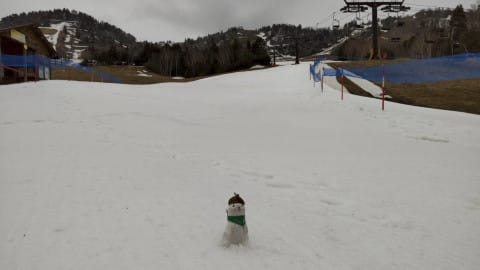

そして．

昨日とうって変わって．

滑りが悪い雪だっただけじゃなく…

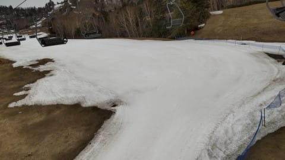

朝9時ごろからは，霧雨っぽいのが

ほんの数分間だけ降ったようです…

それもあって，雪も早くからザブザブに

なってしまい．

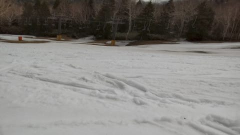

さらに．

ゲレンデの真ん中に，ちょっと穴が

開きかけてきたようです…！！

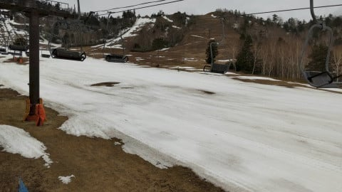

うーん．

この穴の開いた回りがちょっと雪が

薄くなっていて．

この部分が日曜までもたないと判断

されたのかな…？？

ってなことで．

残念ながら，残るは金曜・土曜と2日間のみと

なった熊の湯ですが．

横手はまだまだ滑れそうだし．

かぐらも今のところ，まだ問題なく

メインバーンのクワッドが動きそう．

うーん．

でも，かぐら，混むんだろうなぁ…

PS.

今のところ，週末の天気は

土曜は晴れのち曇り．

日曜は午後にパラパラ雨

…というところです．

## 💬 コメント一覧

### 💬 コメント by (ikkun)
**タイトル**: Unknown
**投稿日**: 2021-05-14 09:13:27

おはよう様です……あやつのせいで お客様が激減だからもあるんではと？  12月の初滑りがここでしたとお話ししたかな？横手山行った時、迷い車でした(笑)さて明日か?

### 💬 コメント by (Skier_S)
**タイトル**: ＞ikkunさま
**投稿日**: 2021-05-15 00:18:16

うーん．

お客さんが減ったというより，やっぱり雪がギリギリアウトだったっぽいです…

12月に熊滑ってたんですね．

明日ラスト，滑りに行ってはいかが？

