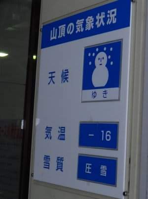
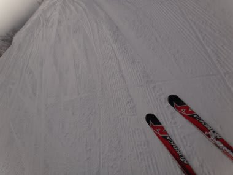
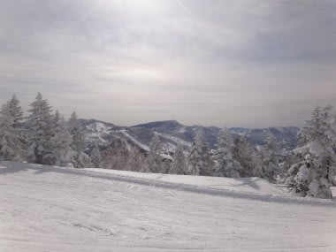
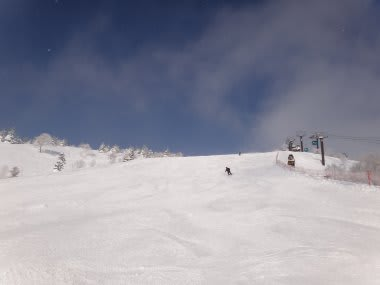
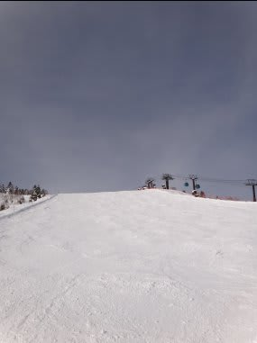
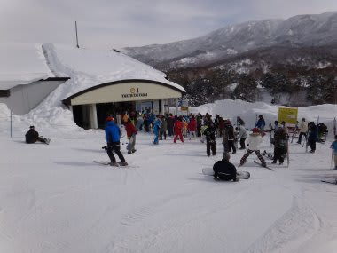
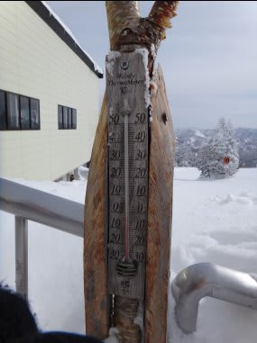
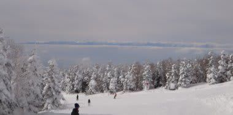
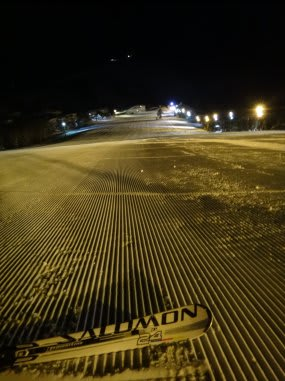

# 2月5日の志賀高原は…がらがら．

📅 投稿日時: 2012-02-05 21:59:47

という感じで．

土曜は用事でスキーにいけなかったんですが．

日曜の今日は，やってきました，いつもの志賀高原．

さてさて．

朝は…

うすぐもり．気温は-16度と寒い！

昼間は気温が上がる予想だったけど，朝はかなり寒い…

おかげで雪質は最高！！！！

今シーズンベストの雪！！

きれいなぴかぴかで，そこそこ締まってるけどしっかりエッジが食い込む

最高の圧雪バーン！

おまけに，朝9時ごろには太陽も顔を出してくれて…

太陽の下，最高の圧雪バーンで完全にサル化．

もう，何も考えられずにひたすら自由落下．引力に引かれるまま落下．

本能の赴くままに落下．

…どーでもいいんですが，今週もスキー場がらがらなんですけど．

うーん．例年なら2月に入ると，人が増えだすんだけどなぁ…

11時過ぎにこの程度のゴンドラ待ち3分ってのが1回あったけど…

次にきたときには解消してて，ほとんどゴンドラ待ちは1-2分あるかないか，って感じ．

うむむ．

3-4年前まで，2月の休日の昼間にこれだけゴンドラ待ちがない，

ってのは経験したことがない気がするんだけど…．

やっぱり減ってるのか？スキー客．

とりあえず，ゲレンデはがらがら．飛ばしたい放題．

ところどころバンプが出たところもあったけど，おおむね

夕方までフラット．

午後はちょっと気温が高めになったけど，それでも山頂でマイナス2度～4度程度．

プラスには振れず，終日コンディションがグッドなままでしたね～．

なんにしろ，人が少なくて雪も荒れず，雪質も最高で軽いので，

終日滑っても疲れません…

まさにサル化．

ひたすらサルのように滑ってました．

天気もいいし，もう，最高．

一年中こんなならいいのに…

って感じでした．

で．

今日は日曜なのに．

…

なぜ．

なぜナイターの写真が？

…明日に続く．
