# 2019年8月，4度目のモアルボアル・小6の娘Cカード取得1周年！ファイナル…ホテルから帰国まで

📅 投稿日時: 2020-09-25 00:54:59

えー．

今日は焼額山スキー場の歴史の続きじゃないの！？？

…という声が聞こえそうですが．

すみません．

今日はちょっと記事を書く時間が無いので，

書きためておいたダイビング日記を

お送りします…

…ってか．

長いこと続いたモアルボアル旅行記も，

今回がラスト！

…あぁ…今回の旅行記も長かった．

連載開始から約2か月．

今日でようやく，帰国までの

ファイナルです．

では，どうぞ～！

ーーー

ということで．

本日朝の飛行機で帰国なわけですが．

ホテルから空港まで，車で3時間．

空港には，国際線出発の2時間前に

着いておきたい…

ということを考えると．

なぜか，

朝3時ホテル出発

という，かなりご無体時間となってしまう，

この旅程．

眠い目をこすりながら，2時過ぎに

起きて．

部屋の前に干してあった器材を

片付けますが…

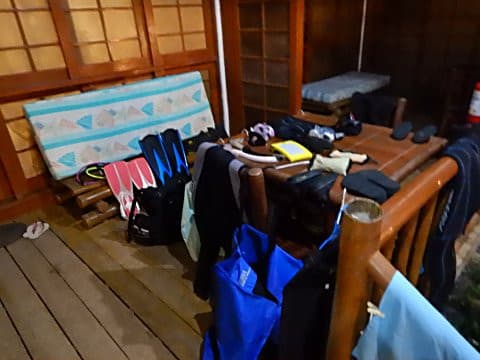

やっぱり，夜は乾かない（涙）

ちょっと湿った感じのまま，

パッキング．

忘れ物が無いか確認して．

午前3時ちょうど，空港までの

送迎者が迎えに来てくれます…

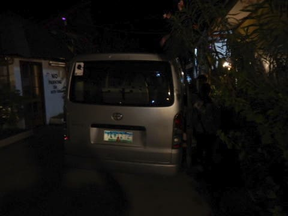

まだ激烈に眠い我が家は，

車に乗った途端，全員熟睡…

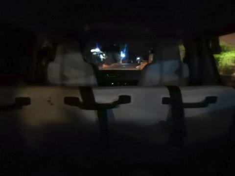

車の中でぐっすり眠り，

気づいたら，セブ国際空港に

着いてました…！

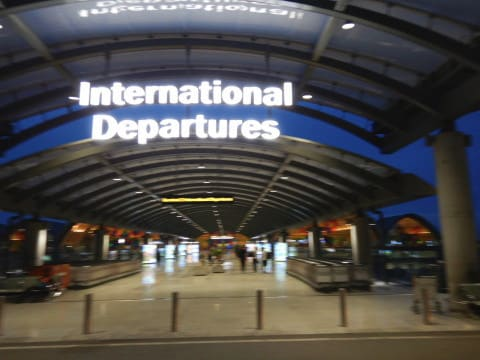

ドライバーさんはかなり飛ばしたのか，

空港に着いたのは午前5時半．

3時間かかる予定が，2時間半で

着きましたね…！

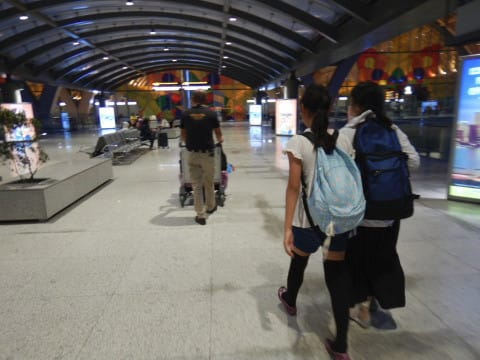

出発までまだ2時間半．

朝早いのもあり，チェックインカウンターが

まだ開いてません（涙）

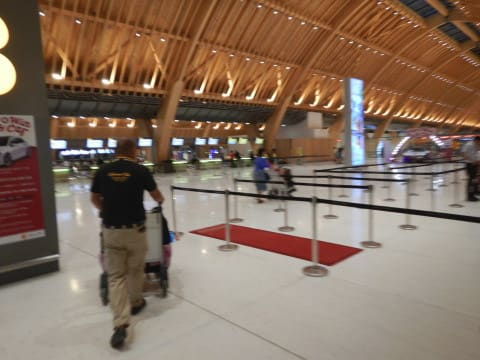

なので，ホテルで昨日の夜に準備して

もらった，朝ごはんのサンドイッチを食べて，

しばし待ちます…

あ，このサンドイッチは，朝食付きで宿泊

したのに，次の朝が早くてレストランで

食べられない人向けに，前日にお願い

しておけば作っておいてもらえるやつです…

30分ほど待つと，チェックインカウンターが

開いたので，チェックイン！

[昨年，空港で意味もなく9時間待った](e504f957ae4935a128dda6cb73b0d3b4c.md)のを

考えれば，天国のような待ち時間の

短さです（笑）．

そして，セブ空港の利用料をこのカウンターで

払いますが…

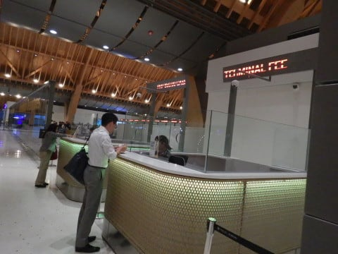

一時期はカード払いもできるという情報も

ありましたが．

「CASH ONLY」と書かれていて．

今は現金払いのみです！

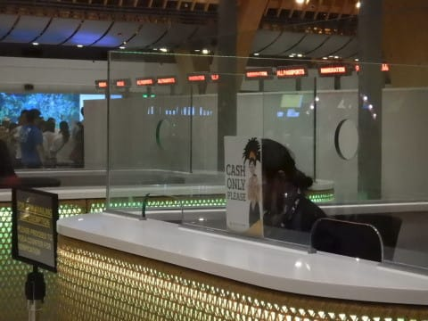

忘れずに，空港利用料分のペソを

残しておきましょう…！

てなことで．

チェックインを終えたら，セキュリティー

チェックをくぐって，搭乗待合室に

向かいますが…

セブ空港．

改装されてから，すごいモダンな空港に

なりましたね…

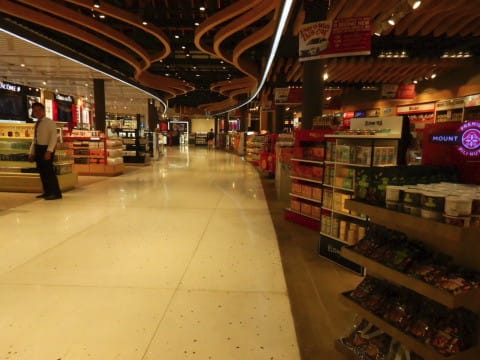

お土産屋さんや免税店が結構増えて．

カフェとかもあって，

いろいろオシャレな感じになりましたが…

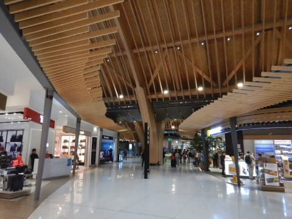

でも．

新しいセブ空港の中のお店．

物価が鬼のように高い（涙）

食べ物もお土産も日本並み，

あるいはそれ以上に物価が高い感じ（涙）

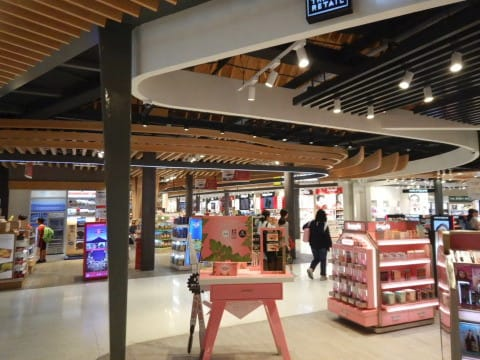

お土産は，空港に着く前に買っておくことを

おススメします．

…って言ったって．

モアルボアルだと，手作りの工作品以外の

お土産を買うところがほとんどないんですが…

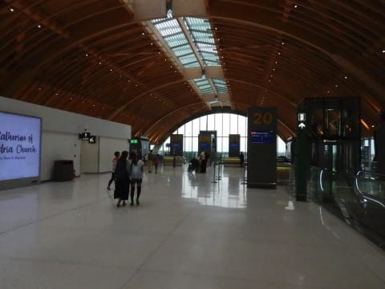

ってなことで，

お土産スペースを1時間ちょい

ぶらぶらしていると，

搭乗時間が近づいてきて．

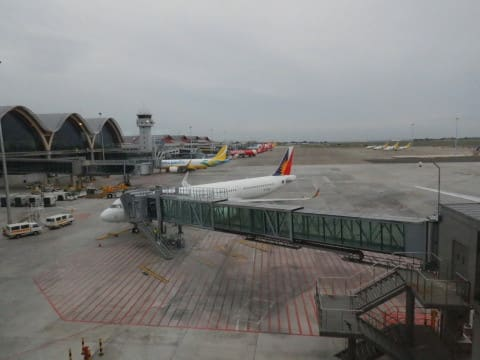

7時半ごろ，早くも搭乗！

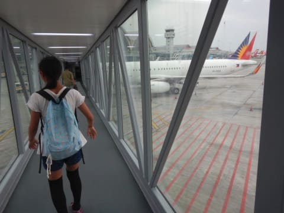

機体は…

当然のごとく，行きと同じA-321のceoですね．

で．

これまた当然ながら，機内エンターテイメント

システムは無くて．

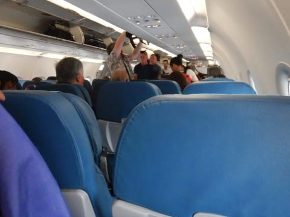

「機内WiFiがあるから，自分のスマホ繋いで

　映画でも何でも見ろや！おら！」

という感じ．

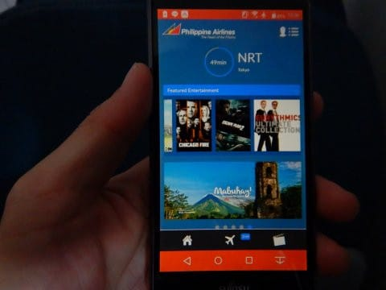

…まぁ，朝2時に起きて．

車で2時間ほど寝たけど，

まだ寝たりない私は，飛行機の中では

寝るだけですが…

飛行機は，定刻の8時過ぎにはスポットアウトし．

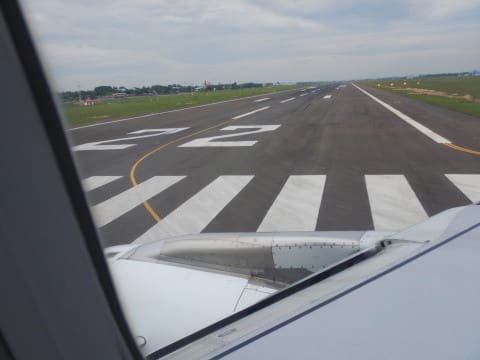

そして，セブ島を後に，日本へ向かって

離陸…

あぁ…さようなら，セブ島．

楽しかったよ，モアルボアル…！

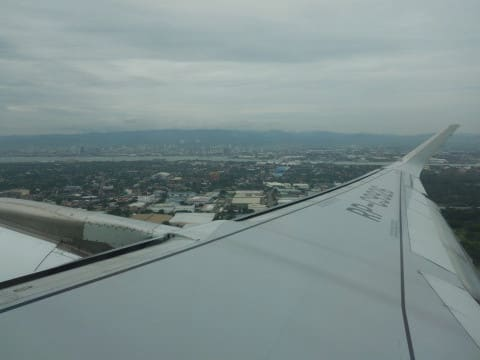

離陸後，1時間ほどすると

機内食が配られますが…

うーむ．

朝ごはんというか，昼ごはんというか…

微妙な時間ですね．

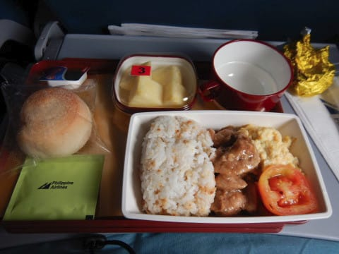

そして．

フィリピン発の飛行機の機内食は…

まぁ，「うわー，おいしい♡」

ってものじゃなかったです．

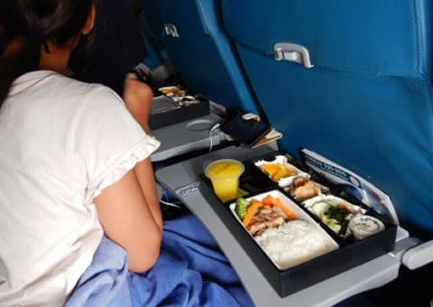

うーむ．

お酒を飲みたいけど．

空港から家まで車なので，お酒が

飲めないのが残念…

ってなことで．

飛行時間はわずか5時間．

食事が終わると，飛行時間も

あと3時間ほど．

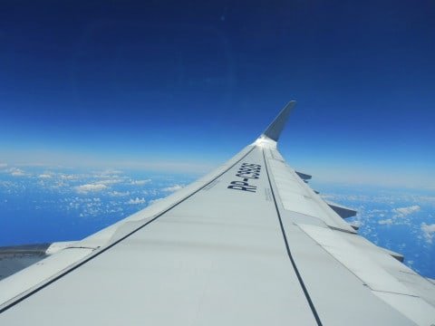

食後は，娘は映画を見たりして

過ごしてましたが，

私は後の車の運転を考え，爆睡．

（私のことを知っている人は良く知っているのですが…

　私はいつでもどこでもすぐ寝ることができるのが特技）

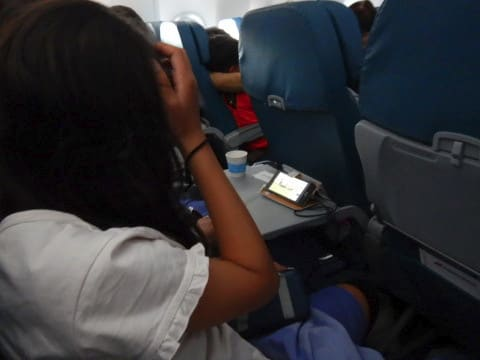

そして．

目覚めたころには，もう千葉県上空．

あぁ…

帰ってきちゃいましたね（泣）

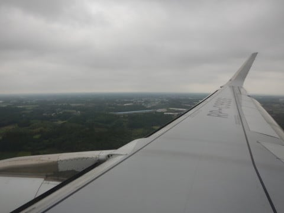

ということで．

日本時間午後2時ごろ，

成田空港へ到着…！

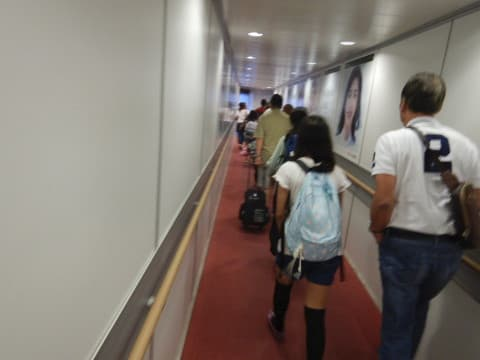

6日間の旅行を終えて，戻ってきてしまった

のでした…

あぁ…

ついさっき，同じ成田空港で行きの

飛行機に乗ったばかりみたいな

気がするんだけど．

また今，成田にいるってのは…

6日間も日本を離れていたってのは，

実は夢だったんじゃないかな？？

（おしまい）
