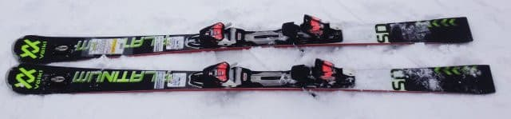

# 2018シーズンモデル，スキー試乗レポート第15回…Volkl編その２

📅 投稿日時: 2017-06-07 01:19:51

🏷️ カテゴリ: [スキー板試乗](c0bd8048615710cee890e403a36cc9a2b.md)

えー．

もう6月というのに，まだまだ続く試乗レポート．

今回のレポートが，4月1，2日の志賀高原で試乗した板の

ラストのレポートになります．

本日はフォルクル編．

SDの長さ違いを2台乗ったので，そのレポートです．

では，どうぞ～！

---

VOLKL Platinum SD 170cm

基礎小回り．

しっかりした張りを感じる板．

フレックスが強い板を，しっかり

たわませられると，かなり速い反発が

返ってくる板です．

板の強さの割に，かなり軽い板なのですが．

170cmという長さもあって，滑るとどっしりした

安定感を感じます．

フレックスが強めで，振動も少ないので，

フラットな圧雪ではスピードには強く，

結構なスピードまでしっかりとした

安定感が維持されます．

ただ，実際の軽さが軽いので，荒れた雪だと

板が叩かれてちょっとだけキョロキョロすることも…

反動はかなり早く．元気な板なので，

スピードを出していくと，反復横飛び

みたいな感じで左右に板が飛んでいくので，

この返りの強さを利用して，硬い斜面を

トップスピードでひゅんひゅん小回りで

切っていくのが楽しい板．

板自体はかなり軽いので，ズラしても

コントロール性があって滑れますが，

ずらして滑ってもあんまりおもしろくないです．

板に圧をかけて行っても，板が粘るように

圧が溜まっていく感じではなく．

長さ170cmとはいえ，ラディウスも13m台で，

反動が早いので．

長さ170cmでも，ちょっと大回りを楽しむ板じゃ

ない感じですね～．

○VOLKL Platinum SD 165cm

基礎小回り．

これもさっきと同じ板ですが．

長さが5cm短い，165cmの板になります．

やはり，張りが強く反応の速さを感じ．

かっちりしてるけど軽いので

どこでも動かせる板です．

170cmと同じく，板に圧をかけて行っても，

板がそのまま粘るネットリ感が無くて，

圧をかけた瞬間にピュンと

返ってくる感じ．

165cmの小回り専用機と捉えれば，

反応が速いので，硬い斜面をこの強く速い

反動を使って気持ちよく小回りできる，

優れた小回り板です．

板をしっかりグリップさせて，この速い

たわみの反動をもらわないと面白くないし．

荒れた斜面だとちょっとだけ板が叩かれる

感じがあるので．

板がしっかりグリップしない荒れた雪で

滑っても面白くなく．

ピカピカ整地でピュンピュン小回りを

楽しんで滑る板かな～．
