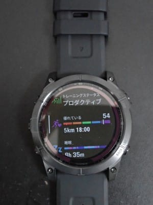
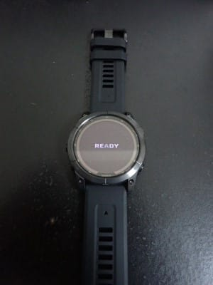
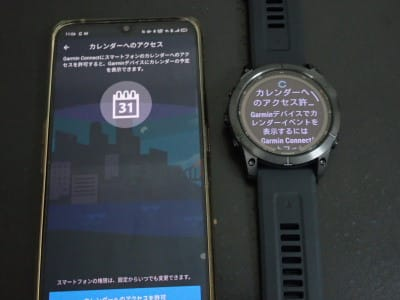

# 新しいスマートウォッチ，Garmin Fenix7Xを買ったよ！その2…ついに購入！開封＆初期設定

📅 投稿日時: 2022-08-09 01:32:02

🏷️ カテゴリ: [PC,カメラ&小物](c0d8caed13e597efe97b661a8ae56bed0.md)

（Garmin Fenix7Xのレポート全16回のもくじ

機能説明，登山用地図の作り方，登山で使ってみた…など

は[ここをクリック](e516b23a4874189de2e9208be87fa5184.md)）

ってなことで．

前回，Garmin Fenix7Xを購入するいきさつを

説明しましたが…

Fenix7シリーズは，

画面が一番大きいFenix7X（直径51mm！），

標準の大きさのFenix7（直径47mm）

小型のFenix7s（直径42mm）

の3種類のサイズがあって．

7と7Sには，ソーラー充電対応の

Sapphire Dual Power（チタンケース，サファイアガラス）

ソーラー充電非対応の

ノーマルモデル（ステンレスケース，ゴリラガラス）

の2種類があります．

7Xはソーラー充電対応の

Sapphire Dual Power

のみで，ノーマルモデルはありません…

ってなことで．

さらにFenix7Xでも，色違い（グレー，黒）

とか，

バンド違い（チタン，革，シリコン）

など，またいろいろ種類あるんですが…

厳密に言うと，今回購入したのは

Fenix 7X Sapphire Dual Power Ti Black DLC / Black

で．

黒色，シリコンバンドの，7Xとしては

一番安いモデルです…

で．今回．

ご無体な仕事の見返りである「ぼぉなす」

というもので，無事購入することができて，

無事，我が家に到着しました～！

…思ったより小ぶりな箱だな．

いざ，開封～っ！！

中に入っているのは，これだけですか…

まずは大事な本体．

画面表示風のシールが貼ってありますね．

そして，マニュアルですが…

これは詳細マニュアルというより，

薄っぺらい，「はじめに」的な

簡易操作説明書．

…当然日本正規品なので，

ちゃんと日本語なのが偉い．

後は充電＆PC接続用を兼ねる

USBケーブルと…

これは…

ステッカーですね．

ってなことで．

無事本体とご対面したことですから．

早速腕に着けてみますが…

ベゼル直径52mmという，かなり巨大な

時計なんですが．

最近はG-Shockとか，盤面が大きめの

時計が流行ってるからか，

それほど気にならない感じ…

直径47mmのAmazfit GTRと

比べてみても，意外とそこまで

大きさは感じないかも？

ちなみに，Amazfit GTRと

並べて比べてみると…

うん．思ったほど大きく感じない．

ただ，厚みはちょっとあるかな．

裏から見ると，円の上下が削られていて，

バンドの上下のピンの間隔は

Amazfit GTRと同じくらいになってますね．

このあたりが，あまり大きさを

感じさせない理由かも…

ってなことで．

Garmin Fenix7X．

電源投入の儀です…！

いざ，スイッチオン…！

をを！画面が点いた！！

そして，起動画面でしばらく待たされて…

READY表示が出ました！

ここで，最初に言語選択画面が

出るので，日本語を選ぶと…

「アプリでデバイスを追加して下さい」

と表示されましたね…

だもんで．

同封されていたカードのQRコードを読んで，

スマホにGarmin Connectのアプリを

インストールして，アプリを起動すると．

アプリが勝手に時計を見つけて

くれましたね…

この時計が接続する時計か確認するため，

時計の画面に出ている番号を入力すると，

時計とBluetooth接続されて…

時計とスマホが同期を始めましたね…

しばらく待つと．

時計とアプリの同期が終わって，

アプリの使用準備完了です！

このあとは，スマホでアプリの設定を

求められて…

トレーニングのいろんな計算や判断に

使うための，性別やら…

身長やら体重やらのデータの

入力が求められて．

さらに，カレンダーやら，

通話やら，スマホのいろんな機能への

アクセス権限を求められるので，

許可してあげると…

無事，アプリ側の設定は完了です！

時計の画面は，これでやっと初期設定画面から，

通常の時計画面になりました…！

アプリの設定が終わったら．

今度は時計の設定画面に移ります．

時計もいろんな設定項目がありますね…

音楽を時計にダウンロードするための設定や，

Garmin Payの設定（時計でSuicaが使える！），

Wi-Fiの設定などを行います．

一通りの設定が終わったら．

これでアプリも時計も使えるように

なりました！

設定完了まで，15分ほど．

案内に従うだけで，何も悩むことなく

初期設定が完了しました…

さて．

それでは，実際に使ってみましょうか…

（続く）
