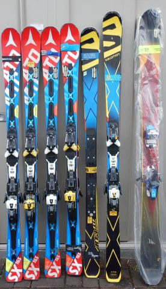
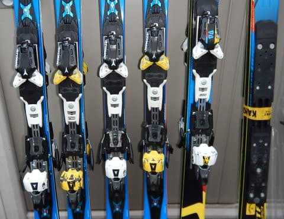

# 勝手に板が増殖する我が家

📅 投稿日時: 2017-12-22 01:31:15

🏷️ カテゴリ: [スキー雑談](c1f9d2cb7478308da16419928ea3945e9.md)

えー．

最新の天気図を見て．

日曜日も，午後にそれほど雲が増えず．

意外と夕方まで晴れが続くかも？？

土日2日間とも，ずっと晴れが続きそう…

と思い始めた，Skier_Sです．

ということで．

剥離したSXの携行品損害補償で[8万円近い保険金が出て](ed868696918a40419c43706429d5d8193.md)，

太板とSXのお金のほとんどが埋め合わされた上に，

ありえない安値（[値段間違い](e8f6f10c51443780808e48b1f54c3ed5b.md)とも言う）でSXが売り

出されていたため．

いろいろ理性をうしなってしまい，

2週連続でSXを買ってしまう

という，

普通ではありえない行為に出てしまうなど．

[物欲選手権](edcaba43061d969c15802f9c095f6dd32.md)に敗れ続け．

板が次々増えていく我が家ですが．

自分の持っている板を並べると…

偏ってる．

偏ってるよ…

太板を除く6セット．

4セットがSX，2セットがX-RACEか…

それも．

全てがVARビンディングorXビンディングという，

同じビンディングの板が6セット並んでます…

もう，偏りすぎてます…

で．

前回の記事に載せたこの写真を撮っている時．

近所の人が奇異の目で通り過ぎて行ったのですが…

近所の人　「なんで同じ板がこんなに？」

私　「い，いや…えーっと．ええ．そう．

　知らぬ間に，細胞分裂したんですよ…」

ということで．

うちの妻にも．

同じ板を物置に並べて置いておいたら，

勝手に繁殖した

ということにしておこう…

## 💬 コメント一覧

### 💬 コメント by (れお)
**タイトル**: 凄い眺めですね～ 笑
**投稿日**: 2017-12-22 11:23:56

いや、板は勝手に増殖しませんから…

お金っていう栄養を与えてるハズです! 笑

なんか私が行かない今週末のコンディションが良さそうですね。

実は仕事納めの前日(28日)に、休みとって志賀に行ってしまおうと考えてるんですが、その日が荒れそうな感じじゃないでしょうか？ 笑

### 💬 コメント by (タカ)
**タイトル**: 増殖(笑)
**投稿日**: 2017-12-22 17:20:50

スキー板勝手に増殖してほしい❗全スキーヤーの願いですね。

あ、今日カンダハー町田店にお邪魔したのですがS9i proがビンなしで83000円になってましたよ❗

### 💬 コメント by (olaf2125)
**タイトル**: なるほど
**投稿日**: 2017-12-22 19:19:11

私も試して見ようと思います。

室温とか湿度が関係しますか？

### 💬 コメント by (はっち)
**タイトル**: 自分の板も
**投稿日**: 2017-12-22 19:34:13

今度、板をお預けしますので、増やして下さいm(_ _)m

### 💬 コメント by (つーちゃん)
**タイトル**: 繁殖
**投稿日**: 2017-12-22 19:35:23

来シーズンあたり、いや、今シーズン終わり頃に

進化を遂げてS9iが産まれそうですね。。。

### 💬 コメント by (しんちゃん)
**タイトル**: 増殖
**投稿日**: 2017-12-22 21:50:47

板がへたったら増殖するんですよね(笑)

### 💬 コメント by (Skier_S)
**タイトル**: 板は繁殖するんです
**投稿日**: 2017-12-23 00:39:09

＞れおさま

そうですね…

動物のブリーダーと同じで，

繁殖にはお金がかかりますね（笑）．

私も28日に志賀日帰り予定ですが…

まだ天気図が出てないのでどんな天気だか

まだ分かりません（涙）．

＞タカさま

私にとっては，知らぬ間にSXが次々増殖してくれると

すごい嬉しいんですけどね～！

…で，S9i proが板のみ83000円！？？

うーむ．

ちょっと惹かれるけど…

まぁ，SXが増殖したので新規小回り板は

来シーズン以降です…

＞olaf2125さま

室温はあまり気にしなくていいようです．

ただし，SXは有性生殖らしく，

どちらが♂か♀か分かりませんが，ワンポイントが

オレンジの板と黄色の板を並べておくと

増えるようです（爆）．

ちゃんと父親と母親で遺伝子が交換されるらしく，

子供は親と比べると，ポイントの色とビンディングの色が

組みかわっています…（大嘘）

＞はっちさま

増えるか増えないかは運次第なので，

最高級グレードの板を2シーズンほど

私に貸していただければ，増えるかどうか

試してみます（笑）

＞つーちゃんさま

進化してくれたら最高ですね…

S9i proに進化してくれないかな～．

