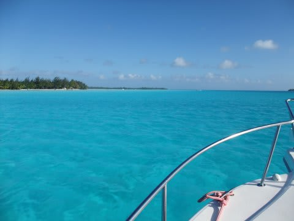
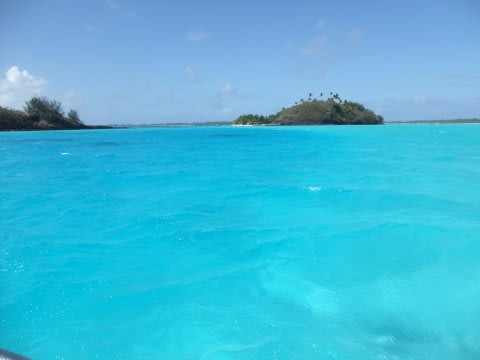
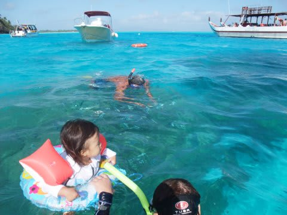
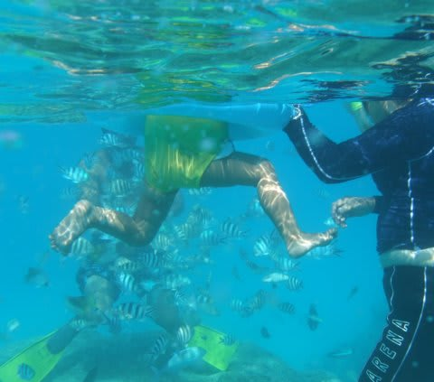
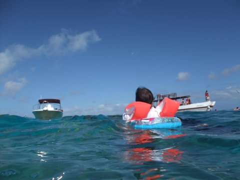
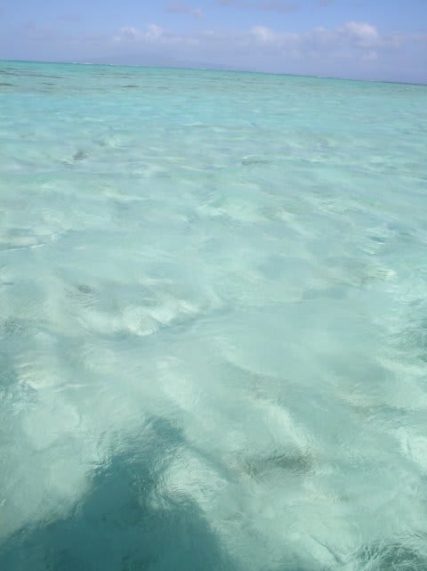
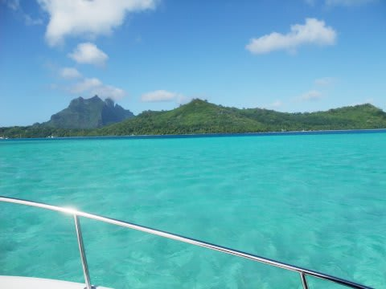
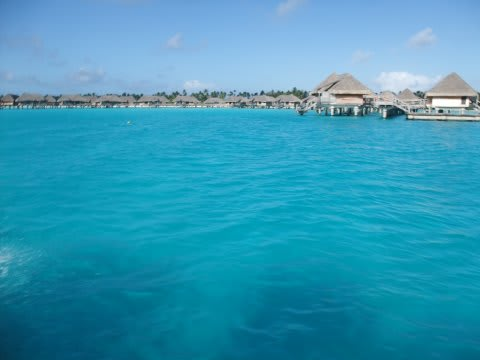
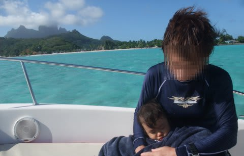

# 2009年　初の海外子連れダイビング旅行記　11　Cruising around Borabora

📅 投稿日時: 2012-09-07 00:04:31

🏷️ カテゴリ: [ダイビング日記](ce3a7a8d424d112fce83ee85c81a0e344.md)

というわけで．

われわれ家族を乗せた，チャーターボートはホテル前桟橋を出発！

出発して10分も経たないうちにシュノーケリングポイントに到着です．

うひゃー！

海の色がきれい！！

娘よ！

これだ！

これを見せてあげたかった．

とりあえず．

シュノーケリングポイントってことなので，シュノーケリングしましょうか…

水深は3-5m程度．

足が着く海じゃないけど．

娘は，まぁ浮き輪に入れれば大丈夫だろう…

と，無謀にも娘を浮き輪に突っ込み，シュノーケリングポイントへ娘を浮かべます．

…もしかすると．

いや．もしかしなくても．これが娘の海水浴デビューではないかっ！！！

タヒチのボラボラで海水浴デビューとは，なんと生意気な…

それも，ボートから足の付かない海に泳ぎだすという…

普通はありえない海水浴デビューをしてしまったようだな．

うちの娘は…

で．

水に浮かべられた娘は．

プールだろうが海だろうが関係なく．

「ばしゃばしゃ楽しい～」

と超ハイテンション．ものすごい喜びかた．

遊び人の血全開．

周りには，きれいな魚がいっぱい寄ってきます．

そりゃ，ボラボラのこんなきれいな海に浮かんで，お魚に

囲まれて…楽しくなかったらウソでしょう．

でも．

これで，午前中預けられた悪い思い出も帳消しになったかな…

と．

喜んでいる娘をダークな心で見つめる私なのだった．

しかし，浮き輪で浮かんでいるとはいえ，足が全く着かない大海原を

大喜びで一人バシャバシャと進んでいく娘＠1歳のなんと頼もしいことよ…

って感じで．

しばしシュノーケリングを楽しんだ後は，引き続き島一周へ．

海の色が，深さによって明るいエメラルドグリーンから深い

コバルトブルーにまで，次々と変化していきます．

うううううううううううーーーーーんん．

きれいだっ！

美しいっ！

娘よ，見よ！このきれいさを…

…って，寝てるじゃないか～！

さっきのシュノーケリングポイントで疲れちゃったか…
