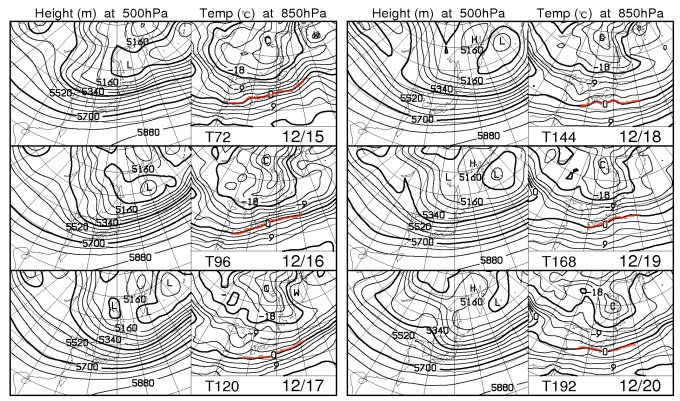
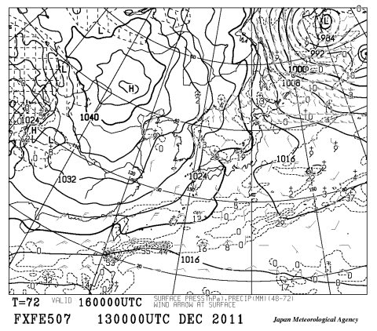

# 今週末までに雪は積もるのか？？

📅 投稿日時: 2011-12-14 00:44:38

🏷️ カテゴリ: [スキー天気予想](c6554f5c3c106093b511a8daae23757e8.md)

…って感じで．

雪がもう一降り．

いや，もうふた降り…

いやいや．もっともっと積もってくれないと困るような状況なんだけど．

今週末までに雪が積もるのかっ？？

…ってところで．天気図を見てみると．

冷えますね～．

この一週間．

下の図の青矢印にあるように，14日にちょっと気温が上がりますが…

まぁ，雨が降るほどではないんで，安心してください．

で，15日以降は冷え込みますね～．

特に，赤矢印で示した17日の土曜日は．

平年より6度ほど冷えるという，かなりの寒さになりそう．

んで，この図にあるみたいに…

15日から一週間は，850hpaの0度線(赤線)が日本より南側にあるので．

…この時期に，山沿いで降れば必ず雪です．

降れば雪．

雨になる心配は無いです．

降れば，雪なんですが．

で．この16日の地上天気図にあるように．

西高東低のきれいな冬型に入るし，一見よさそうなんですが．

んで，この図から分かるように…

赤く記した，いわゆる上空5000mのー30度の寒気．

これが，日本に近づいて来てますし．

一見雪になりそうなんですが．

全ての条件は揃ってそうなんですが．

…

…

…

信州にはあんまり降水量がなさそうなパターンですね（涙)．

風が西から回り込み，きれいに日本海の寒気が北から吹き込んでいないんですね…

あ，新潟は降りそうです．結構．

特に，16日は積もるんじゃないですかね．

…でも．

信州のスキー場は．

ほとんど積もらなさそう…

この予想は，外れて欲しい…
