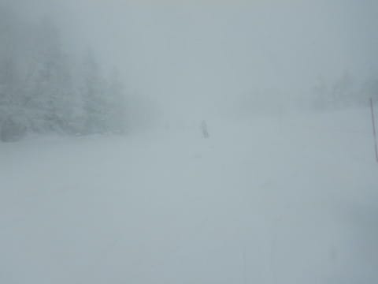

# 2022/3/6(日)の志賀高原スキー場速報レポート…午前小雪，午後ガン降りの激寒デー．でも，12，13日の週末は5月並みの気温に！？

📅 投稿日時: 2022-03-07 02:10:49

🏷️ カテゴリ: [2022スキー滑走日記](cc9cb73e4320f6a97af6fccc37587a61a.md)

本日も志賀高原で滑ってきたわけですが．

いつも通りしっかりラストリフトまで滑って，

そして洗車やらなにやらして帰宅すると

日付変更線突破…(涙)

だもんで．

いつも通りの速報モードで，本日の志賀高原の

レポートをするわけですが．

…その前に．

衝撃の事実をお伝えせねばなりません…

本日，FZCX50の850hpa気温の週間予想を見ると．

…なんじゃこりゃ(屍)

…この13日．

平年比+8℃だぁ！？？？

なんだそりゃ！！

5月くらいの気温まで上がるってこと？？？

この日の850hpa気温予想図をFXXN519から

見てみると…

なんじゃこりゃ！！

12，13日の土日，赤い0℃線は津軽海峡くらいまで

上がって…

で，志賀高原に近づくのは水色の+6℃線！？？

これ，ヘタすると…昼間は10℃くらいまで上がりそう．

…これって，GWより気温高いかも？？

そして，地上天気図を見ると…

12，13日ともに，高気圧に覆われて

晴れそうですが…

まぁ．

雨よりマシだな．雨よりは．

…でも，+10℃の気温で晴れって…

間違いなく，春の雪になりますね．

ずっしり重くて，ヘタすると板に張り付く

滑りの悪い4月下旬の雪になるかも(激泣）

とはいえ．明日の月曜はまだ冷え冷えです．

明日の月曜は，早朝まで冷え冷え雪が降り．

昼には晴れて，冷え冷え最高雪質なのに

晴れという最高のコンディションに

なりそうです…

その後も10日あたりまではそれほど

気温が上がりませんが．

11日以降は覚悟してください．

4月から5月並みの気温が待っていそうです…(激しく流れる涙)

次の週末，春スキーの準備をした方が

良さそうなくらいです

今までが平年比マイナス3~4℃の冷え冷えだったのに．

一気に平年比プラス8℃って…

極端すぎるんですけど…

これは．

きっと．

どこかで．

暖まれ暖まれ踊りを踊っている，

かなりの手練れがいると見た！！←どんな踊りだ，それ

その達人を見つけ出して，この世から

抹消せねば…

だれだ？？こんなに強烈に効く暖まれ暖まれ踊りを踊ってるやつは！？

ってなことで，

次の週末はかなり暖まりそう

という予告でしたが．

とりあえず，まだ冷え冷えだった今日の志賀高原の

速報レポートをば…

まず．

強風でゴンドラ運転が心配された本日．

第2ゴンドラが運休でしたが…

第1ゴンドラは減速もせず営業で．

風に弱い奥志賀ゴンドラも動きました～！

…風はそこまで強くなかったので，

第2ゴンドラは故障で動かなかった説も

あるんですが…

ってなことで．

そこそこ明るく，ゲレンデの凹凸は見やすい

うす曇りで始まった本日．

朝までの積雪は5cm程度で．

圧雪バーンにも数cmのうっすら新雪が！

気温は-10℃以下まで冷えてたので，

うっすら積雪は軽くて，ほぼ抵抗なく

滑れます！

冷え冷えで雪は良かったけど…

でも，第2ゴンドラが動いてなかったのも

あり，午前中は第1ゴンドラは待ち時間も長く．

ゲレンデの人口密度も，ちょい高めでした(涙)

でも，昼ごろから雪がガン降りとなり．

前が見えないほどに激しく雪が吹き付けはじめ

圧雪バーンの上にも，新雪がかなりつもって

いくほどの激しい吹雪になっていきました…

でも．

そのおかげで．

午後はゴンドラ待ちも短めで．

（それでもピークは5分ほど待ったけど)

そして，ゲレンデの人も少なくなり．

午後3時以降は，焼額は目をつぶっても

滑れるはずの私でも．←いや，さすがに目をつぶったら滑れないから

どっちがコースか分からなくなるほどに，

雪が激しく吹き付ける，厳しい天気となり．

ゴーグルの内側の曇りが直ちに凍りつくような，

激しい低温の吹雪の中．

それでもリフトが動いていると帰れないので，←危険な発想だ

ひたすらラストまで滑り続けたのでした…

いや～．

今日は寒かった．

とても3月と思えない冷え込みで，

最高の冷え冷え雪が積もったので．

明日の朝は最高の冷え冷えパウダー

だろうなぁ…

そして．

次の週末は激烈高温なので．

冷え冷えパウダーは，明日が滑り収め

なのかも…

また明日，日曜の志賀高原詳細レポート予定！

## 💬 コメント一覧

### 💬 コメント by (レインボー74)
**タイトル**: Unknown
**投稿日**: 2022-03-07 16:14:28

月曜日の志賀高原情報

朝の上林-2℃　蓮池-9℃。状態はいい。

ニゴン運休でイチゴンスタート。搬器がかなり後ろになったけど、なんとGSサイド一番乗り。30cmはある。浮きます。たまに底付きするけどしあわせ！

オリンピックは50cmはあるとか。

そして、白樺がなんと二番乗り。10cmはある。しあわせです。

新雪はいいとこ取りをしたいので、オリンピックやスーパーは諦めて、ダイヤモンドへ。ここも30cm。エス様の予報通り晴れ間が！ひたすら回してから仲間と合流してパーフェクタへ。だけどポール貸しきりで閉鎖。寺子屋へ。

ここでは、今日は感動なし。

ファミリーは圧雪の上に少しぼこぼこが。だけど気温が低いので雪質はまずまず。

タンネも、動いていた。

銀嶺ざるそばのあとは目的地の西舘へ。楽しかった！ここを根城にしている友人にも会えて、面白い新雪を、ヘロヘロになるまで味わえました。いやあ、今日はよかった。楽しかった。しあわせだった。

### 💬 コメント by (副院長)
**タイトル**: Unknown
**投稿日**: 2022-03-07 22:12:59

この週末は年に一度の白馬五竜に。土曜日は晴れから雨～みぞれ。爆風。日曜日はべたつく雪のガン降り。上部は視界０。帰りも大町過ぎまで渋滞と圧雪路。はやり、僕は志賀党でしたわ。強風地吹雪でも志賀がいい。（でも、高速リフトが高速で動いてる点はうらやましい）

ところで13.14.15日はラストなんですが、5月の陽気と雨？ですか？

### 💬 コメント by (アツシ)
**タイトル**: Unknown
**投稿日**: 2022-03-07 23:46:26

いやー、寒いけど、視界ないけど、幸せでしたね。午後の雪降りは、サウスの閉鎖コース(４ロマ下)〜４ロマ回しが楽しかった。相変わらず、リフト遅すぎですが。今季最後のふわふわモフモフかな？と思いながら、この天気をもたらしてくれたSさまに感謝して滑ってました(笑)

### 💬 コメント by (Skier_S)
**タイトル**: 試乗レポートもお楽しみに
**投稿日**: 2022-03-08 01:18:21

＞新米パパさま

あら．

そんなすぐそばにいらっしゃったのですね．全く気付かず…

そして，ファーストトラック参加ですか！

ついに禁断の世界に手を出しましたね（笑）．

＞レインボー74さま

30~50cmも積もったんですか！

予想以上の新雪でしたね…

ちょっと重くなかったですか？？

午後は天気も回復したようですが，午前から晴れれば最高でしたね！

でも，新雪満喫されたようでうらやましいです…

＞副院長さま

あら！五竜ですか？？

土曜は雨だったみたいですが…志賀は天気良かったですよ！

日曜日は視界は悪かったですが，冷え冷え雪でした！

やっぱり志賀じゃないと…．浮気しちゃダメですよ（笑）．

＞アツシさま

え？？

あの寒い中，4ロマ回したんですか？？

我々の仲間では「今日4ロマに乗ろうって人はよっぽどおかしい」

と言っていたんですが…

とりあえず，新雪楽しまれたようですので，私に感謝してください（なんのこっちゃ）

